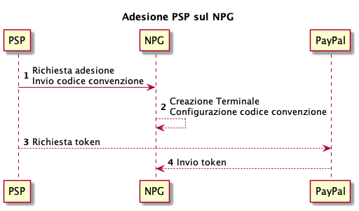
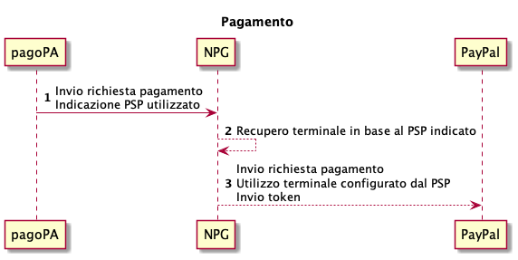
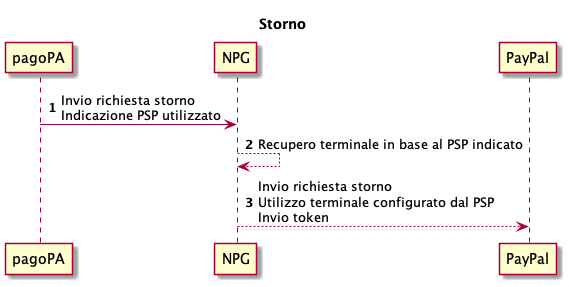

# Integrazione per strumento di pagamento PayPal

## Adesione 

Nel caso in cui un PSP aderente voglia attestarsi sul Payment Gateway (_NPG_) di PagoPA S.p.A. abilitando il metodo di pagamento PayPal® è necessario seguire i seguenti step:

1. invio richiesta di adesione al Payment Gateway contenente il codice convenzione fornito da PayPal®;
2. sul Payment Gateway viene effettuata la configurazione del terminale abilitando i metodi di pagamento con il codice convenzione indicati dal PSP aderente;
3. per completare l’abilitazione il PSP aderente, tramite il wizard del Payment Gateway, deve accedere sul dominio PayPal con le proprie utenze di business per generare il relativo token;
4. il token generato viene configurato sul terminale impostato al punto 2.

Si sottolinea che PagoPA S.p.A. non sottoscrive accordi con PayPal®, quindi è onere del PSP aderente contattare PayPal® se vuole offrire questo strumento di pagamento su _NPG._

<figure><figcaption></figcaption></figure>

## Pagamento 

Durante il pagamento di un numero avviso viene utilizzato il terminale relativo al PSP aderente selezionato dal cittadino, per la comunicazione tra Payment Gateway e PayPal®.

Nella chiamata a PayPal® viene inviato anche il token generato dal PSP aderente in fase di adesione.

<figure><figcaption></figcaption></figure>

## Storno 

In fase di storno di un pagamento viene utilizzato lo stesso terminale relativo al PSP PayPal®PayPal®selezionato in fase di pagamento.

Nella chiamata allo strumento di pagamento viene inviato il token generato dal PSP in fase di adesione.

<figure><figcaption></figcaption></figure>
