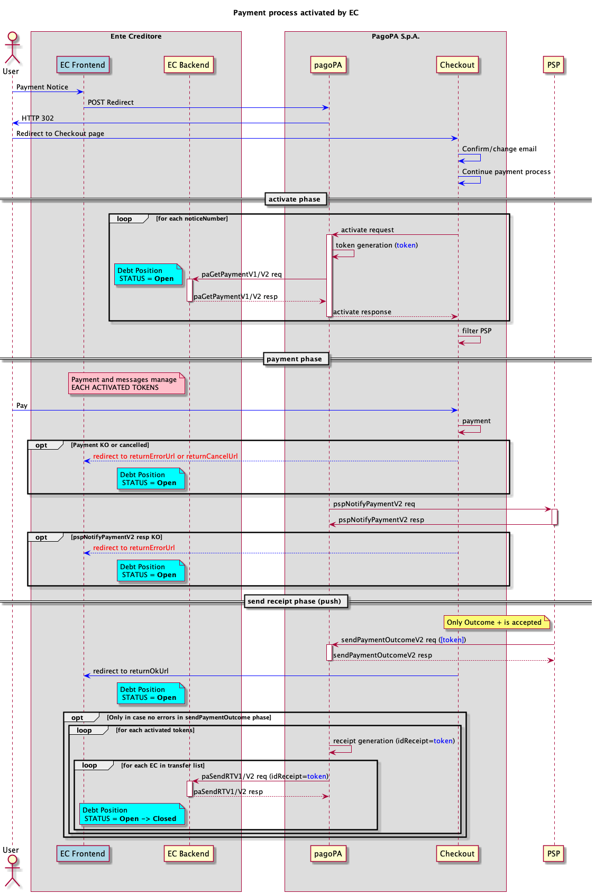

# Payment at the creditor’s frontend

This process is activated the moment in which the payment operation starts at the creditor’s frontend, the workflow serves the purpose of having as little impact as possible on the creditor and PSP. In fact, the communication interfaces are the same used for the payment at the PSPs, therefore they share all the prerequisites.

<figure><figcaption></figcaption></figure>

* when the creditor’s frontend receives the payment request for one or more notices, it forwards it with a [redirect](../creditor/integration-methods/integration-of-the-EC-touch-point-with-checkout.md) to Checkout, the front-end interface of PagoPA S.p.A.;
* Checkout, based on the number of notices it received, requests the Node to activate the _n_ payments at the creditor;
* Each individual request to activate the payment reaches the creditor by means of [paGetPayment](../appendices/primitive.md#pagetpayment);
* Checkout permits the registered PSP, who offers their digital payment instruments on the pagoPA platform ([offering-payment-systems-on-PagoPA-S.p.A.-touchpoints.md](../payment-service-provider/integration-methods/offering-payment-systems-on-PagoPA-S.p.A.-touchpoints.md "mention")), to collect the amount due from the user; 
* once the payment operation is complete, Checkout performs a redirect to the frontend of the creditor and sends the outcomes to the Node that then sends them to the PSP via the [pspNotifyPayment vers. 2](../appendices/primitive.md#versione-2-4), in the case of a KO response from the PSP, the process is interrupted and the payment must be canceled;
* in the case of technical exceptions during the call to [pspNotifyPayment vers. 2](../appendices/primitive.md#versione-2-4) which prevents receiving a response, the Node would wait for the first of the following events to occur
  * _expiration of the payment token_: the process is interrupted and the payment must be canceled;
  * _reception of the_ [_sendPaymentOutcome vers. 2_](../appendices/primitive.md#versione-2-3)_:_ the flow proceeds normally, always keeping in mind that the PSP cannot send an outcome = KO;
* if the PSP sends a [sendPaymentOutcome vers. 2](../appendices/primitive.md#versione-2-3) after responding with KO to [pspNotifyPayment vers. 2](../appendices/primitive.md#versione-2-4) the node would respond with KO to signal the discordant outcome;
* in case of acceptance of the [pspNotifyPayment vers. 2](../appendices/primitive.md#versione-2-4) the PSP is required to provide the outcome of the payment **within 2sec** from acceptance with the [sendPaymentOutcome vers. 2](../appendices/primitive.md#versione-2-3), that contains a single outcome for all tokens activated in the previous phases;
* if the PSP sends an outcome = KO after accepting the [pspNotifyPayment vers. 2](../appendices/primitive.md#versione-2-4) the node would respond with KO to signal the discordant outcome;
* By means of the primitive [paSendRT](../appendices/primitive.md#pasendrt), the _receipt_ is sent to the _n_ creditors involved with the payment only if the payment was made, the _receipt_ is an object generated by the pagoPA platform;
* When the creditor receives the _receipt_, they must close the debt position and consider the notice subject to the payment fully paid.

To manage the errors, refer to [Error management](https://app.gitbook.com/o/KXYtsf32WSKm6ga638R3/s/mU2qgiLV1G3m9z1VjAOc/ "mention").

To be able to use the _metadata_ in a correct and standardized manner, a [metadata dictionary](https://app.gitbook.com/o/KXYtsf32WSKm6ga638R3/s/u6YdY319vyFX9MIvnKBa/ "mention") has been prepared that contains a section dedicated to information about the payment channel present in _additionalPaymentInformations_ of [pspNotifyPayment vers. 2](../appendices/primitive.md#versione-2-4).