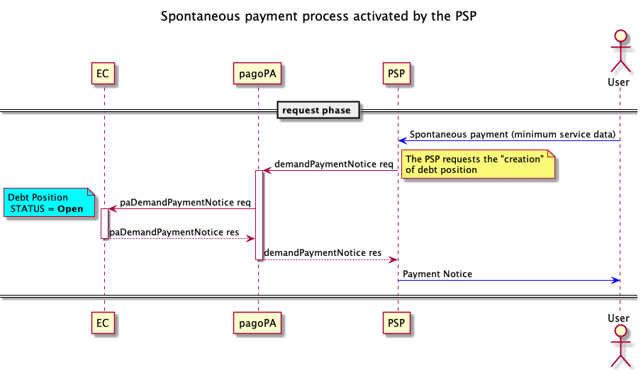

# Car property tax

The payment of the car property tax is one of the cases of use of a spontaneous payment activated from the PSP touch point.

Usually, after the user has entered the data for their vehicle, the type and license plate, which will be sent to ACI for the creation of the debt position, they can proceed with the payment.



* The [demandPaymentNotice](../../appendices/primitive.md#demandpaymentnotice) can be used by the PSPs for sending data for the specific service entered by the user, which in the current case is basically the license plate number and the type of vehicle;
* The [paDemandPaymentNotice](../../appendices/primitive.md#pademandpaymentnotice) is used to request ACI to create the debt position based on the license plate number and type of vehicle. ACI will send the notice number and the data of the payment beneficiary as a response.In fact, by checking the address of the vehicle owner, it is able to determine the Region that receives the payment;

The structure that must transit via the _datiSpecificiServizio_ tag in base64 format is shown below.

```xml
<tassaAuto>
    <veicoloConTarga>
        <tipoVeicoloTarga>1</tipoVeicoloTarga>
        <veicoloTarga>AB123CD</veicoloTarga>
    </veicoloConTarga>
</tassaAuto>
```