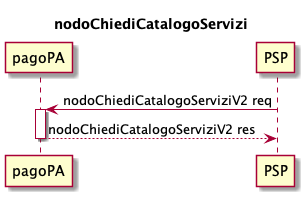

# Service catalog

The Service catalog is the repository that contains the list of generalized services activated by the creditors for the payment process activated spontaneously at the PSP. 

The Service catalog is updated and published daily.

The Service catalog information is coded in an XML file according to the trace [https://github.com/pagopa/pagopa-api/blob/SANP3.3.0/xsd/CatalogoServizi_2_0_0.xsd](https://github.com/pagopa/pagopa-api/blob/SANP3.3.0/xsd/CatalogoServizi_2_0_0.xsd) and must be sent by each creditor to PagoPA S.p.A. using the functions provided on the service portal.



The information can be requested by the individual PSPs from the pagoPA platform using the primitive [nodoChiediCatalogoServizi](../../appendices/primitive.md#nodochiedicatalogoservizi). 

Each service included in the Service catalog is associated with a set of specific data that the creditor needs to provide the PSP with the _notice number_, this data set is associated with an XSD schema that defines its content and makes it possible to control the information. The name of the XSD is indicated in the _xsdRiferimento_ element of the Service catalog.

An example is shown below of the xml of the Service catalog returned in the _xmlCatalogoServizi_ tag in base64 format via the primitive [nodoChiediCatalogoServizi](../../appendices/primitive.md#nodochiedicatalogoservizi). 

```xml
<listaCatalogoServizi>
	<catalogoServizi>
		<idServizio>00009</idServizio>
		<descrizioneServizio>School cafeteria payment</descrizioneServizio>
		<elencoSoggettiEroganti>
			<soggettoErogante>
				<idSoggettoServizio>00035</idSoggettoServizio>
				<idDominio>77777777777</idDominio>
				<denominazioneEnteCreditore>Day care school cafeteria payment</denominazioneEnteCreditore>
				<dataInizioValidita>2022-04-30</dataInizioValidita>
				<dataFineValidita>2024-04-30</dataFineValidita>
				<commissione>N</commissione>
			</soggettoErogante>
			<soggettoErogante>
				<idSoggettoServizio>00036</idSoggettoServizio>
				<idDominio>77777777777</idDominio>
				<denominazioneEnteCreditore>Kindergarten school cafeteria payment</denominazioneEnteCreditore>
				<dataInizioValidita>2022-06-30</dataInizioValidita>
				<dataFineValidita>2024-06-30</dataFineValidita>
				<commissione>S</commissione>
			</soggettoErogante>
			<soggettoErogante>
				<idSoggettoServizio>00037</idSoggettoServizio>
				<idDominio>77777777778</idDominio>
				<denominazioneEnteCreditore>Kindergarten school cafeteria payment</denominazioneEnteCreditore>
				<dataInizioValidita>2022-09-30</dataInizioValidita>
				<dataFineValidita>2024-09-30</dataFineValidita>
				<commissione>S</commissione>
			</soggettoErogante>
		</elencoSoggettiEroganti>
		<categoria>School cafeteria</categoria>
		<xsdRiferimento>mensa_scolastica_1_1_0.xsd</xsdRiferimento>
	</catalogoServizi>
</listaCatalogoServizi>
```

* _idServizio_: service identifier;
* _descrizioneServizio_: global description of the service;
* _elencoSoggettiEroganti_: list of the creditors associated with the service;
* _categoria_: service category;
* _xsdRiferimento_: XSD schema that defines the content of the specific data for the service and permits control of the information.

The object _soggettoErogante_ is defined as follows

* _idSoggettoServizio_: identifier of the association between the service and the creditor;
* _idDominio_: identifier of the creditor;
* _denominazioneEnteCreditore_: description attributed to the service by the creditor;
* _dataInizioValidita_: start date of validity of the service for the specific creditor;
* _dataFineValidita_: end date of validity of the service for the specific creditor;
* _commissione_: flag that defines whether or not to associate a share of the commission with the service by the creditor.