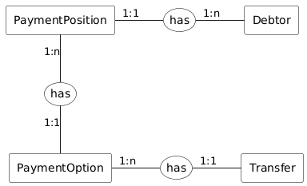

# Modello dei dati V 1

### Schema logico (ER)

La **Posizione Debitoria (Payment Position)** ha le seguenti relazioni:

* Una **Payment Position**  è collegata a un **Debtor**. Se esiste un **Debtor** esiste almeno una **Payment Position** ad esso collegata.
* Una **Payment Position** può avere più **Payment Option**. Ne esiste almeno una. Una **Payment Option** è collegata ad una sola **Payment Position**.


_Ad esempio, una delle opzioni più comuni di pagamento per un tributo annuale sono:_

* _rata unica_
* _prima rata_
* _..._
* _n-esima rata_


* Una **Payment Option** può avere più **Transfer**, tanti quanti gli Enti Creditori (EC) a cui deve afferire. Ne esiste _almeno uno con un massimo di cinque_. Un **Transfer** è collegato ad una sola **Payment Option**.


_Ad esempio, una opzione di pagamento potrebbe avere la seguente suddivisione:_

* _pagamento mono-beneficiario, con singolo versamento (1 EC, 1 versamento);_
* _pagamento mono-beneficiario, con più versamenti (1 EC, n versamenti);_
* _pagamento multi-beneficiario (n EC, n versamenti);_
* _una combinazione dei punti precedenti (n EC, m versamenti con m>n)._


Nei paragrafi seguenti sono riportati le principali caratteristiche di una Posizione Debitoria. Maggiori dettagli tecnici sulla logica del sistema e le transizioni di stato dipendenti dai campi specificati sono riportati nella sezione dedicata agli Stati della Posizione Debitoria.

#### Posizione Debitoria (Payment Position)

Le principali caratteristiche di una Posizione Debitoria sono le seguenti:

* **IUPD**: Identificativo univoco posizione debitoria. È onere dell’EC la creazione di uno IUPD univoco. Qualora non sia univoco il sistema restituirà un errore.
* **Ente Creditore**: Codice Fiscale dell’ente creditore proprietario della PD.
* **Anagrafica Ente Creditore**: Ragione sociale, dipartimento, ufficio.
* **Data di pubblicazione**: Data in cui la PD è pubblicata nel sistema.
* **Data di Validità**: Data dalla quale è valida e pagabile la Posizione Debitoria e le Opzione di Pagamento in essa contenute.&#x20;


È responsabilità dell’EC gestire la PD e ogni informazione ad essa associata, ivi compresa la data di validità.


* **Scadenza**_\[flag]_: Indica se la PD è da rendere non pagabile alla scadenza.

#### Debitore (Debtor)

Le principali caratteristiche di un Debitore sono le seguenti:

* **Tipo**: Indica se è una persona fisica o giuridica.
* **Identificativo**: Codice Fiscale (o anche Partita IVA in caso di persona giuridica) del debitore.
* **Indirizzo** _\[optional]_
* **Email** _\[optional]_
* **Numero di telefono** _\[optional]_

#### Opzione di Pagamento (Payment Option)

Le principali caratteristiche di una Opzione di Pagamento sono le seguenti:

* **Numero Avviso (NAV)**: Identificativo della Rata emessa da un determinato Ente Creditore, sarà l’identificativo utilizzato dal Nodo dei Pagamenti per avviare la transazione, emettere la ricevuta e rendicontare il pagamento.
* **Identificativo Univoco Versamento (IUV)**: Identificativo univoco per ogni Rata.
* **Importo**: Importo previsto per la Rata.
* **Descrizione**: Descrizione della Rata.
* **Data di scadenza**: Data che definisce la data di scadenza del dovuto. Ha un effetto sulla pagabilità qualora sia attivo il flag di scadenza.
* **Meta-Dati** _\[optional]_: Array per permettere agli EC di inserire informazioni custom tipicamente relative alla riconciliazione contabile, allineamento programmi gestionali, etc.

#### Versamento (Transfer)

Le principali caratteristiche di un Versamento sono le seguenti:

* **Id**: Identificativo (progressivo) di un versamento all’interno di una Rata.
* **Ente Creditore**: Ente beneficiario del versamento.
* **Importo**: Importo previsto per il versamento.
* **Causale versamento**: Causale del singolo versamento.
* **Tassonomia**: Tassonomia del servizio associato al versamento.
* **IBAN**: IBAN su cui verra riversato l’importo.&#x20;


L’IBAN viene associato alla **PD** nel momento in cui viene caricata. Se l’IBAN scelto viene modificato da [Back Office](https://developer.pagopa.it/pago-pa/guides/manuale-bo-ec/v1.0/manuale-operativo-back-office-pagopa-ente-creditore/funzionalita/gestione-iban/modifica-iban), la **PD** precedentemente caricata avrà associato sempre l’IBAN che è stato associato in fase di creazione.

