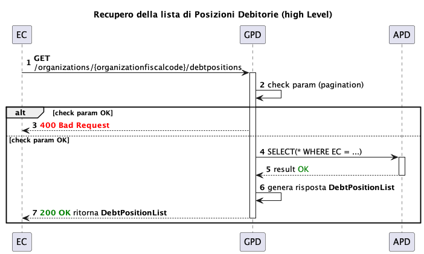
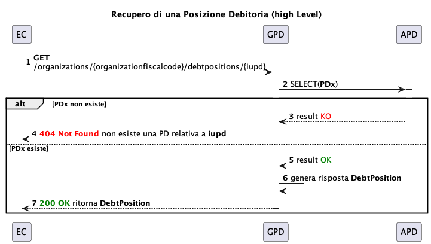
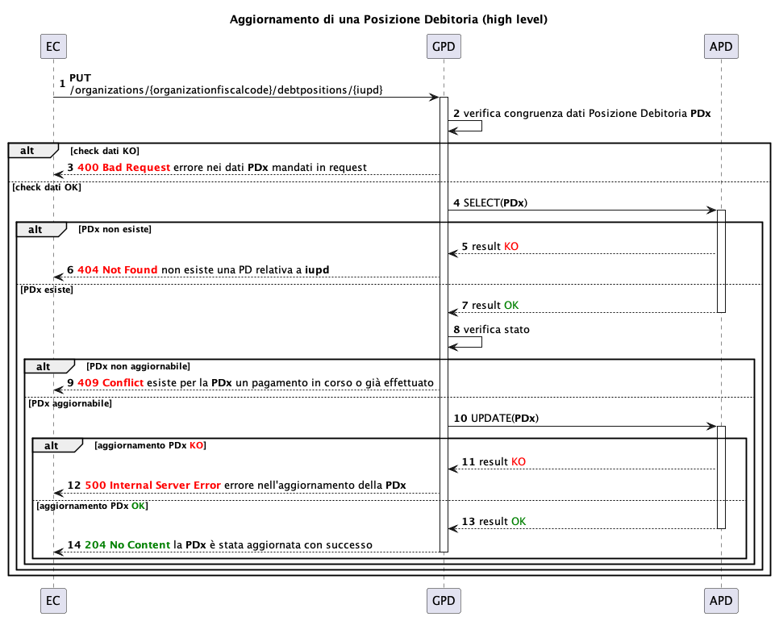
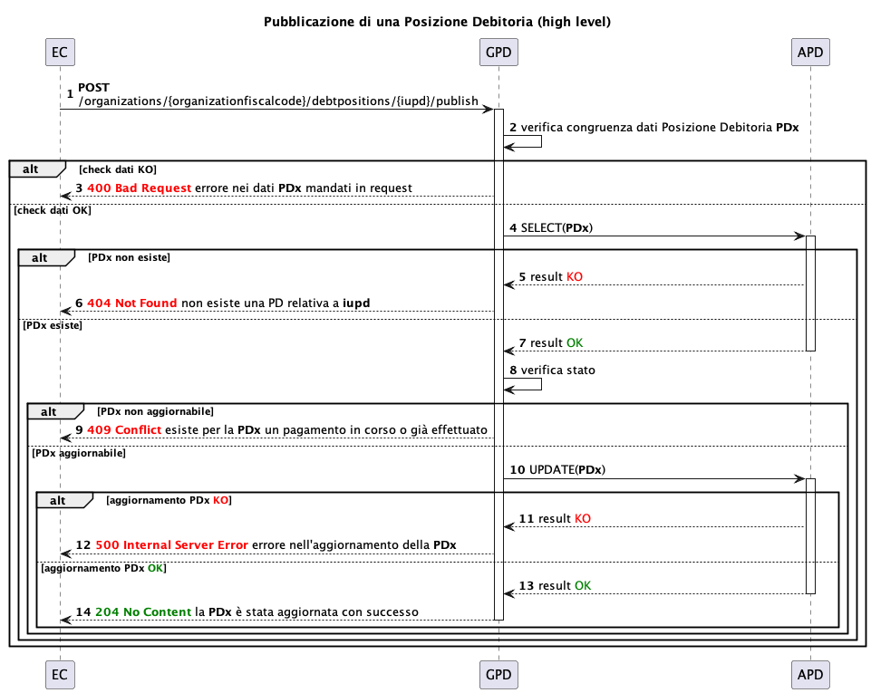
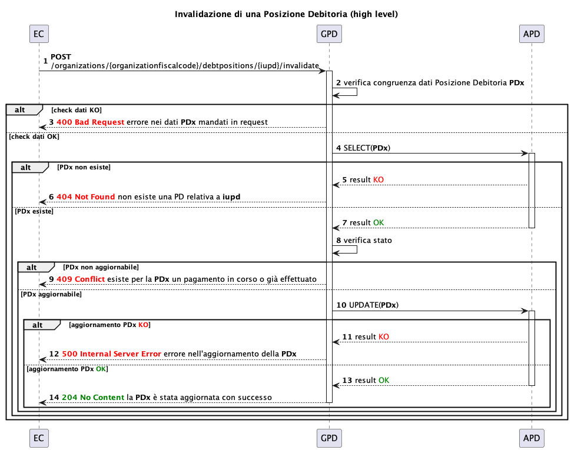
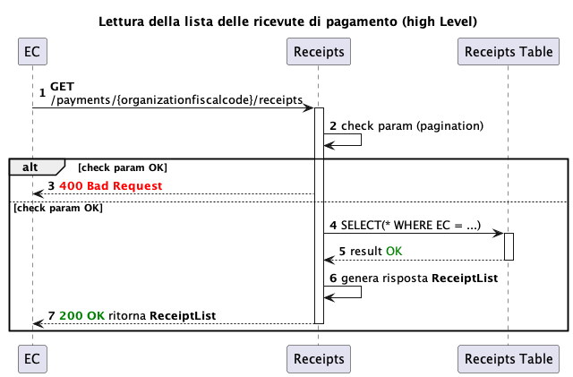
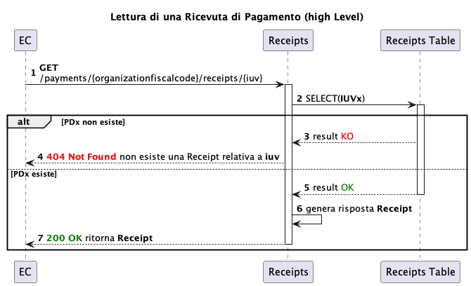
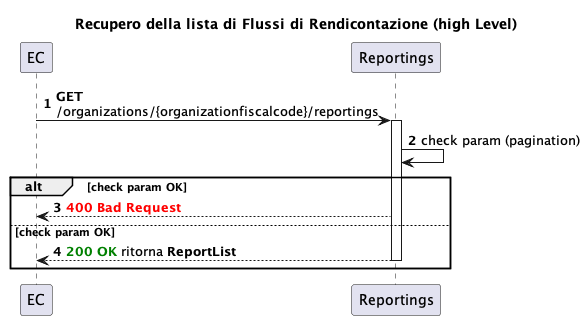
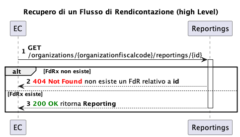

# Operazioni disponibili

## Gestione posizioni debitorie

Nei seguenti sequence diagram si identifica con l'acronimo GPD il servizio di Gestione Posizioni Debitorie e con APD l'Archivio delle Posizioni Debitorie (base dati).

Per i dettagli [https://github.com/pagopa/pagopa-api/tree/SANP3.10.0/openapi](https://github.com/pagopa/pagopa-api/tree/SANP3.8.0/openapi)

.png>)

In fase di creazione della posizione debitoria il servizio effettuerà controlli sui dati in input e controlli di eventuali duplicati.

Tra i controlli dei dati in input si rilevano:

* obbligatorietà dei dati
* coerenza date (ad esempio `due_date` ≥ `validity_date` )
* coerenza importi (ad esempio la somma degli importi dei versamenti deve essere uguale all'importo totale)
* validità della tassonomia
* validità degli IBAN (devono essere censiti sulla piattaforma pagoPA)

L'identificazione di eventuali duplicati si basa sugli identificativi IUPD, IUV, NAV e fiscalCode.

L'operazione di creazione della posizione debitoria potrebbe fallire se questa esiste già per l'EC chiamante e proprietario della stessa posizione debitoria.

### Lettura di una lista di posizioni debitorie e di una singola posizione debitoria

La lettura di una lista di posizioni debitorie prevede sempre una paginazione. E' inoltre possibile filtrare per `due_date` in modo da limitare i risultati. La richiesta potrebbe fallire a causa di input non validi, per esempio numero di elementi richiesti per pagina maggiore rispetto al massimo previsto o intervalli di date non coerenti.

La lettura di una posizione debitoria si basa sull'identificativo in input (`IUPD`). In caso lo `IUPD` non sia esistente verrà emesso un errore.

### Aggiornamento di una posizione debitoria

In fase di aggiornamento, oltre ai già citati controlli in fase di creazione, si verifica, inoltre, che la posizione sia esistente ed aggiornabile. In particolare, l'aggiornabilità della posizione debitoria dipende dallo stato della posizione stessa. Ad esempio, se una posizione debitoria è già stata pagata, interamente o parzialmente, oppure rendicontata oppure invalidata non sarà possibile aggiornarla e verrà restituito un errore.

### Cancellazione di una Posizione Debitoria

.png>)

La cancellazione di una posizione debitoria prevede controlli sia sull'esistenza (`IUPD`) che sullo stato. Una posizione debitoria non sarà cancellabile se è già stata pagata.

### Pubblicazione di una posizione debitoria

La pubblicazione della posizione debitoria permette il passaggio dallo stato `DRAFT` allo stato `PUBLISHED.`  Una posizione in stato `DRAFT` (bozza), infatti, non permette la normale operatività con la piattaforma pagoPA. Solo quando l'Ente Creditore pubblica la posizione, in coerenza con le date di validità e di scadenza, questa risulta pagabile sulla piattaforma. Nel caso in cui allo IUPD indicato nella richiesta non corrisponda una posizione debitoria in stato `DRAFT` appartenente all'EC richiedente, la richiesta restituisce un errore.

### Invalidazione di una posizione debitoria

L'invalidazione di una posizione debitore consiste di fatto in una cancellazione logica. E' possibile effettuarla solo se la posizione debitoria da invalidare si trova negli stati `PUBLISHED` e `VALID`. La funzionalità è utile quando si vuole dare evidenza all'utente, in fase di pagamento, della invalidazione della posizione debitoria. Nel caso in cui allo IUPD indicato nella richiesta non corrisponda una posizione debitoria appartenente all'EC richiedente, la richiesta restituisce un errore.

## Ricevute di pagamento

Sono messe a disposizione due API REST per il recupero delle ricevute di pagamento:

* lista ricevute di pagamento
* dettaglio singola ricevuta.

<figure><figcaption></figcaption></figure>

La lettura di un lista di ricevute di pagamento prevede sempre una paginazione. E' inoltre possibile filtrare per debitore o date di pagamento in modo da limitare i risultati.&#x20;

<figure><figcaption></figcaption></figure>

La lettura di una ricevuta di pagamento si basa sull'identificativo in input (`IUV`). In caso lo `IUV` non sia esistente o non esiste una ricevuta ad esso associata verrà emesso un errore.

## Flussi di rendicontazione

Sono messe a disposizione delle funzionalità di lettura dei flussi di rendicontazione:

* Lista di flussi di rendicontazione per un Ente Creditore
* Dettaglio del flusso di rendicontazione


L'abilitazione al servizio per la gestione dei flussi di rendicontazione su GPD non è automatico e va richiesto esplicitamente al momento dell'on-boarding dell'EC.


La lettura di un lista di flussi di rendicontazione prevede sempre una paginazione. E' inoltre possibile indicare la data di inizio a partire dalla quale selezionare i flussi.&#x20;

La lettura di un flusso di rendicontazione si basa sull'identificativo del reporting in input (`id`). In caso non esista un flusso di rendicontazione relativo all'`id`  inserito nella richiesta verrà restituito un errore.
