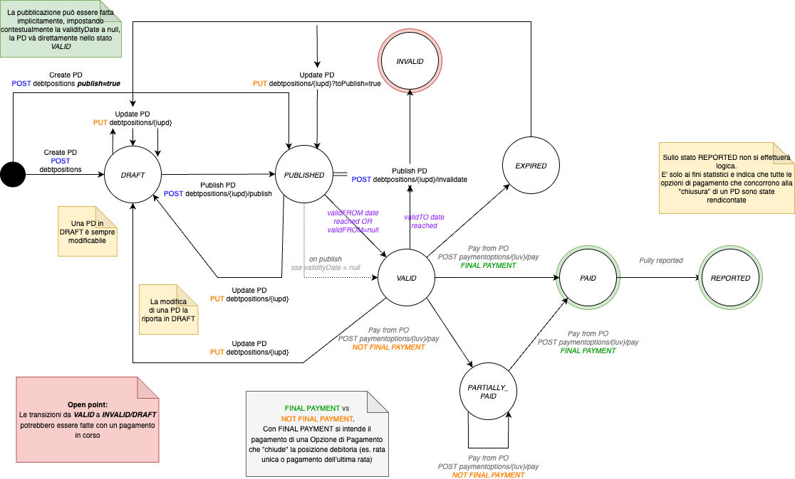
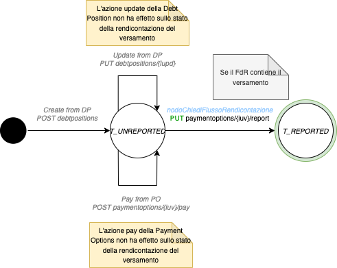

# Stati della posizione debitoria

In questa sezione sono rappresentate le macchine a stati delle 3 principali (Posizione Debitoria, Opzione di Pagamento e versamento).

Le azioni indicate nei seguenti schemi possono avvenire da 2 fonti:

* Partner/intermediario tecnologico o eventualmente Ente Creditore (ad esempio, la creazione e l'aggiornamento di una posizione debitoria)
* Nodo dei Pagamenti (ad esempio attraverso la ricezione di una ricevuta di pagamento)

## Posizione debitoria

<figure><figcaption></figcaption></figure>

## Opzione di Pagamento

.png>)

## Versamento

