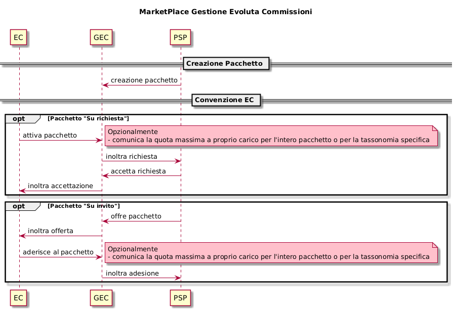
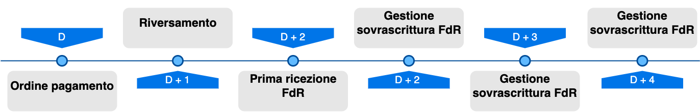

# Rendicontazione e Cashflow

Ogni PSP aderente alla piattaforma in data D+2 rendiconta tramite il _**flusso di rendicontazione**_ il dettaglio dei riversamenti effettuati nella giornata D+1 verso i conti di accredito dei pagamenti avvenuti nella giornata operativa D, come definito nelle Linee Guida della piattaforma pagoPA, nello specifico nelle [SACI](https://app.gitbook.com/o/KXYtsf32WSKm6ga638R3/s/QdpcBdgV6Vin3SHiZyFM/).

I PSP inviano ogni singolo flusso di rendicontazione alla piattaforma pagoPA tramite la primitiva [nodoInviaFlussoRendicontazione](../../appendici/primitive/psp/api-soap.md#nodoinviaflussorendicontazione); per la ricezione dei flussi di rendicontazione da parte degli EC le primitive da usare sono la [nodoChiediElencoFlussiRendicontazione,](../../appendici/primitive/ente-creditore/api-soap.md#nodochiedielencoflussirendicontazione) per avere l'elenco dei flussi disponibili, e la [nodoChiediFlussoRendicontazione](../../appendici/primitive/ente-creditore/api-soap.md#nodochiediflussorendicontazione) per scaricare uno specifico flusso.

Per semplicità di “narrativa” negli schemi successivi ci si riferisce sempre:

* lato PSP → all’ invio di un singolo flusso
* lato EC → al recupero di molteplici flussi.

Questa scelta è data dalla natura della funzionalità lato EC che prevede:

1. Recupero di “lista di flussi”
2. Recupero del singolo flusso (menzionato precedentemente in lista)

Per i PSP esiste un unica modalità di invio di flussi rendicontazione alla piattaforma pagoPA:

* SOAP (Web Service)

Esistono, invece, 2 configurazioni possibili (mutuamente esclusive) per l’EC relativamente alla ricezione dei flussi di rendicontazione:

* SOAP (Web Service)
* SFTP



.png>)

Per quanto riguarda la [nodoChiediElencoFlussiRendicontazione](../../appendici/primitive/ente-creditore/api-soap.md#nodochiedielencoflussirendicontazione) la piattaforma risponderà in maniera indipendente dalla configurazione dell'EC (SOAP o SFTP), in entrambi i casi infatti la piattaforma risponderà con un elenco di FdR. L’utilizzo della primitiva in caso di configurazione SFTP è opzionale e un possibile motivo per l’utilizzo riguarda finalità statistiche.

Per quanto riguarda la [nodoChiediFlussoRendicontazione](../../appendici/primitive/ente-creditore/api-soap.md#nodochiediflussorendicontazione) la piattaforma risponderà in maniera differente in base alla configurazione dell’EC:

* ricezione via _web service_ **SOAP** → file XML: flusso di rendicontazione in base64 binary
* ricezione via _server_ **SFTP** → a differenza della primitiva standard, non viene restituito in output alcun file XML

In caso di configurazione SFTP la chiamata in questione è opzionale, infatti, il deposito del file non avviene al momento della richiesta dell' EC con primitiva, ma avviene non appena il flusso è disponibile al Nodo.

Di seguito un esempio di xml del Flusso di Rendicontazione contenuto nel tag _xmlRendicontazione_ nel formato base64.

```xml
<FlussoRiversamento xmlns="http://www.digitpa.gov.it/schemas/2011/Pagamenti/">
    <versioneOggetto>1.0</versioneOggetto>
    <identificativoFlusso>2021-11-21ABI00000-AABB648200001295</identificativoFlusso>
    <dataOraFlusso>2021-11-22T00:37:32</dataOraFlusso>
    <identificativoUnivocoRegolamento>Bonifico SEPA-00000-AABB0</identificativoUnivocoRegolamento>
    <dataRegolamento>2021-11-21</dataRegolamento>
    <istitutoMittente>
        <identificativoUnivocoMittente>
            <tipoIdentificativoUnivoco>B</tipoIdentificativoUnivoco>
            <codiceIdentificativoUnivoco>ABI00000</codiceIdentificativoUnivoco>
        </identificativoUnivocoMittente>
        <denominazioneMittente>BANCO DI XXXXXXXX SPA</denominazioneMittente>
    </istitutoMittente>
    <istitutoRicevente>
        <identificativoUnivocoRicevente>
            <tipoIdentificativoUnivoco>G</tipoIdentificativoUnivoco>
            <codiceIdentificativoUnivoco>77777777777</codiceIdentificativoUnivoco>
        </identificativoUnivocoRicevente>
        <denominazioneRicevente>XXXXXXXXXXX</denominazioneRicevente>
    </istitutoRicevente>
    <numeroTotalePagamenti>1</numeroTotalePagamenti>
    <importoTotalePagamenti>1234.56</importoTotalePagamenti>
    <datiSingoliPagamenti>
        <identificativoUnivocoVersamento>12210209926737900</identificativoUnivocoVersamento>
        <identificativoUnivocoRiscossione>2130101502302932577</identificativoUnivocoRiscossione>
        <indiceDatiSingoloPagamento>1</indiceDatiSingoloPagamento>
        <singoloImportoPagato>1234.56</singoloImportoPagato>
        <codiceEsitoSingoloPagamento>0</codiceEsitoSingoloPagamento>
        <dataEsitoSingoloPagamento>2021-11-21</dataEsitoSingoloPagamento>
    </datiSingoliPagamenti>
</FlussoRiversamento>
```

## Gestione sovrascritture Flussi di Rendicontazione <a href="#title-text" id="title-text"></a>

Un PSP ha la possibilità di mandare più flussi allo stesso EC tramite la primitiva [nodoInviaFlussoRendicontazione](../../appendici/primitive/psp/api-soap.md#nodoinviaflussorendicontazione) con lo stesso _identificativoFlusso_ ma con _dataOraFlusso_ differente. Questa opzione permette al PSP di **sovrascrivere** un flusso già inviato, in caso un flusso già inviato necessitasse di correzioni.&#x20;

Si ricorda, inoltre, l'_identificativoFlusso_ deve essere univoco nell’ambito dell’anno di riferimento delle operazioni di pagamento cui si riferisce il flusso, di conseguenza lo stesso _identificativoFlusso_ può essere usato più di una volta nel corso dello stesso anno solo nel caso di invio di un flusso di sovrascrittura.

**Esempio:**

* Flusso **errato** _identificativoFlusso_ **=** ab&#x63;**,** _dataOraFlusso_ **=** 2019-01-01T10:00:00
* Flusso **corretto** _identificativoFlusso_ **=** ab&#x63;**,** _dataOraFlusso_ **=** 2019-01-01T14:00:00

Un PSP una volta inviato un flusso con un determinato _identificativoFlusso_, per sovrascriverlo deve inviare un flusso con lo stesso _identificativoFlusso_ ma con _dataOraFlusso_ **superiore** a quella inviata in precedenza.

Il flusso di sovrascrittura è ritenuto valido se inviato entro, e non oltre, le ore 24 della quarta giornata lavorativa successiva alla ricezione dell’ordine di pagamento (D+4).

### Comportamento del Nodo dei Pagamenti <a href="#comportamento-del-nodo-dei-pagamenti" id="comportamento-del-nodo-dei-pagamenti"></a>

Nei seguenti due esempi sono mostrati i comportamenti del Nodo dei pagamenti in caso di due invii successivi:

* Esempio 1
  * **Invio 1**: _identificativoFlusso_ **=** ab&#x63;**,** _dataOraFlusso_ **=** 2019-01-01T**10**:00:00
  * **Invio 2**: _identificativoFlusso_ **=** ab&#x63;**,** _dataOraFlusso_ **=** 2019-01-01T**14**:00:00

Al secondo invio, il nodo accetterà il flusso di rendicontazione.

* Esempio 2
  * **Invio 1**: _identificativoFlusso_ **=** ab&#x63;**,** _dataOraFlusso_ **=** 2019-01-01T**10**:00:00,
  * **Invio 2**: _identificativoFlusso_ **=** ab&#x63;**,** _dataOraFlusso_ **=** 2019-01-01T**07**:00:00

Al secondo invio il Nodo rifiuterà il flusso di rendicontazione (lo stesso accadrebbe anche se la seconda dataTora fosse identica alla prima).

## Richiesta dei Flussi di Rendicontazione da parte dell'Ente Creditore <a href="#richiesta-flussi-di-rendicontazione-da-parte-dellente-creditore" id="richiesta-flussi-di-rendicontazione-da-parte-dellente-creditore"></a>

### Elenco Flussi <a href="#elenco-flussi" id="elenco-flussi"></a>

Quando l’EC richiede l'elenco dei flussi ([nodoChiediElencoFlussiRendicontazione](../../appendici/primitive/ente-creditore/api-soap.md#nodochiedielencoflussirendicontazione)) il Nodo dei pagamenti deve rispondere, per un determinato _identificativoFlusso_, con il flusso più recente a disposizione, in riferimento al precedente esempio 1 e supponendo che la richiesta avvenga dopo la ricezione del secondo flusso da parte del nodo:

* _identificativoFlusso_ **=** ab&#x63;**,** _dataOraFlusso_ **=** 2019-01-01T**14**:00:00

Ad ogni richiesta vengono restituiti gli elenchi dei flussi secondo la seguente logica sui parametri di input opzionali eventualmente inseriti nella _request_:

* _idDominio_
  * se specificato → la piattaforma restituisce l'elenco dell’EC specificato;
  * se non specificato → la piattaforma restituisce gli elenchi di tutti gli EC dell’Intermediario o Partner Tecnologico tramite cui è transitata la richiesta;
* _identificativoPSP_
  * se specificato → la piattaforma restituisce l'elenco del PSP specificato;
  * se non specificato → la piattaforma restituisce gli elenchi di tutti i PSP.

Attualmente il Nodo non tiene traccia dei flussi già scaricati dall’EC, per questo motivo vengono sempre restituiti tutti i flussi disponibili sulla piattaforma, rimane compito dell’EC comprendere quali flussi sono da richiedere e quali sono già stati elaborati, tenendo a mente che un PSP può sovrascrivere un flusso secondo le logiche sopra esposte.

Per una corretta gestione l'EC deve verificare ed eventualmente gestire il contenuto associato ad ogni singolo _identificativoFlusso_ inviato fino alla quarta giornata lavorativa (D+4) successiva alla ricezione dell’ordine di pagamento.



Non esistendo lato EC possibilità di filtrare, né temporalmente, né quantitativamente gli elementi restituiti, è stata definita una proprietà della piattaforma che permette di limitare l'intervallo temporale su cui basarsi per rispondere alla chiamata, la proprietà è unica per tutta la piattaforma e attualmente è impostata a 30 giorni.

### Singolo Flusso <a href="#singolo-flusso" id="singolo-flusso"></a>

L’EC, quindi, richiede il singolo flusso ([nodoChiediFlussoRendicontazione](../../appendici/primitive/ente-creditore/api-soap.md#nodochiediflussorendicontazione)) fornendo in input esclusivamente _identificativoFlusso_ e non _dataOraFlusso_ (in riferimento alla richiesta di esempio qui sopra _identificativoFlusso_ **=** abc)\
Il Nodo deve rispondere coerentemente con quanto dichiarato nella primitiva precedente ([nodoChiediElencoFlussiRendicontazione](../../appendici/primitive/ente-creditore/api-soap.md#nodochiedielencoflussirendicontazione)) e fornire quindi il flusso più recente per quell'_identificativoFlusso_, in riferimento all'esempio precedente:

* _identificativoFlusso_ = abc, _dataOraFlusso_ = 2019-01-01T**14**:00:00

## Nuove primitive flussi di rendicontazione <a href="#richiesta-flussi-di-rendicontazione-da-parte-dellente-creditore" id="richiesta-flussi-di-rendicontazione-da-parte-dellente-creditore"></a>

PagoPA metterà a disposizione degli EC/PSP delle nuove [primitive](../../appendici/primitive/#nuova-gestione-flussi-di-rendicontazione) per la gestione di download/upload dei FdR.&#x20;

Ogni PSP aderente alla piattaforma, in data **D+2**, rendiconta tramite il **flusso di rendicontazione** il dettaglio dei riversamenti effettuati nella giornata **D+1** verso i conti di accredito dei pagamenti avvenuti nella giornata operativa **D**, come definito nelle Linee Guida della piattaforma pagoPA, in particolare nelle [SACI. ](https://app.gitbook.com/o/KXYtsf32WSKm6ga638R3/s/QdpcBdgV6Vin3SHiZyFM/)

PagoPA metterà a disposizione degli EC/PSP delle nuove [primitive](../../appendici/primitive/#nuova-gestione-flussi-di-rendicontazione) REST per la gestione di download/upload dei FdR.&#x20;

Gli EC ed i PSP potranno adeguare le chiamate alle primitive messe a disposizione dalla piattaforma pagoPA per poter gestire in maniera efficiente gli FdR.

Per poter usufruire delle nuove API sarà necessario effettuare una sottoscrizione al prodotto che mette a disposizione le primitive di seguito elencate. Per maggiori informazioni su come richiedere una sottoscrizione ad un nuovo prodotto si può far riferimento ai manuali per la creazione di nuove API Key per [EC](https://developer.pagopa.it/pago-pa/guides/manuale-bo-ec/v1.0/manuale-operativo-back-office-pagopa-ente-creditore/funzionalita/generazione-api-key) e [PSP](https://developer.pagopa.it/pago-pa/guides/manuale-bo-psp/v1.0/manuale-operativo-pagamenti-pagopa-prestatore-di-servizi-di-pagamento/funzionalita/generazione-api-key).

Vengono messi a disposizione due nuovi prodotti:

* **"FDR - Flussi di rendicontazione \[ORG]"** - API per gli Enti Creditori
* **"FDR - Flussi di rendicontazione \[PSP]"** - API per i PSP

Si riporta di seguito il disegno del nuovo processo:

<figure><figcaption></figcaption></figure>

Il processo prevede l'introduzione di diversi step, descritti nei paragrafi seguenti.

Gli esempi delle chiamate sono consultabili sul [developer portal.](https://developer.pagopa.it/pago-pa/api/flussi-di-rendicontazione)

#### **Azioni disponibili per l'invio e la gestione dei flussi di rendicontazione**

**Lato PSP :**

1. **Avvio del caricamento flusso:**\
   Il PSP avvia il processo notificando al sistema l’intenzione di inviare un nuovo flusso di rendicontazione, il cui nome deve essere univoco nell’anno di riferimento delle operazioni di pagamento. In questo step, imposta tutte le informazioni caratteristiche del flusso, quali il totale rendicontato dal flusso, il numero di pagamenti inclusi nel flusso, l’ente ricevente e così via. Questa operazione è consentita solo se non esistono altri flussi con lo stesso nome già creati e in attesa di pubblicazione.
2. **Invio dei pacchetti:**\
   Il PSP provvede ad inviare al sistema i riferimenti dei pagamenti da includere nel flusso di rendicontazione. Il flusso può essere popolato suddividendo l’inserimento in più pacchetti di dimensioni entro un tetto massimo di 1000 pagamenti, inviati e gestiti autonomamente. Questa operazione può essere ripetuta fino al completamento del flusso. Nel caso in cui l’inserimento di un determinato pacchetto dovesse andare in errore, tutti i pagamenti inclusi in esso non vengono inseriti nel flusso di rendicontazione ed è pertanto possibile inviarlo nuovamente senza ottenere conflitti. Questa operazione è permessa solo se il flusso non è stato già pubblicato. Per garantire un utilizzo uniforme del traffico, a ciascun PSP viene applicato un limite di 10 richieste al secondo e 300 richieste al minuto.
3. **Eliminazione di un pacchetto:**\
   Il PSP, nel caso in cui un singolo pagamento o un pacchetto precedentemente inviato deve essere rimosso dal flusso di rendicontazione, può decidere di eliminarlo definitivamente. Nel caso in cui la cancellazione di un determinato pacchetto di pagamenti dovesse andare in errore, tutti i pagamenti inclusi in esso non vengono rimossi dal flusso di rendicontazione ed è pertanto possibile eseguire nuovamente l’operazione senza ottenere conflitti. Questa operazione è permessa solo se il flusso non è stato già pubblicato. Per garantire un utilizzo uniforme del traffico, a ciascun PSP viene applicato un limite di 10 richieste al secondo e 300 richieste al minuto.&#x20;
4. **Pubblicazione del flusso:**\
   l PSP, dopo aver inviato tutti i pacchetti di pagamenti, può pubblicare il flusso di rendicontazione al fine di renderlo disponibile agli Enti Creditori (EC). Questa operazione è permessa solo se il flusso non è stato già pubblicato.
5. **Cancellazione dell'intero flusso:**\
   Il PSP, in alternativa alla pubblicazione, può decidere di eliminare un intero flusso e tutti i pacchetti di pagamenti ad esso associati. Nel caso in cui la cancellazione dovesse andare in errore, tutti i pagamenti inclusi in esso non vengono rimossi dal flusso di rendicontazione ed è pertanto possibile eseguire nuovamente l’operazione senza ottenere conflitti. Questa operazione è permessa solo se il flusso non è stato già pubblicato.

#### **Lato Ente Creditore:**

1. **Richiesta dell'elenco dei flussi disponibili:**\
   L’EC può richiedere l’elenco dei flussi di rendicontazione ad essa associati. E’ possibile recuperare unicamente i flussi di rendicontazione degli ultimi 30 giorni.
2. **Download di un flusso specifico:**\
   Dopo aver ottenuto l’elenco, l’EC può richiedere il download di un singolo flusso di rendicontazione. Se il flusso richiesto è molto grande, deve essere scaricato in forma paginata, recuperando i pagamenti suddivisi per blocchi. E’ possibile recuperare unicamente i flussi di rendicontazione degli ultimi 30 giorni.

### Revisioni dei Flussi di Rendicontazione

Un PSP ha la possibilità di sottomettere lo stesso flusso di rendicontazione utilizzando lo stesso identificativo. Questa funzionalità è utile nel caso in cui si voglia inviare una versione revisionata e corretta di un certo flusso di rendicontazione precedentemente pubblicato.&#x20;

Nel caso in cui il flusso di rendicontazione non sia ancora stato pubblicato, è invece necessario prima cancellare il flusso in stato di bozza, quindi ripetere l’intero processo: creazione, aggiunta dei pagamenti e pubblicazione. Questo consente di evitare la proliferazione di versioni errate del flusso di rendicontazione.&#x20;

Tutte le revisioni pubblicate da un PSP sono consultabili dall'EC destinatario, qualora ne avesse la necessità. L’API dedicata alla consultazione dei flussi di rendicontazione consente all’EC di ottenere, per ciascun flusso, le informazioni principali relative all’ultima revisione disponibile. Da lì, è possibile recuperare direttamente l’ultima versione pubblicata oppure ricercare tra le revisioni precedenti, specificando il numero di revisione. Poiché il sistema non registra quali flussi siano già stati scaricati dall’EC, spetta a quest’ultimo gestire autonomamente lo stato di elaborazione, distinguendo tra flussi già acquisiti e flussi ancora da recuperare. È importante considerare che un PSP potrebbe generare nuove revisioni di un determinato flusso, qualora necessario. Per una corretta gestione, l’EC deve quindi verificare e monitorare la revisione ed il contenuto del flusso ricevuto, tenendo conto che eventuali nuove versioni possono avvenire fino alle ore 00:00 della quarta giornata lavorativa (D+4) successiva alla ricezione dell’ordine di pagamento.

Un PSP può quindi inviare più volte un flusso con lo stesso identificativo (campo `fdr` della richiesta di creazione flusso), ma nel rispetto di regole precise. Il sistema accetta una nuova revisione dello stesso flusso di rendicontazione solo se la data ad esso associata (campo `fdrDate` della richiesta di creazione flusso) è successiva a quella dell’ultima versione pubblicata del flusso. La nuova revisione del flusso di rendicontazione è ritenuta valida se pubblicata entro e non oltre le ore 00:00 della quarta giornata lavorativa (D+4) successiva alla ricezione dell’ordine di pagamento.

I PSP, gli EC, i Partner Tecnologici e gli Intermediari possono operare sui flussi di rendicontazione esclusivamente per i soggetti sui quali risultano abilitati o per i quali possiedono una delega valida.
