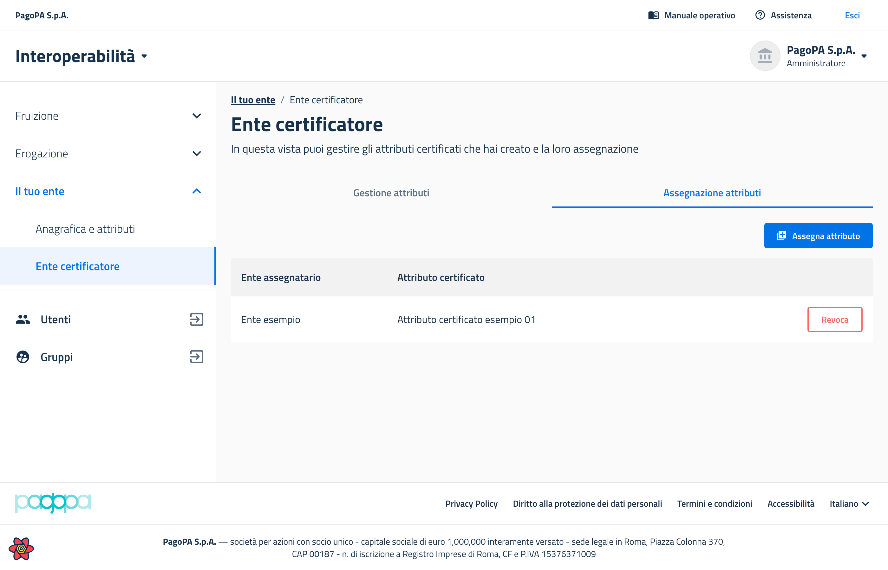

# Come assegnare o revocare un attributo certificato

## Step 1 - Accedere al back office

Gli utenti con permessi di _amministratore_ di un ente accreditato come "certificatore" possono accedere attraverso il back office nel menu di sinistra alla voce _**Il tuo ente > Ente certificatore**,_ che permette di accedere alla schermata seguente.

Gli enti certificatori hanno a disposizione una tab _**Assegnazione attributi**_ all'interno della pagina _**Il tuo ente > Ente certificatore**_, accessibile attraverso il menu a sinistra.

<figure><figcaption>
La schermata che mostra la tab <em><strong>Assegnazione attributi</strong></em> all'interno della pagina <em><strong>Il mio ente > Ente certificatore</strong></em>
</figcaption></figure>

Al suo interno avrà la possibilità di:&#x20;

* vedere la lista degli enti e degli attributi che ha assegnato;
* assegnare un attributo ad un ente: attraverso il pulsante _**Assegna attributo**_, inserendo il nome dell'attributo certificato ed il nome dell'ente assegnatario;
* revocare un attributo ad un ente: attraverso il pulsante _**Revoca**._

Un ente certificatore può assegnare o revocare agli enti solo gli attributi certificati creati da lui, non quelli creati da altri certificatori.


**Attenzione**: la revoca di un attributo certificato potrebbe causare un'interruzione di servizio all'ente interessato dalla revoca stessa. Tutte le richieste di fruizione attive che prevedono quell'attributo certificato tra i requisiti verranno immediatamente sospese da PDND Interoperabilità. Nessun nuovo voucher potrà essere ottenuto dall'ente per quelle richieste di fruizione fino all'eventuale riassegnazione dell'attributo certificato.

