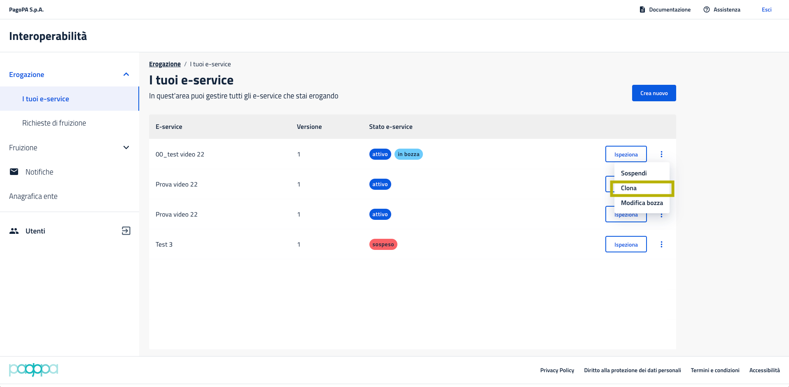
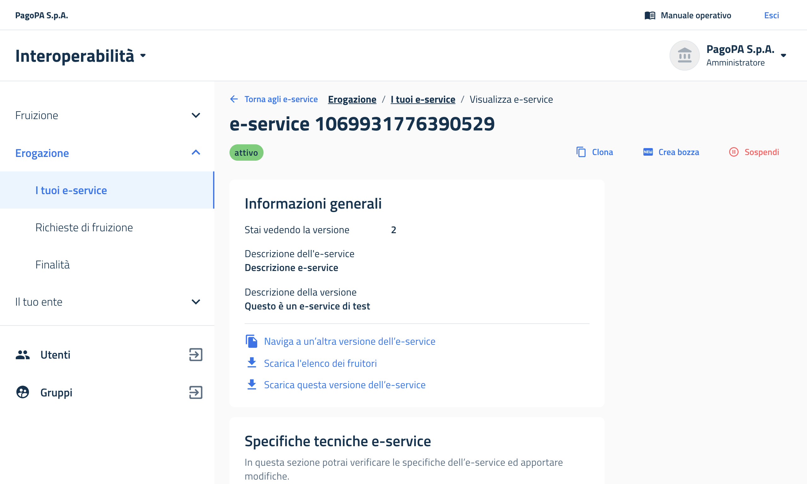

# Come gestire un e-service

## Come erogare un e-service

L'aderente può gestire l'e-service dalla voce di menu _**Erogazione > I tuoi e-service**_.&#x20;

Una volta pubblicato un e-service, è visualizzabile in modalità fruizione su _**Fruizione > Catalogo e-service**_.&#x20;

Gli aderenti interessati a fruire dell'e-service e in possesso dei requisiti minimi richiesti dall'erogatore (attributi), possono iscriversi presentando una richiesta di fruizione.&#x20;

Ogni erogatore troverà le richieste di fruizione presentate dai Fruitori in _**Erogazione > Richieste di fruizione**_, dove può gestirle. Il fruitore può presentare le finalità e, dopo che la richiesta è approvata, iniziare a utilizzare l'e-service.


Per approfondire il funzionamento del flusso dell'erogatore si rimanda ai paragrafi successivi e alle voci [Client e materiale crittografico](../guida-tecnica/client-e-materiale-crittografico.md) e [Utilizzare i voucher](../guida-tecnica/utilizzare-i-voucher/) di questa guida.


## Come eliminare un e-service

Per cancellare un e-service o una sua versione in bozza, andare su _**Erogazione > I tuoi e-service**_, cliccare sui tre pallini della versione di e-service in bozza desiderata e su _**Elimina**_.

## Come clonare un e-service

Per facilitare la procedura di creazione di e-service molto simili, è stata disposta una funzionalità di clonazione. Per farlo, puoi andare su _**Erogazione > I tuoi e-service**_, cliccare sui tre pallini dell'e-service da clonare e selezionare _**Clona**_. È possibile clonare solo versioni di e-service in stato "attivo" o "deprecato".

L'e-service creato da questo clone non sarà pubblicato immediatamente, sarà messo in bozza. La sua numerazione di versione partirà da 1, indipendentemente dal numero di versione dell'e-service dal quale è stato clonato.

<figure><figcaption></figcaption></figure>

## Come esportare e importare un e-service

È possibile esportare una versione di e-service da un ambiente di PDND Interoperabilità; quindi, la si può importare all'interno di un altro ambiente come nuovo e-service in bozza. Attualmente questa funzionalità è disponibile solo attraverso la UI.

La funzionalità è pensata per facilitare il passaggio di un e-service che ha superato la fase di collaudo ed è pronto per essere portato in produzione, ma può essere usata a discrezione per esportare e importare gli e-service da un ambiente all'altro, oppure per replicare uno stesso e-service presso più enti (nel caso, ad esempio, di Partner Tecnologici).

Un esempio pratico: c'è un e-service chiamato "Il mio e-service" in versione 5 in collaudo. È possibile esportare questa versione di e-service e reimportarla in produzione come versione 1 in bozza. L'e-service avrà lo stesso nome e le stesse caratteristiche di quello di partenza, con alcuni caveat descritti più sotto.

### Importare un e-service in bozza

Un utente con permessi di gestione per gli e-service (ossia amministratore o operatore API) può entrare nella pagina che elenca gli e-service erogati dal proprio ente _**Erogazione > I tuoi e-service**_**.** Alla sinistra dell'azione _**+1 Crea nuovo**_, si trova _**Importa**_**.**

<figure><figcaption>
Vista della lista degli e-service in gestione all'ente con, in alto a destra, il pulsante "Importa"
</figcaption></figure>

Cliccando su _**Importa**_, si apre un cassetto laterale che offre la possibilità di inserire un file zip. Una volta inserito, vengono elencate le possibili problematiche che impediscono il corretto caricamento. Una volta verificati tutti i punti, si può cliccare su _**Ho preso visione** > **Confermo**_ > _**Importa**_.&#x20;

<figure><figcaption>
Vista del cassetto laterale che permette di caricare lo .zip
</figcaption></figure>

Se tutto va a buon fine, l'utente è reindirizzato direttamente alla bozza del nuovo e-service che è stata creata a partire dallo .zip importato. In caso contrario, si riceve un feedback negativo.

### Esportare una versione di e-service

Un utente con permessi di gestione per gli e-service (ossia amministratore o operatore API) può entrare nella scheda del singolo e-service in _**Erogazione > I tuoi e-service**_. A quel punto, tra le azioni disponibili in basso nella scheda _**Informazioni generali**_, trova _**Scarica questa versione dell'e-service**_.

<figure><figcaption>
L'azione "Scarica questa versione dell'e-service" è l'ultima in basso nella scheda "Informazioni generali"
</figcaption></figure>

La versione di e-service viene scaricata in formato .zip, pronta per essere reimportata nell'altro ambiente.

## Come modificare la documentazione di un e-service

È possibile modificare la documentazione dell'e-service anche dopo la sua pubblicazione: bisogna entrare nell'e-service, scorrere in basso fino alla voce _**Specifiche tecniche e-service**_ e cliccare su _**Modifica**_ alla voce _**Documentazione**_.

<figure><figcaption>
Schermata di modifica documentazione e-service
</figcaption></figure>

## Come archiviare un e-service

Se una versione di e-service è archiviabile, l'opzione per farlo sarà attiva. Bisogna andare su _**Erogazione > I tuoi e-service**_, cliccare sui tre pallini della versione di e-service deprecata di interesse e su _**Archivia**_.


Questa funzionalità non è ancora stata rilasciata in ambiente di esercizio

