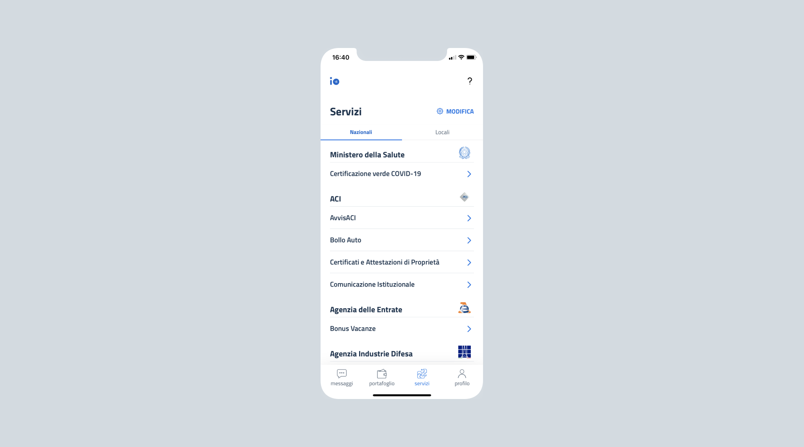

# Quali enti possono erogare servizi su IO

Gli enti che possono erogare i propri servizi su IO sono individuati dall'[articolo 2, comma 2](https://docs.italia.it/italia/piano-triennale-ict/codice-amministrazione-digitale-docs/it/v2018-09-28/\_rst/capo1\_sezione1\_art2.html) del Codice dell'amministrazione digitale. Le tipologie di enti definite dal CAD sono:

> a) \[...] **pubbliche amministrazioni** di cui all’articolo 1, comma 2, del decreto legislativo 30 marzo 2001, n. 165, nel rispetto del riparto di competenza di cui all’articolo 117 della Costituzione, ivi comprese le autorità di sistema portuale, nonché alle autorità amministrative indipendenti di garanzia, vigilanza e regolazione;
>
> b) \[...] **gestori di servizi pubblici**, ivi comprese le società quotate, in relazione ai servizi di pubblico interesse;
>
> c) \[...] **società a controllo pubblico**, come definite nel decreto legislativo 19 agosto 2016, n. 175, escluse le società quotate di cui all’articolo 2, comma 1, lettera p), del medesimo decreto che non rientrino nella categoria di cui alla lettera b).


Possono rendere fruibili i propri servizi tramite IO anche enti diversi da quelli individuati dall’articolo 2, comma 2 del CAD, previa stipula di apposita convenzione con PagoPA S.p.A. e nel rispetto delle[ linee guida di IO](https://www.agid.gov.it/sites/default/files/repository\_files/lg\_punto\_accesso\_telematico\_servizi\_pa\_3112021.pdf).


Gli enti possono operare in autonomia o essere supportati da:

* uno o più **partner tecnologici,** ovvero soggetti terzi che si occupano di gestire il dialogo tecnico con IO in nome e per conto degli enti aderenti;
* un **ente aggregatore**, vale a dire un ente che agisce in qualità di aggregatore di altri soggetti pubblici, per esempio Regioni o Unioni di Comuni.&#x20;

### Enti pubblici

Le Pubbliche Amministrazioni (PA) sono la tipologia di enti più corposa nell'app. Nella sezione Servizi di IO, le Pubbliche Amministrazioni e gli altri enti pubblici sono distinti tra "nazionali" e "locali".&#x20;

#### **Enti pubblici nazionali**

Una Pubblica Amministrazione nazionale è un ente grande e complesso. Per facilitare l'ingresso in IO, è prevista l'adesione al contratto anche alle singole **Aree Organizzative Omogenee (AOO)** e alle **Unità Operative (UO)** che compongono un ente centrale, se provviste di un proprio Legale Rappresentante.

#### **Enti pubblici locali**

Una Pubblica Amministrazione locale spesso non ha tutti gli strumenti per gestire da sola piattaforme come IO. Questo manuale è pensato per dare loro maggiore supporto nella creazione e gestione di contenuti nell'app.

### Partner tecnologici

Gli enti possono farsi carico di tutte le attività di implementazione, oppure nominare uno o più partner tecnologici.&#x20;

### Enti aggregatori e aggregati

Gli enti possono aderire a IO in qualità di **aggregatori di altri soggetti erogatori**. Il rapporto di aggregazione tra i soggetti erogatori è regolato dagli accordi (compresi gli accordi di cooperazione di cui all’art. 15 della L. 241/1990) e dagli atti amministrativi necessari a conferire al soggetto aggregante i poteri e le attribuzioni necessarie a sottoscrivere il contratto di adesione anche per conto e a beneficio dei soggetti aggregati.

In molti casi, i soggetti aggregatori sono una soluzione ottimale per centralizzare la gestione di piattaforme che altrimenti il singolo ente non riuscirebbe a gestire da solo.&#x20;


**Un esempio** **di ente aggregatore**

Una regione aderisce a IO per tutti gli enti locali del territorio di riferimento, mettendo a disposizione la società in-house regionale per gestire la loro integrazione tecnologica.


Gli enti aggregatori devono elencare tutti gli enti che rappresentano ai fini dell’adesione a IO tramite il relativo **allegato al contratto**. In questo allegato, si deve comunicare la lista completa degli enti, inserendo per ognuno questi dati:

* denominazione;
* sede;
* Codice Fiscale o partita IVA;
* [codice IPA](https://www.indicepa.gov.it/ipa-portale/consultazione/indirizzo-sede/ricerca-ente).

Eventuali cambiamenti nella lista di enti aggregati **vanno tempestivamente comunicati** a PagoPA S.p.A. [**Come contattarci -->** ](../appendice/contatti.md)


**Un aiuto per i partner tecnologici**

I partner tecnologici e gli enti aggregatori spesso hanno difficoltà a **gestire il grande numero di enti** per cui lavorano. Questo manuale è pensato per dare loro maggiore supporto e condividere buone pratiche di creazione e gestione dei servizi.&#x20;

