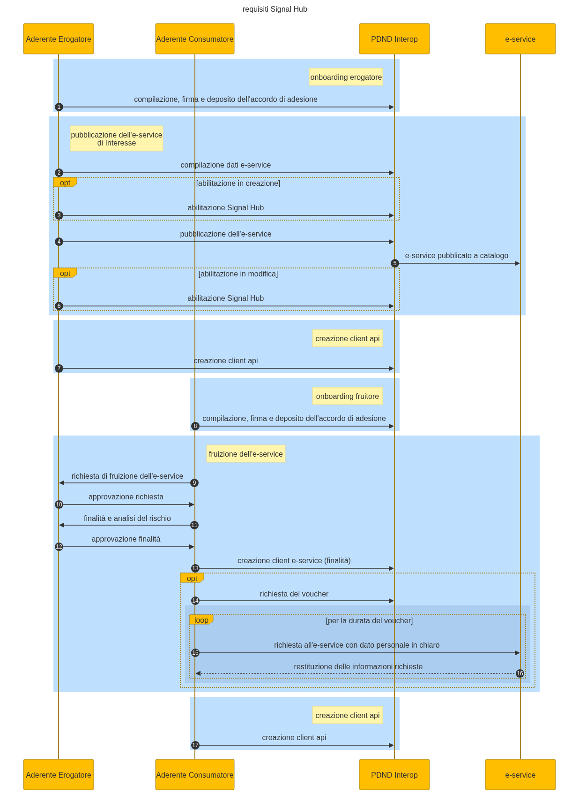

# Prerequisiti

Per poter accedere al servizio, vanno svolte le seguenti operazioni preliminari, interne a PDND Interoperabilità:

* i soggetti aderenti, sia chi eroga i dati sia chi ne fruisce, devono aver completato l’[**onboarding su PDND**](https://mermaid.live/edit#pako:eNqNkk2L2zAQhv-KUA9twVnifG0iSmCbbKCHlrCBHoousjX2CuQZdyxDsyH_vbKyaSiltD7IGumZdyS9c5IlWZBKjkYjjcEFD0oQFmTYOqw1loSVq5VGIcIzNHG3MB38Cr8adqbw0CVCiJZdY_i4IU-shJZvdruPu_FYS42pgsYOvveAJWydqdk0Gk0fCPumAH6VMBxc6VqDQeyfhOnEgwUGDCAemWoTiOFPcnP4jdwQdn3zF3a__bId6PT_FHGmdjhaxBjKILgu3uWrPBOTyTQO8_n7i8bwIUV1D1UQVCUBlZZvTyYs1N6JhxBru1ve_mm0Xl_4kprWefPiCCETlePGCIhpLXUuUJx4_9aUJbGNgRPGQjegN63N4X-1PhS8_ocgoNUoM9lAzHU2tsJp2NAy-avl4KKFyvQ-DC6eIzo4djhiKVXgHjLZt9aEq6FSVcZ3cTU-tVQn-UOq2fJusZjm43wxnk3ul3kmj1Llq_u7Sb6azPPpdLFcLWfnTL4Qxfz8qvho4x34WgVS9PnSrqlrU41vKeeCMPX18-sBzj8BoLXuZQ) tramite accordo di adesione e che siano a tutti gli effetti aderenti
* l’aderente deve aver [**pubblicato l’e-service**](https://mermaid.live/edit#pako:eNp9kkGPmzAQhf_KyD20lWAV2MAGq4rUNonaQ6vVRuph5csAE2LJ2NSYqtko_70GQhq10XLAMv7ezDNvjqwwJTHOwjAU2kmniEPT5bmSBb5IowkobMn-kgUJXRi9kxUXGsDtqfZoji1dtj_QSswVtQMB0FhZoz18NspYDoK92Ww-bWYzwYQe2gnd0s-OdEEriZXFWmjsnNFdnZM9l0DrZCEb1A4enwBb-FiSJe0I1tZU6IylG-Tq-6pnh_Wrh61p_qfW2565ut6IWCoc2Cp_F2VRAHF8719J8n481MZ3trLaOzA77-jfn1WSUm8vJeFDbpdQytEDte3Za_88PoXLZW-QQ2HqRqqpAjp5beoGj7lU0p35raw0KvjS5TfZ1-xdCTzrJest_9v6InUGEPyCylRm1JAuhWYBq8nWKEs_P8f-QLBhDgTr0y5ph51yfdonj_bJbg-6YNzZjgLWNf6mU_DTR58L40f2m_FkcZem91GSzuOHRRZlATswns7v4iiLH7IkWWSzdJ6dAvZijJdHU8F1Kf1MTPVo2H0bR3yY9KHH86AZEWu6as_4DlVLpz89u_5Y) di interesse e  deve averlo [**abilitato a Signal Hub**](abilitazione-del-servizio.md)
* l’aderente fruitore [**acceda all’e-service di interesse**](https://mermaid.live/edit#pako:eNqFlNuO2jAQhl9l5F50kQAlARqSi5VaDlIvWlUg9aLKjUkmYCnY6cRBZdG-S9-lL9ZxOIUFaX2Rw_j_v3HGnhxEajIUsej1eom2yhYYQ071izIaAXsV0k6lmOjU6Fyt40QD2A1uWbWSFV5ef0pSclVg1SgASlJbSfuJKQzFkIgP8_mXueclItFNpkRX-LtGneJUyTXJbaJlbY2utyukE0KSVakqpbYwWYKs4HOGhNoizKlW1hCCA73V_ph-nzp1c__KcjLlvWq2uCHOyKylQz5QNrlbpTgnJUwt0Hr15Ed-F4JgwJfRqHOc1IappNYbCybn9TdVVceyZlgUH1tAOI3Jsvf8PFvE7Es3CisrIVMtn3xsmy3Y5jLIsiSzk0fxhfGAnystC2X__e0DU91zpdyq2FSxy7zHvvjfsF3JY0gJT7q0UFzda-3g6eLsXK1umNLeBlq8VjV4iTtTp5vzGWmP63aEbju8EV8GUedeWBhTQokEBRNrku-Br6VbthdzsxvA_QEZnyAHrgx_JILSwFpJ5jFytuydakvMU7a-Hg7nzQ1tmzKqS068B6HOAG7DHLoLnCTNlOiKLTJbZdz2BzeRiKaHE-E6NcNc1oV1nfrKUteVy71ORWypxq6oS_7Kc9Oeg9wnIj6IPyKOgr4XecPR-FMQBX7o-V2xF_Ew6ofewAvDgT_wo2gQvXbFizHs9_rjcTT0gyAYsiEcjfxzilnmWvycAZu3b8d_VfPLarL-aiBHCZl6vRFxLosKX_8D2-p9ig), dopo aver eseguito le seguenti azioni:
  * presentazione richiesta di fruizione (e contestuale approvazione da parte dell’erogatore)&#x20;
  * richiesta di fruizione in stato ATTIVO
  * presentazione di almeno una finalità, connessa all’analisi del rischio (e contestuale approvazione da parte dell’erogatore)
  * la stessa finalità deve risultare in stato ATTIVO
  * creazione un client connesso alla finalità
* i soggetti fruitori abbiano creato un client api interop necessario per la fruizione del servizio di deposito e recupero dei segnali tramite voucher .

<figure><figcaption></figcaption></figure>

{% embed url="https://mermaid.live/edit#pako:eNqtVcFu2zAM_RVCO6wFkiJx6qY2hgJbmmI7bCgaYIfBF9mmHQG26Mlysbbov-xf9mOj7MRJ2iDthupgW_LjexRJiQ8ioRRFKIbDYaStsgWGYPBno2plFSxUrmUBn5s40gnpTOVhpAHsEkvGxbLGfvpdGiXjAusWAVAZVUpzN6OCTAiReHd19elqNIpEpFutSNcsgzrBSyVzI8tIy8aSbsoYjftdSWNVoiqpLVzfgKzhY4oGtUWYG8qlJYO7qNliBzUjXTflHtz15bdLh2zfXxhqqNpFzFsmHNZoblWCzh2DiQWTx0fjYDwAz5vww_ePu81qYr0CMwuUtbQhkI5JmlTpHHDjrgNf3wwvLjpQQmWlCnmvSOMAMmVKCQgpVsThJ_4oivcyScikPFEgU6wdNNKo09e4ZFS-7Hy6CaFq4rhQSafWcfc7hA-xuXASbTiwrle-HvAXUskVshWjPXgZq0LZFX67mPZgD7m3ZcBYNpkvwo10b8ohk8AvWVBOrw7Sbt4SgysXkkJxHYGs1PO87QX9l95WnWSmUZsymS3eqEwc2T-UyoxD6zw5nIfOO64qo5KlwtpKp_yyXRtEJyGrytDtKoo9yR6BTHHVKPvnN29Zus9aOXa2qdmIXqLuzZ9S70_kpqiOesvjjakbVNndhS2-rWiwi7fUJEt3m8GTsUnH1KVj5PNjEhw_BxZEFVRooGDGxsiXiHt33AHZOCN3zjrf5O7wkiOuiTeJoDQwVhraTzlfDFex5buBu0SzSbKzzYgr0i2pXhOfE3ExAuwu9_W5jelW3vjwHsr5-vA6nBiI3KhUhNY0OBAl8s7cVDw4nki0vS4SrqOlmMmmsK6jPbIZN44fROXa0lCTL0WYyaLmWVNxwNedbg1x_W5xp5P1nBlE-CB-idAbj08mQTA9PffP_Wngj72BuOPlyck48IKz0enI88686XjyOBD3rejoJOjG6WgS-BPf99ai89RdKmsNbGdfu6bf9n52lfeOZkaNtiIMHv8CWHaLBQ" %}
prerequisiti di Signal Hub

