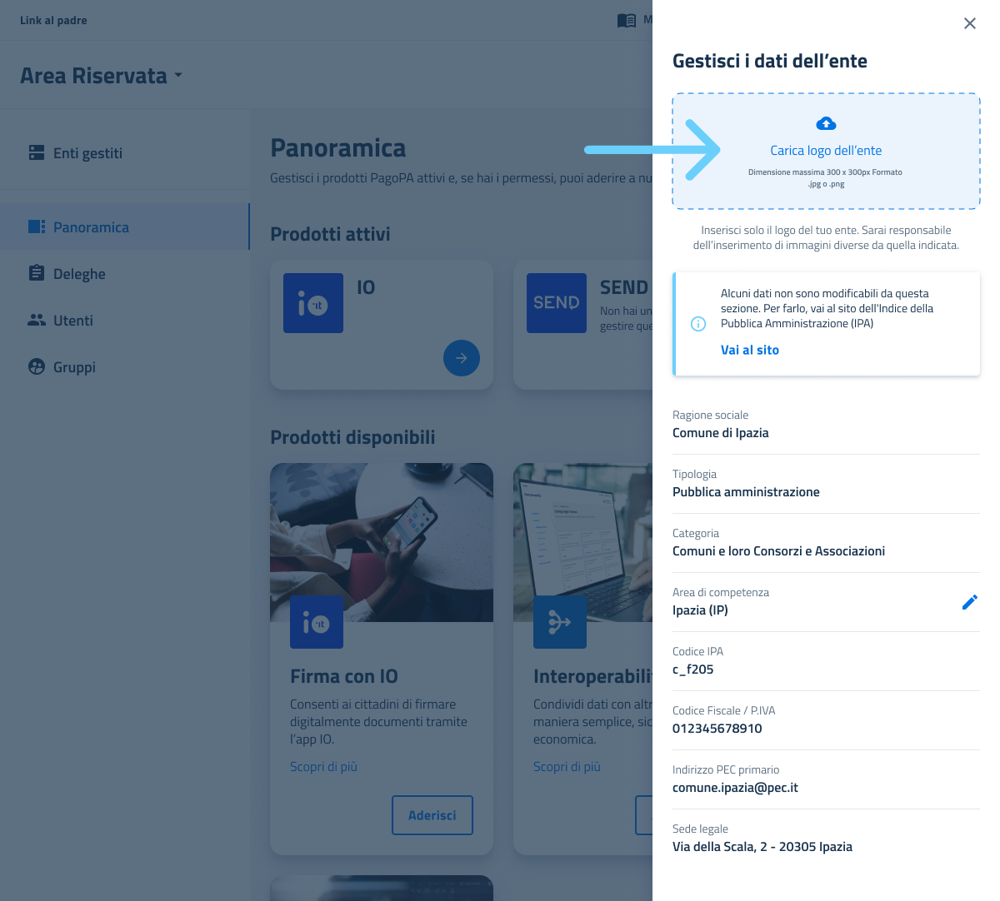

# Requisiti per il corretto caricamento dei loghi

## Obiettivo del documento

Questo documento definisce le **linee guida per il caricamento del logo** dell’ente sul portale Area Riservata, con l’obiettivo di **garantirne una resa chiara, professionale e conforme agli standard** richiesti. **Un logo di qualità assicura una comunicazione visiva efficace e contribuisce a confermare la riconoscibilità dell’ente.** Le specifiche tecniche fornite assicurano che il logo sia leggibile, riconoscibile e coerente con l’utilizzo digitale previsto. Il rispetto di questi requisiti è fondamentale affinché il logo, insieme alla documentazione allegata, **abbia validità legale e possa essere correttamente riconosciuto dal sistema.**

## Contesto

Su Area Riservata è possibile completare e **personalizzare il profilo** dell’ente inserendo una serie di informazioni, tra cui il logo.

<figure><figcaption>
Schermata di caricamento logo su Area Riservata
</figcaption></figure>

Il logo viene utilizzato sia all’interno della piattaforma Area Riservata e nel backoffice di SEND, sia nella generazione di documentazione ufficiale con valore legale, come ad esempio l’Avviso di Avvenuta Ricezione previsto da SEND.

<figure><figcaption>
Esempio di logo inserito su un Avviso di Avvenuta Ricezione
</figcaption></figure>

Per garantire che il logo comunichi in modo chiaro l’identità dell’ente e ne rafforzi la riconoscibilità, **di seguito sono riportate le indicazioni tecniche e di qualità necessarie.** Il rispetto di questi requisiti assicura una visualizzazione sempre leggibile e riconoscibile, evitando fraintendimenti e contribuendo a **distinguere la documentazione ufficiale da comunicazioni non affidabili o percepite come spam.**

## Requisiti tecnici del file

Assicurati che l’immagine che stai per caricare rispetti **TUTTI** i seguenti parametri:

* **Peso massimo:** 100 KB
* **Dimensioni:** 300 x 300 pixel
* **Formato:** `.png`&#x20;

## Requisiti di qualità

* **Sfondo bianco uniforme**
* Logo **centrato, nitido e facilmente leggibile**
* Immagine ad **alta definizione, senza sfocature o distorsioni**
* Il logo deve **occupare al meglio l’area disponibile (300x300 pixel), mantenendo sempre le proporzioni corrette.**

## Do & Don't

Di seguito sono riportati una serie di **esempi visivi** che mostrano chiaramente le **pratiche corrette e gli errori da evitare.**

| 🔴 Indicazione da evitare                                                                                                                                                                                                                                            | Don't                                                                                                                                        | Do                                                                                                                                             |
| -------------------------------------------------------------------------------------------------------------------------------------------------------------------------------------------------------------------------------------------------------------------- | -------------------------------------------------------------------------------------------------------------------------------------------- | ---------------------------------------------------------------------------------------------------------------------------------------------- |
| 
<strong>Sfondo colorato:</strong> 

l’uso di uno sfondo colorato può <strong>compromettere la leggibilità e la nitidezza</strong> del logo; per garantire la massima chiarezza è quindi consigliabile mantenere uno sfondo bianco uniforme.
       | 
<figure><figcaption>
Logo con sfondo
</figcaption></figure>
     | 
<figure><figcaption>
Logo senza sfondo
</figcaption></figure>
      |
| 
<strong>Bordature:</strong>

lo spazio disponibile è limitato; aggiungere bordi <strong>riduce</strong> ulteriormente <strong>l’area visiva utile</strong>, perciò è preferibile evitarli.
                                                        | 
<figure><figcaption>
Logo con bordo
</figcaption></figure>
      | 
<figure><figcaption>
Logo senza bordo
</figcaption></figure>
      |
| 
<strong>Logo eccessivamente piccolo:</strong> 

una dimensione ridotta <strong>compromette la leggibilità e il riconoscimento del logo</strong>; per assicurare una corretta visibilità, il logo deve rispettare le dimensioni adeguate (300x300 px).
 | 
<figure><figcaption>
Logo troppo piccolo
</figcaption></figure>
 | 
<figure><figcaption>
Logo 300x300 px
</figcaption></figure>
       |
| 
<strong>Testo piccolo illeggibile:</strong> 

un testo troppo piccolo <strong>rende difficile la lettura e compromette la comunicazione</strong>; è fondamentale utilizzare una dimensione del testo che garantisca chiarezza e leggibilità.
          | 
<figure><figcaption>
Testo illeggibile
</figcaption></figure>
   | 
<figure><figcaption>
Testo leggibile
</figcaption></figure>
       |
| 
<strong>Logo sbiadito:</strong>

un logo con colori sbiaditi <strong>perde impatto visivo e riconoscibilità</strong>; è importante utilizzare sempre versioni nitide e dai colori vividi per mantenere l’integrità dell’immagine.
                 | 
<figure><figcaption>
Logo sbiadito
</figcaption></figure>
       | 
<figure><figcaption>
Logo colorato
</figcaption></figure>
         |
| 
<strong>Logo sfocato:</strong>

un logo sfocato <strong>compromette la qualità visiva e rende difficile il riconoscimento</strong>; è essenziale utilizzare immagini nitide e ad alta definizione.
                                                | 
<figure><figcaption>
Logo sfocato
</figcaption></figure>
        | 
<figure><figcaption>
Logo nitido
</figcaption></figure>
           |
| 
<strong>Logo tagliato:</strong>

un logo parzialmente visibile <strong>riduce la chiarezza e la professionalità</strong>; è necessario assicurarsi che l’intero logo sia sempre completamente visibile e correttamente proporzionato.
             | 
<figure><figcaption>
Logo tagliato
</figcaption></figure>
       | 
<figure><figcaption>
Logo intero
</figcaption></figure>
           |
| 
<strong>Logo di qualità bassa:</strong>

un logo a bassa risoluzione <strong>compromette la nitidezza e la professionalità dell’immagine</strong>; è fondamentale utilizzare file ad alta qualità per garantire una corretta visualizzazione.
     | 
<figure><figcaption>
Logo pixelato
</figcaption></figure>
       | 
<figure><figcaption>
Logo di buona qualità
</figcaption></figure>
 |

| 🟡 Indicazioni sconsigliate                                                                                                                                                                                                                                                                                   | Don't                                                                                                                                               | Do                                                                                                                                                |
| ------------------------------------------------------------------------------------------------------------------------------------------------------------------------------------------------------------------------------------------------------------------------------------------------------------- | --------------------------------------------------------------------------------------------------------------------------------------------------- | ------------------------------------------------------------------------------------------------------------------------------------------------- |
| 
<strong>Logo piccolo, ma leggibile:</strong>

sebbene il logo mantenga la leggibilità, <strong>dimensioni troppo ridotte possono limitarne l’impatto visivo</strong>; è quindi consigliabile riempire l'intera area consigliata (300x300 px) per mantenere una dimensione equilibrata.
     | 
<figure><figcaption>
Logo piccolo ma visibile
</figcaption></figure>
   | 
<figure><figcaption>
Logo 300x300 px
</figcaption></figure>
          |
| 
<strong>Testo piccolo, ma leggibile:</strong>

 i testi all’interno di immagini di piccole dimensioni <strong>possono risultare difficili da leggere, soprattutto su schermi mobili</strong>; per questo, è preferibile utilizzare versioni del logo prive di scritte.
                         | 
<figure><figcaption>
Testo piccolo ma leggibile
</figcaption></figure>
 | 
<figure><figcaption>
Testo leggibile e nitido
</figcaption></figure>
 |
| 
<strong>Elementi decorativi superflui:</strong>

gli elementi grafici aggiuntivi <strong>possono distrarre e ridurre la chiarezza del logo</strong>; è consigliabile mantenere un design semplice e pulito per favorire il riconoscimento immediato.
                                       | 
<figure><figcaption>
Elementi superflui
</figcaption></figure>
         | 
<figure><figcaption>
Elementi essenziali
</figcaption></figure>
      |
| 
<strong>Logo schiacciato:</strong>

una distorsione delle proporzioni <strong>compromette l’aspetto e la riconoscibilità del logo</strong>; è importante mantenere sempre le proporzioni originali per garantire un’immagine corretta e professionale.
                                     | 
<figure><figcaption>
Logo schiacciato
</figcaption></figure>
           | 
<figure><figcaption>
Logo proporzionato
</figcaption></figure>
       |
| 
<strong>Logo allungato:</strong>

modificare le proporzioni allungando il logo <strong>altera la sua immagine e ne riduce la riconoscibilità</strong>; è fondamentale rispettare le proporzioni originali per preservare l’integrità visiva.
                                               | 
<figure><figcaption>
Logo allungato
</figcaption></figure>
             | 
<figure><figcaption>
Logo proporzionato
</figcaption></figure>
       |
| 
<strong>Logo ombreggiato:</strong>

le ombreggiature possono <strong>appesantire il logo e compromettere la sua chiarezza, specialmente su sfondi chiari</strong>; è preferibile mantenere un design pulito e senza effetti aggiuntivi.
                                                    | 
<figure><figcaption>
Logo con ombreggiatura
</figcaption></figure>
     | 
<figure><figcaption>
Logo senza ombreggiatura
</figcaption></figure>
 |
| 
<strong>Logo in bianco e nero:</strong>

sebbene l’uso del logo in bianco e nero sia talvolta accettabile, <strong>mantenere la versione a colori favorisce una maggiore riconoscibilità e un impatto visivo più forte, contribuendo a comunicare al meglio l’identità dell’ente</strong>.
 | 
<figure><figcaption>
Logo in bianco e nero
</figcaption></figure>
      | 
<figure><figcaption>
Logo colorato
</figcaption></figure>
            |
