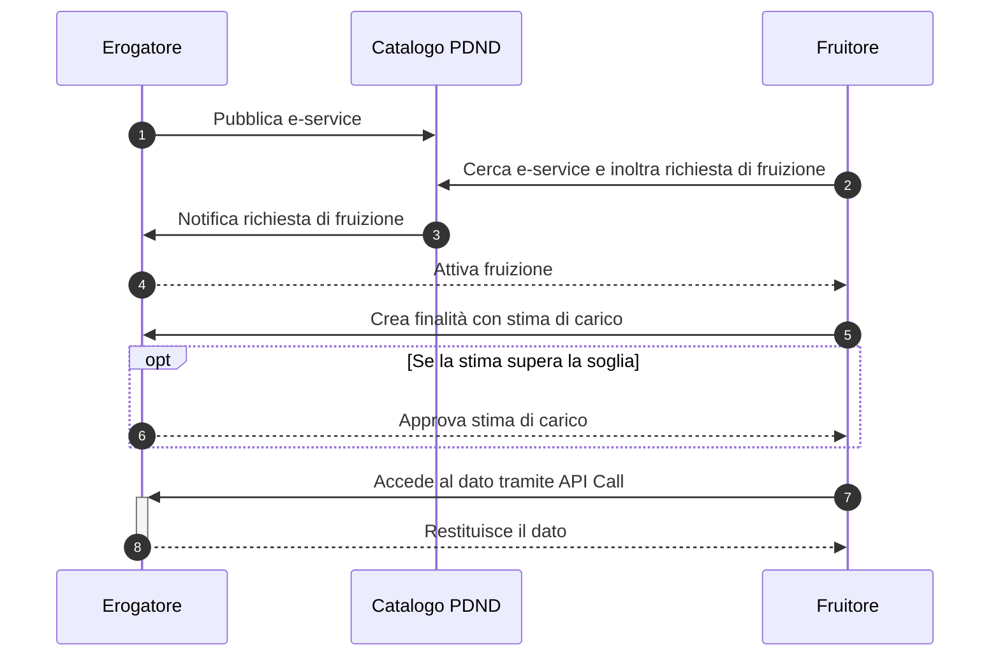

# Come funziona: il Flusso Operativo

L'interazione tra enti sulla piattaforma si basa su un modello di cooperazione standardizzato, che garantisce sicurezza, tracciabilità e aderenza alla normativa. Il processo è orchestrato dalla piattaforma e si fonda su due ruoli principali.

### I Ruoli Chiave: Erogatore e Fruitore

Tutti gli enti che aderiscono a PDND Interoperabilità possono agire, a seconda delle necessità, come:

* **Erogatore**: Un ente che possiede e gestisce una o più banche dati di interesse nazionale e che, in conformità con la normativa, espone i propri servizi digitali (e-service) sul catalogo della piattaforma per renderli accessibili ad altri enti.
* **Fruitore**: Un ente che, per svolgere un proprio compito istituzionale, necessita di accedere ai dati resi disponibili da un Erogatore. Il Fruitore utilizza la piattaforma per trovare i servizi di cui ha bisogno e richiedere l'autorizzazione all'accesso.

### Il Flusso di Interazione End-to-End

Il diagramma seguente illustra i passaggi fondamentali di un tipico flusso di interazione tra un Erogatore e un Fruitore.



```mermaid
```

Di seguito è riportata la spiegazione di ogni passaggio del flusso:

1. **Pubblicazione dell'e-service**: L'Erogatore descrive il proprio servizio (API) nel catalogo di PDND Interoperabilità, specificando le modalità di accesso, i dati offerti e le policy di utilizzo.
2. **Richiesta di fruizione**: Il Fruitore cerca nel catalogo il servizio di cui ha bisogno e invia una richiesta di fruizione, specificando per quale motivo necessita di accedere a quei dati.
3. **Notifica all'Erogatore**: La piattaforma notifica all'Erogatore la ricezione di una nuova richiesta.
4. **Attivazione della fruizione**: L'Erogatore valuta la richiesta e, se la approva, autorizza il Fruitore ad accedere al servizio.
5. **Creazione della finalità**: Il Fruitore crea una "finalità", un oggetto che lega la sua richiesta a uno scopo specifico e dichiara una stima del numero di chiamate API che prevede di effettuare.
6. **Approvazione della stima (opzionale)**: Se la stima di carico del Fruitore supera le soglie definite dall'Erogatore, quest'ultimo deve approvarla esplicitamente.
7. **Accesso al dato (API Call)**: Il Fruitore è finalmente abilitato a richiamare le API dell'Erogatore per ottenere il dato richiesto, autenticandosi tramite un token di sicurezza (voucher) fornito dalla piattaforma.
8. **Restituzione del dato**: L'Erogatore, dopo aver validato il voucher, eroga il dato al Fruitore.
