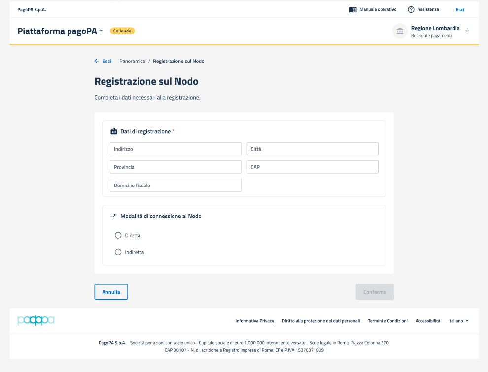

# Annulla richiesta in corso

Dopo aver inviato una richiesta di attivazione pacchetto al PSP (vedi sezione [Attiva pacchetto](attiva-pacchetto.md)), accedendo al dettaglio del pacchetto (vedi sezione [Visualizza dettaglio](visualizza-dettaglio.md)) è possibile annullare la richiesta appena effettuata solo nel caso in cui non sia stata ancora accettata da parte del PSP.

<figure><figcaption></figcaption></figure>

Cliccando sul tasto `"Annulla richiesta"` presente nella schermata, viene mostrato all'utente un messaggio dove può confermare o meno la propria decisione di annullare la richiesta di attivazione per quel pacchetto.

<figure><figcaption></figcaption></figure>

Cliccando sul tasto `"Conferma"`, viene annullata la richiesta di attivazione.
