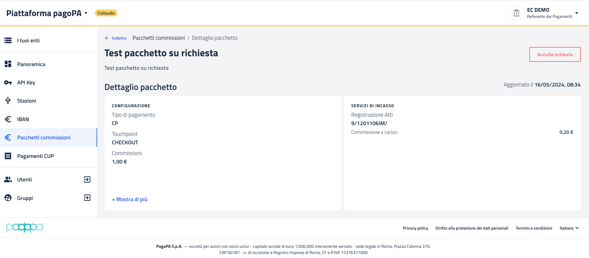

# Visualizza dettaglio

Accedendo ad uno specifico pacchetto (vedi sezione [Visualizzazione pacchetti "Su richiesta"](../visualizzazione-pacchetti-su-richiesta/)), è possibile visualizzarne il dettaglio.

<figure><figcaption></figcaption></figure>

Cliccando sulle due etichette `"+ Mostra di più"` è possibile espandere il dettaglio.

<figure><figcaption></figcaption></figure>

<figure><figcaption></figcaption></figure>
