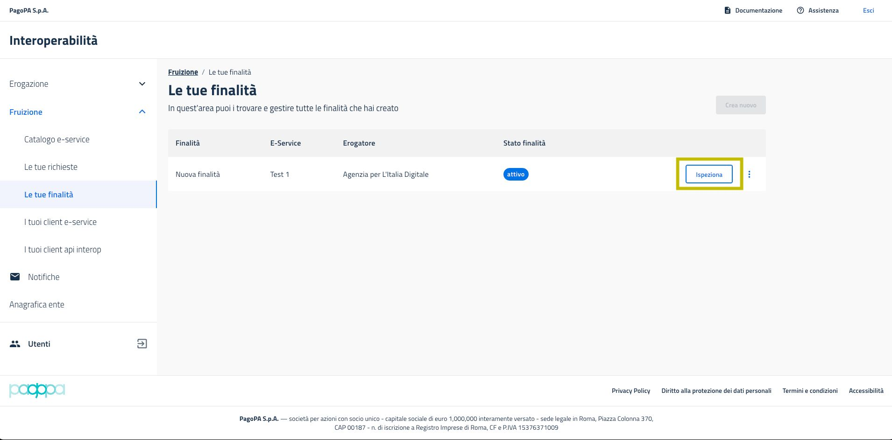

# Cos'è e come si crea una finalità in PDND

Per recuperare le informazioni dall'API dell'erogatore, per prima cosa un fruitore deve inoltrare e vedersi attivata una **richiesta di fruizione per un determinato e-service**. A questo punto, per poterlo utilizzare, deve creare almeno una **finalità** da associare a questo e-service.

Cos'è una finalità? Come indicato nel glossario, il ruolo della finalità è _"dettagliare le sue ragioni e modalità di accesso alle informazioni in possesso dell'erogatore"_. Tramite una finalità è possibile associare uno o più client sui quali verrà caricato il materiale crittografico necessario a ottenere un voucher valido da spendere presso l'erogatore. L'erogatore riceverà sempre indicazione della finalità per la quale il fruitore sta facendo una determinata richiesta di dati.

### Come si crea una finalità

Un fruitore può creare una nuova finalità andando su _Fruizione > Le tue finalità_ e cliccando _Aggiungi_.

<figure><figcaption></figcaption></figure>

Una finalità è composta essenzialmente da alcune informazioni generali, dalla stima di carico legata all'impiego delle risorse dell'erogatore, dall'analisi del rischio rispetto all'utilizzo dei dati e dai client associati. Una volta pubblicata la finalità, le informazioni generali e l'analisi del rischio non sono modificabili, mentre sarà possibile aggiornare i client utilizzati e la stima di carico.

Nel momento in cui si crea la finalità, sarà necessario indicare l'e-service per il quale la finalità sarà attiva. Dall'elenco, si potranno scegliere solo gli e-service per i quali l'ente ha una richiesta di fruizione attiva.

<figure><figcaption></figcaption></figure>

Sarà sempre possibile mantenere la finalità in bozza o pubblicarla. Una volta pubblicata, diventerà immediatamente attiva se l'utilizzo delle risorse stimato dal fruitore è inferiore a tutte le soglie stabilite dell'erogatore. In caso contrario, dovrà invece essere approvata manualmente dall'erogatore. Per maggiori informazioni sul meccanismo di stima del carico, c'è una [sezione dedicata](https://docs.pagopa.it/interoperabilita-1/manuale-operativo/finalita#aggiornare-la-stima-di-carico-di-una-finalita).

Per facilitare il compito dei fruitori rispetto alla compilazione dell'analisi del rischio, nella quale si indica "la finalità e le modalità del trattamento dei dati dei quali si viene in possesso", PDND Interoperabilità mette a disposizione un sistema di templating. In sostanza, sarà possibile esplorare le finalità sottoscritte da altri fruitori o i casi d'uso più comuni indicati dagli erogatori e creare una nuova richiesta di fruizione a partire da una già presente nell'archivio della piattaforma.

### Associare e rimuovere i client da una finalità

È sempre possibile associare e rimuovere i client legati ad una finalità, anche dopo la sua pubblicazione. Se si intende modificare in un secondo momento uno o più client associati, il fruitore può andare su _Fruizione > Le mie finalità_, trovare la finalità desiderata e cliccare su _Ispeziona_. Nella tab _Client associati_ sarà possibile operare sui client.

<figure><figcaption></figcaption></figure>

Le mie finalità --> Ispeziona

<figure><figcaption></figcaption></figure>

Tab "Client associati"

Una volta rimosso un client da una finalità, non sarà più possibile utilizzare le chiavi in esso contenute per ottenere voucher validi da spendere verso l'API dell'erogatore dell'e-service per quella specifica finalità.

Per fare un esempio, se un client è associato alla finalità A e alla finalità B, entrambe a loro volta associate ad uno stesso e-service, se io rimuovo il client solo dalla finalità A, sarà possibile continuare ad ottenere voucher validi per l'e-service attraverso la finalità B.

### Aggiornare la stima di carico di una finalità

Se la motivazione per accedere ad un e-service rimane la stessa ma cambiano le necessità in termini di richieste API al giorno stimate, è possibile aggiornare la stima di carico per quella finalità. Se il risultato dell'aggiornamento è un valore sotto le soglie impostate dall'erogatore, verrà aggiornata automaticamente e sarà attiva da subito. In caso contrario, la finalità mostrerà come stato "In attesa di approvazione". Sarà facoltà esclusiva dell'erogatore decidere i tempi e le modalità di approvazione in base al carico della propria infrastruttura e ai propri processi interni.

Per aggiornare la stima di carico, andare su _Fruizione > Le mie finalità_, cliccare sui tre pallini della finalità di interesse e selezionare l'azione _Aggiorna stima di carico_. Inserire la nuova stima di carico nella modale che viene aperta.

### Sospendere o riattivare una finalità

In qualsiasi momento il fruitore può unilateralmente sospendere una propria finalità. Il risultato sarà che le chiavi pubbliche in uso per quella finalità non permetteranno più di ottenere un voucher valido da spendere presso l'API dell'erogatore. Inoltre, verrà alleggerito il carico stimato sull'e-service dell'erogatore di una quota pari alla stima di carico della finalità appena sospesa.

Per sospendere una finalità, andare su _Fruizione > Le mie finalità_, cliccare sui tre pallini della finalità di interesse e selezionare l'azione _Sospendi_ o _Attiva_.

Quando una finalità viene sospesa dal fruitore, modificata e avrà così come stato "In attesa di approvazione", diventerà automaticamente attiva una volta che l'erogatore avrà approvato la nuova modifica, senza tornare allo stato di sospensione in cui si trovata prima della modifica.

### Archiviare una finalità

Se non sussiste più la necessità di accedere ad un e-service per una specifica finalità, è possibile archiviarla. Quest'azione è irreversibile, tuttavia sarà sempre possibile creare nuove finalità, anche in tutto e per tutto uguali a quelle archiviate.

Il risultato dell'archiviazione sarà un alleggerimento del carico stimato sull'erogatore pari alla stima di carico prevista per quella finalità. Il fruitore potrà quindi sfruttare quel carico per eventuali altre finalità sullo stesso e-service, a patto che non si sia già superata la soglia globale dell'erogatore (ottenuta sommando tutti i carichi di tutte le finalità di tutti i fruitori).

L'archiviazione di una finalità fa sì che le chiavi che erano state depositate sui client associati non siano più utilizzabili per ottenere voucher presso l'erogatore per quella finalità. Continueranno comunque a funzionare per tutte le altre finalità alle quali sono associati.

Per archiviare una finalità, andare su _Fruizione > Le mie finalità_, cliccare sui tre pallini della finalità di interesse e selezionare l'azione _Archivia_.

Ricordati di controllare periodicamente le tue finalità, e di archiviare quelle che non usi più. Questo piccolo accorgimento garantirà una migliore qualità di servizio per tutti.

### Eliminare una finalità

È possibile eliminare una finalità solamente quando questa è in bozza. Per eliminare una finalità in bozza, andare su _Fruizione > Le mie finalità_, cliccare sui tre pallini della finalità di interesse e selezionare l'azione _Elimina_.
