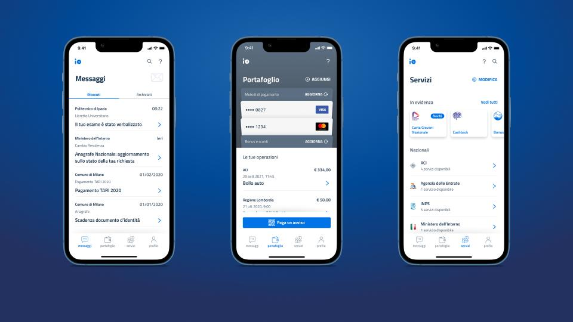

# What is IO and what is its objective

The IO app was created by the Presidency of the Council of Ministers (Italy) – as defined in [art. 64-bis](https://www.normattiva.it/uri-res/N2Ls?urn:nir:stato:decreto.legislativo:2005-03-07;82~art64bis) of the Digital Administration Code – in order to create a **single point of telematic access** to all the digital and digitalized services provided by institutions.

IO is therefore the **main digital channel** that all local and national institutions use to offer their services to citizens in a simple and customized manner, directly on their smartphone or tablet.

The objective of the app is to **facilitate and improve the relationship between citizens and the Public Administration**, by focusing on people and overcoming complexities thanks to an interface that makes it possible to access all public services.

Therefore IO must be considered a **platform** that provides institutions with a series of functions they can use to offer their services, such as:

* messages;
* reminders;
* payments;
* services and external links.

IO is a project that is **continuously evolving**: its functions and integration with other PagoPA S.p.A products and services will **increase over the years** to meet the new needs of institutions in a structured manner, without making the app more complex with customized developments.

 **Citizens and users**

“Citizens" and "users" are anyone who needs to interact with the IO app to exercise a right or fulfill a duty. IO does not only address Italian citizens, but any person who resides in Italy and has an Electronic Identity Card (CIE) or a SPID (Public Digital Identity System) identity. 

### Why should an institution interact with IO?  

In addition to being legally required, interacting with IO makes it possible to:

* **promote and increase the visibility of offered services**: An objective of IO is to collect all the functions that institutions need in a single channel.
* **reduce development and communication costs:** institutions save on costs of implementing technology and on costs for sending communications to citizens.
* **reach everyone**: to contact citizens, the institutions only need their Fiscal Code. Thanks to the wide use of IO, it is highly probable that the recipients are already using the app.
* **reduce collection times**: the possibility to pay directly in-app reduces collection times and costs.

 **Strong authentication**

The certainty to send communications, payment notices and reminders exactly to the person who receives the service is guarantee by the **authentication process via SPID or CIE**.  

During authentication, the Fiscal Code used to univocally identify the user is securely acquired. If recipients have not yet activated the app on their device, the communication will not be forwarded and the institution can reach them using traditional channels. 

### What IO is not and will not be?

❌ **An autonomous document storage system**

On IO, the institutions that sign a Premium contract can send messages with attachments - but the app is not and will not be a substitute storage system pursuant to regulations.

❌ **A project dedicated to companies, with the exception of single-member companies**  

The app provides services to citizens regarding all aspects of their life - family, education, work - if they can be traced to the fiscal code of the physical person. Currently it does not provide services to companies. 

### How can IO be downloaded?

Here are the links for downloading the app and using it as a user:

[**Download the app for iOS -->** ](https://apps.apple.com/it/app/io/id1501681835)

[**Download the app for Android -->**](https://play.google.com/store/apps/details?id=it.pagopa.io.app)