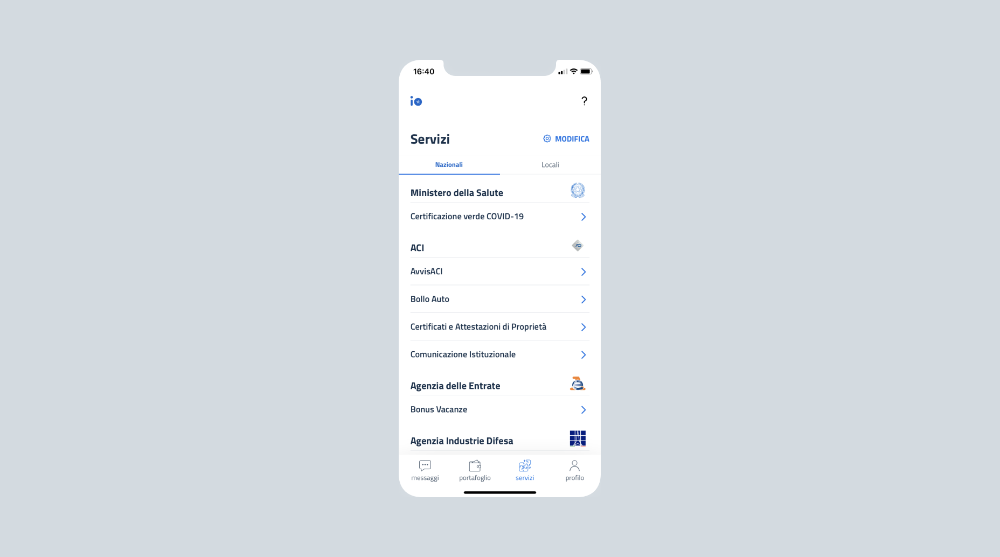

# Which institutions can provides services on IO

The institutions that can provide their services on IO are identified by [article 2, paragraph 2](https://docs.italia.it/italia/piano-triennale-ict/codice-amministrazione-digitale-docs/it/v2018-09-28/_rst/capo1_sezione1_art2.html) of the Digital Administration Code (CAD). The types of institutions defined by the CAD are:

> a) [...] **public administrations** as specified in article 1, paragraph 2 of legislative decree dated 30 March 2001, no. 165, with respect to the division of responsibilities specified in article 117 of the constitution, including the port authorities as well as independent guarantee, control and regulatory administrative authorities;
> 
> b) [...] **public service operators**, including listed companies, in relation to services of public interest;
> 
> c) [...] **state-owned companies**, as defined in legislative decree dated 19 August 2016, no. 175, excluding the listed companies specified in article 2, paragraph 1, letter p), of the same decree that do not fall into the category specified in letter b).


Institutions other than those identified by article 2, paragraph 2 of the CAD (Digital Administration Code) can also make their service available with IO after stipulating an agreement with PagoPA S.p.A. and in compliance with the [IO guidelines](https://trasparenza.agid.gov.it/moduli/downloadFile.php?file=oggetto_allegati/213121604430O__OLG+Punto+accesso+telematico+servizi+PA_3.11.2021.pdf).


Institutions can work with the app autonomously or be supported by:

* one or more **technological partner,** that is third parties that manage the technical dialog with IO in the name and on behalf of the participating institutions;
* an **aggregator**, that is an institute that acts as an aggregator of other public bodies, for example Regions or Unions of Municipalities. 

### Public bodies

Public Administrations (PA) is the largest type of institution in the app. In the IO Services section, Public Administrations and other public bodies are divided between “national” and “local”. 

#### **National public bodies**

A national public administration is a large and complex institution. To make it easier to be included on IO, a contract must be signed also with the individual **Homogeneous Organizational Areas (AOO)** and the **Operational Units (UO)** that comprise a central body, if it has its own legal representative.

#### **Local public bodies**

A local public administration often does not have all the tools for managing platforms like IO independently. This manual is meant to provide them with more support for the creation and management of app content.

### Technological partners

Institutions can perform all the implementation activities independently, or nominate one or more technological partners. 

### Aggregators and aggregates

Institutions can join IO as **aggregators of other service providers**. The aggregation relationship among the service providers is regulated by agreements (including the cooperation agreements specified in art. 15 of Law 241/1990) and by the administrative documents necessary to provide the aggregator with the powers and attributions necessary to sign the standard contract on behalf and to the benefit of the aggregated parties.

In many cases, the aggregators are an optimal solution for centralizing platform management, which otherwise an individual institution could not manage on its own. 


**Example of** **an aggregator**

A region joins IO for all the local institutions in the territory of reference, making the regional in-house company available for managing their technological integration.


The aggregators must list all the institutions that they represent for the purposes of IO in the relative **attachment to the contract**. They must indicate the complete list of the institutions in this attachment, entering the following data for each of them:

* name;
* address;
* Tax code or VAT no.;
* [IPA (Public Administration Index) code](https://www.indicepa.gov.it/ipa-portale/consultazione/indirizzo-sede/ricerca-ente).

Any change to the list of aggregated institutions **must be promptly communicated** to PagoPA S.p.A. [**How to contact us -->** ](../appendix/contacts.md)


**Help for technological partners**

Technological partners and aggregators often find it difficult to **manage the large number of institutions** they are working for. This manual is meant to provide them with more support and share good practices for the creation and management of services.
