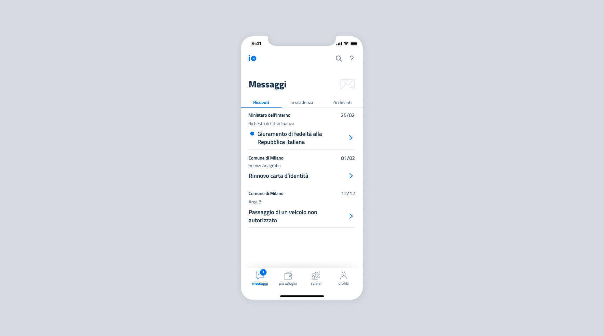

# Send messages

The messages institutions send with IO are always **personal communications**, as they are directed to a specific user. 

The institution can query the back end with respect to the fiscal code it has available and to which it has something personal to communicate. If the fiscal code is present among the app users and if the service is active, the institution is authorized to proceed and send its communication. 

Therefore **it is not permitted to send mass communications** to all IO users or to **send messages to users who are not direct recipients** of the provided services.

## Types of messages

The messages that are sent on IO can be of different types and enriched depending on:

* The type of content to be conveyed: _informative, regarding payments or due dates;_
* What type of contract has been signed by the institution: _standard or Premium;_
* How the content of the message is managed: _static or from remote._

### Content of messages

In general, the messages can be:

* **informational messages**: text messages that can concern an update related, for example, to a new available document or a request presented to the institution;
* **messages that indicate a payment**: messages that contain information about an amount due, with a reminder of the payment deadline and the “see notification” button to proceed with the payment. For these types of messages, the fields related to the `payment_data` (notice code, amount to be paid, due date) must be included;
* **messages that indicate a deadline**: messages that contain a deadline or a reminder (a reminder for the expiration date of a document to be renewed or the deadline for signing up for a service). For these types of messages, the field `due_date`must be used in the message payload.

### Standard and Premium messages

Institutions can either make use of standard messages or sign a **new IO app contract that allows them to take advantage of Premium functions**.

Compared to Standard messages, Premium messages offer these additional **functions**:

* they can contain **attachments**;
* the institution can always check if they were sent, received or **read**;
* if there is a payment notice, the institution can check at any time if they were **paid**;
* if the citizen provides consent, they can generate push notifications that **remind the citizen that the message was not yet read**;
* if the citizen provides consent, they can generate push notifications that **remind the citizen that the message was read but the payment was not made**.

At the time of sending, institutions that have signed up for the Premium program can indicate, for each message to be sent, whether it is Premium - and therefore paid for, according to the conditions signed - or standard.

Here is a summary of the functions and types of messages to which they apply.

| Function| Basic messages| Premium messages|
|----------|----------|----------|
| Text that contains information| ✅| ✅|
| Payment notice in the message| ✅| ✅|
| Messages that contain a deadline or a reminder| ✅| ✅|
| Attachments to a message| ❌| ✅|
| Check that the message was sent, received or read| ❌| ✅|
| Check that the payment was made for the payment notice in the message| ❌| ✅|
| Option to send push notifications that remind that a message was not read| ❌| ✅|
| Option to send push notifications that remind that a payment was not made| ❌| ✅|

### Messages with remote content

In addition to the categorizations previously described, messages can be identified in two types, **according to the content management mode** provided by your Organization:

* **Traditional**, i.e. messages whose content is invariable over time and defined at the time they are sent;
* **Remote-Content**, i.e. messages whose content is not persisted on IO but provided directly by your systems at the time of their use by the recipient. Messages with remote content are intended in particular for communications that send sensitive information. 

You can find detailed information on remote content messages in the [dedicated section of the IO Technical Guide](https://app.gitbook.com/s/sUBZStlCQZzLI6ZesbND/funzionalita/inviare-un-messaggio/inviare-un-messaggio-a-contenuto-remoto).

 **Be careful with sensitive information**

**In case of sensitive information to be conveyed in IO messages, you can use remote content messages.** Do not include personal information or sensitive data in the title of a traditional message and make sure that the message contains only data that is strictly necessary.  Find out more in the section dedicated to [Sensitive information](../../the-services-on-io/sensitive-information.md). 