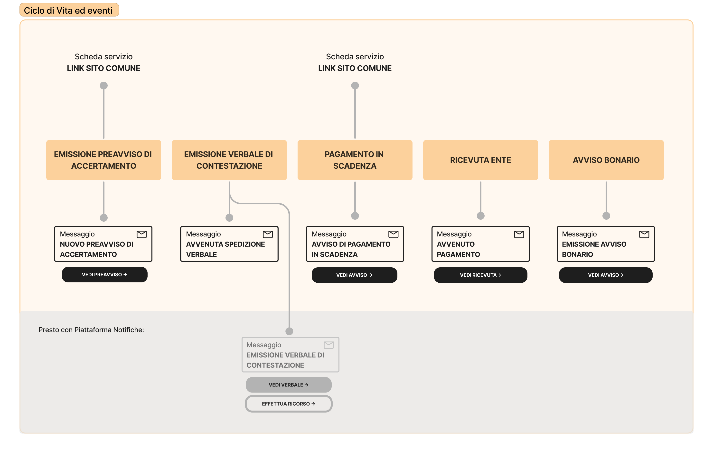

# Multe per violazione codice della strada

Erogare il servizio "Multe per violazioni al Codice della Strada" tramite IO permette agli enti di:

* **aggiornare in tempo reale** i cittadini e quindi consentirgli di agire con tempestività sul pagamento di violazioni al codice della strada;
* **ridurre i tempi** e i costi del processo di notifica e consegna della contravvenzione;
* **velocizzare i tempi** di riscossione delle multe;
* **informare sugli avvisi in scadenza**, riducendo la possibilità dei cittadini di incorrere in sanzioni aggiuntive.

[**Scopri tutti i benefici di integrarsi con IO →**](../../cose-io-e-qual-e-il-suo-obiettivo.md#perche-integrarsi-con-io)

### Scheda servizio e attributi

| **Nome servizio**            | Multe per violazioni al Codice della Strada                                                                                                                                                                                                                                                                                                                                                                                                                                                                                                                                                     |
| ---------------------------- | ----------------------------------------------------------------------------------------------------------------------------------------------------------------------------------------------------------------------------------------------------------------------------------------------------------------------------------------------------------------------------------------------------------------------------------------------------------------------------------------------------------------------------------------------------------------------------------------------- |
| **Argomento**                | Mobilità e trasporti                                                                                                                                                                                                                                                                                                                                                                                                                                                                                                                                                                            |
| **Descrizione del servizio** | 
Questo servizio riguarda le multe per violazioni al Codice della Strada per i veicoli intestati a te.

Tramite IO potrai:
<ul><li>ricevere il preavviso di accertamento e pagarlo su IO;</li><li>se non hai pagato il preavviso entro 15 giorni dalla sua ricezione, ricevere un messaggio che ti informa che il verbale di contestazione è stato inviato al tuo indirizzo di residenza;</li><li>ricevere conferma del pagamento;</li><li>ricevere un messaggio che ti informa che il pagamento è in scadenza;</li><li>ricevere un messaggio in caso di mancato pagamento.</li></ul> |

### **Ciclo di vita del servizio**

<figure><figcaption>
<strong>Ciclo di vita ed eventi del servizio multe per violazione del Codice della Strada</strong>
</figcaption></figure>

### Messaggio del servizio


**Il servizio ideale**

L'insieme di tutti i messaggi rappresenta il servizio ideale. L'ente che intende erogare questo servizio, può valutare quali e quanti messaggi inviare, in base alle proprie possibilità di integrazione. L'obiettivo finale rimane quello di inviarli tutti, rilasciando versioni del servizio sempre più complete.


Emissione preavviso di accertamento

**🖋 Titolo del messaggio:** Preavviso di accertamento

🗒 **Testo del messaggio**: Il `<gg/mm/aaaa>` alle `<hh:mm>` in `<indirizzo>`, la persona alla guida del veicolo targato `<numero targa>` ha commesso queste violazioni:

**• `<tipologia di violazione>` - art. `<numero>`**

**Accertamento numero**: `<numero accertamento>`

\[Vedi accertamento]\(link)

**Da pagare**: xx,yy €, già scontato del 30% se paghi entro il `<gg/mm/aaaa>`

**Cosa succede se non pago entro il `<gg/mm/aa>`?** Riceverai il verbale di contravvenzione al tuo indirizzo di residenza e ti verranno addebitate le spese di notifica.

**🪄 Pulsante**: Vedi avviso

**---**

**Destinatari**: Tutti i cittadini residenti nell'area geografica di azione del servizio, che hanno l'app IO e che hanno effettuato una violazione del Codice della Strada

**Quando inviarlo**: Quando è commessa la violazione

**User story**: <mark style="color:purple;">Come cittadino voglio ricevere notifica immediata della violazione commessa</mark>

<mark style="color:purple;">💡</mark> L'accertamento può essere veicolato tramite link oppure tramite [allegato](../../che-cosa-puo-fare-un-servizio-su-io/inviare-messaggi/messaggi-con-allegati-premium.md) al messaggio, se l'ente è iscritto ai servizi premium.

Avvenuta spedizione del verbale

**🖋 Titolo del messaggio:** Spedizione del verbale

🗒 **Testo del messaggio**: Abbiamo inviato al tuo indirizzo di residenza il verbale di contravvenzione `<numero verbale>`. Lo riceverai tramite raccomandata nei prossimi giorni.

L’importo del verbale comprenderà le spese di notifica. Per maggiori informazioni, visita \[questo sito]\(URL).

**🪄 Pulsante**: n/a

**---**

**Destinatari**: Tutti i cittadini che hanno ricevuto un avviso di accertamento e non lo hanno pagato

**Quando inviarlo**: Quando è scaduto

**User story**: <mark style="color:purple;">Come cittadino voglio ricevere notifica immediata della violazione commessa</mark>

Pagamento in scadenza

**🖋 Titolo del messaggio:** Pagamento in scadenza

🗒 **Testo del messaggio**: Hai tempo fino al `<gg/mm/aa>` per pagare il verbale di contravvenzione numero `<numero verbale>`. Pagalo subito per evitare costi aggiuntivi.

**🪄 Pulsante**: n/a

**---**

**Destinatari**: Tutti i cittadini residenti nell'area geografica di azione del servizio, che hanno l'app IO e che hanno effettuato una violazione del Codice della Strada

**Quando inviarlo**: Quando la scadenza del verbale è imminente

**User story**: <mark style="color:purple;">Come cittadino voglio ricevere un promemoria per i pagamenti in scadenza</mark>

Ricevuta avvenuto pagamento

**🖋 Titolo del messaggio:** Conferma del pagamento

🗒 **Testo del messaggio**: Ti confermiamo che il `<gg/mm/aaaa>` abbiamo ricevuto un pagamento relativo al preavviso di accertamento `<numero preavviso>` / verbale di contravvenzione `<numero verbale>`.

**🪄 Pulsante**: Vedi ricevuta

**---**

**Destinatari**: Tutti i cittadini che hanno effettuato un pagamento a fronte di un verbale ricevuto

**Quando inviarlo**: Quando è stato effettuato un pagamento a fronte di un verbale ricevuto

**User story**: <mark style="color:purple;">Come cittadino voglio ricevere notifica immediata della riuscita del mio pagamento</mark>

### In arrivo: Piattaforma Notifiche


**Cosa potrò fare con Piattaforma Notifiche?**

IO sarà presto integrata con il nuovo servizio di Piattaforma Notifiche per permettere l'invio di notifiche a valore legale come i verbali di contestazione. \\

[**Scopri di più su Piattaforma Notifiche →**](https://www.pagopa.it/it/prodotti-e-servizi/piattaforma-notifiche-digitali)

Qui riportiamo alcuni esempi di messaggi che sarà possibile implementare con la futura integrazione di Piattaforma Notifiche:

Emissione di un verbale di contestazione

**User story**: Come cittadino voglio sapere quando il verbale è stato emesso

Avviso bonario

**User story**: Come cittadino voglio avere la possibilità di ricevere un avviso bonario prima di incorrere in sanzioni aggiuntive

Conferma di presentazione ricorso

**User story**: Come cittadino voglio ricevere notifica della corretta ricezione del mio ricorso

<mark style="color:purple;">ℹ️</mark> Questo messaggio è in capo all'ente di riferimento e non al Comune

Invalidazione presentazione ricorso

**User story**: Come cittadino voglio sapere perché il mio ricorso non è stato correttamente presentato

<mark style="color:purple;">ℹ️</mark> Questo messaggio è in capo all'ente di riferimento e non al Comune

Esito ricorso e aggiornamento verbale

**User story**: Come cittadino voglio ricevere notifica dell’esito del mio ricorso

<mark style="color:purple;">ℹ️</mark> Questo messaggio è in capo all'ente di riferimento e non al Comune



Il modello delle **multe per violazione al Codice della Strada** è connesso con quello di [**Rimozione veicoli**](rimozione-veicoli.md)**,** secondo il seguente ciclo di vita:

<figure><figcaption>
<strong>Ciclo di vita ed eventi del servizio multe per violazione al Codice della Strada e rimozione veicoli</strong>
</figcaption></figure>


**Un modello da personalizzare**

Le procedure di questo servizio variano molto da ente a ente. Consigliamo di utilizzare i testi dei messaggi come un punto di partenza e di aggiungere ulteriori informazioni.

Puoi copiare i testi dei messaggi da personalizzare da [questo documento](https://docs.google.com/spreadsheets/d/1wMW1LqkX8N3e9EFb5jEDwMNNSz17Rt3ybU9abafbrPc/edit#gid=538647580).

