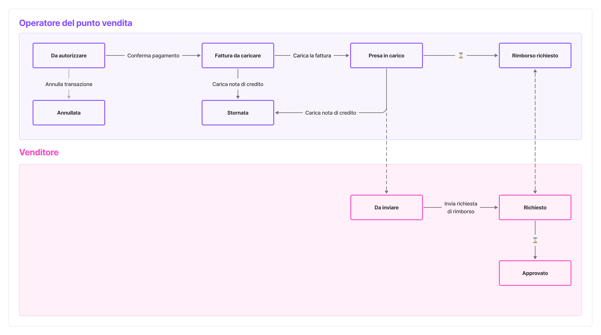

# Stati delle transazioni

Il _Portale Esercenti_ utilizza diversi stati per identificare le operazioni.

Di seguito è riportata la definizione degli stati principali che una transazione può assumere nel suo ciclo di vita. A seconda del ruolo dell'utente, la transazione avrà uno stato che spiega qual è l'azione richiesta da compiere, se prevista.

<figure><figcaption>
Lo schema riepiloga il passaggio tra i vari stati di una transazione.
</figcaption></figure>

## Vista degli stati per l'Operatore del punto vendita

<table data-full-width="false"><thead><tr><th width="151.7109375">Stato</th><th>Descrizione</th></tr></thead><tbody><tr><td><strong>Da autorizzare</strong></td><td>La transazione è stata pre-autorizzata: l'Operatore del punto vendita deve confermare che il pagamento si sia concluso con successo o annullarlo.  L'operatore può anche scaricare e stampare un documento di pre-autorizzazione, per facilitare il pagamento in cassa.</td></tr><tr><td><strong>Annullata</strong></td><td>
L'Operatore del punto vendita ha annullato la transazione prima della conferma del pagamento.

Il buono sconto è stato rilasciato e torna immediatamente disponibile per il cittadino (potrebbero essere necessari fino a 5 minuti se il buono proviene dall'app IO).
</td></tr><tr><td><strong>Fattura da caricare</strong></td><td>
L'operatore del punto vendita deve caricare la fattura relativa all'acquisto. In alternativa, può effettuare uno storno.

In caso di storno, l'Operatore del punto vendita deve caricare la relativa nota di credito.
</td></tr><tr><td><strong>Stornata</strong></td><td>
La transazione è stata stornata.

A differenza dello stato "Annullata", in caso di storno il buono non è più riutilizzabile e il cittadino, se ne desidera un altro, deve effettuare una nuova richiesta d'adesione.
</td></tr><tr><td><strong>Presa in carico</strong></td><td>L'Operatore del punto vendita ha completato i compiti a suo carico. A questo punto il processo passa nelle mani del Venditore, il quale deve approvare la richiesta di rimborso.</td></tr><tr><td><strong>Rimborso richiesto</strong></td><td>Il Venditore ha inviato la richiesta di rimborso, che verrà gestita da Invitalia S.p.A.</td></tr></tbody></table>

## Vista degli stati per il Venditore

<table data-full-width="false"><thead><tr><th width="151.45703125">Stato</th><th>Descrizione</th></tr></thead><tbody><tr><td><strong>Richiedi Rimborso</strong></td><td>Il Venditore deve confermare il lotto contenente tutte le richieste di rimborso relative a un periodo di tempo.</td></tr><tr><td><strong>Rimborso richiesto</strong></td><td>Il Venditore ha inviato la richiesta di rimborso, che verrà gestita da Invitalia S.p.A.</td></tr><tr><td><strong>Rimborso approvato</strong></td><td>Il rimborso è stato approvato. Seguirà l'invio del bonifico.</td></tr></tbody></table>
