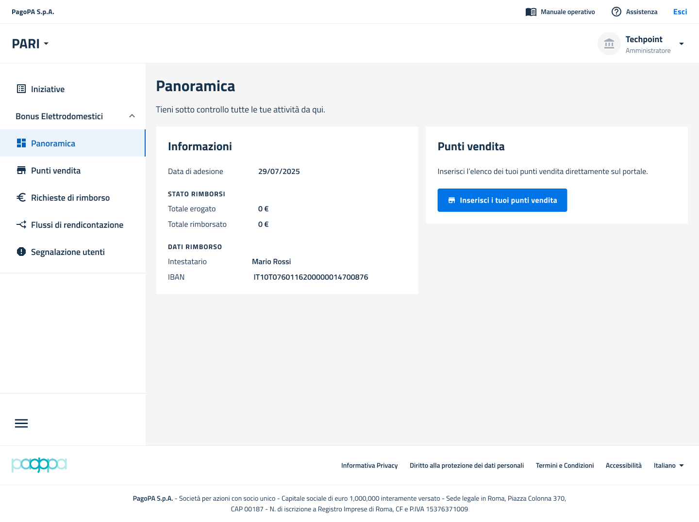

# Come censire i Punti Vendita

Dopo aver completato l'adesione, il **Venditore** (tramite il suo Legale Rappresentante o gli Amministratori) deve registrare sulla piattaforma tutti i Punti Vendita fisici che parteciperanno all'iniziativa.

Questa operazione è un prerequisito fondamentale per poter creare gli account degli Operatori che accetteranno i buoni.

L'operazione di censimento si svolge all'interno del Portale Venditore e permette di inserire **fino a cinque Punti Vendita alla volta**.


**Verifica i dati inseriti prima di inviarli**

Una volta che un Punto Vendita è stato creato e salvato, **non è più possibile modificarne i dati** (es. indirizzo o insegna). È fondamentale verificare la correttezza di tutte le informazioni prima di confermare l'inserimento.


## Step 1 - Accedere al Portale Venditore

Il Venditore (Legale Rappresentante o Amministratore) accede al Portale Venditore autenticandosi tramite [SPID](https://www.google.com/search?q=riferimenti-tecnici/glossario%23spid) o [CIE](https://www.google.com/search?q=riferimenti-tecnici/glossario%23cie).

***

## Step 2 - Avviare il censimento

Navigare alla sezione **"Censimento Punti Vendita"** (o voce di menu equivalente) per avviare la procedura di inserimento.

<figure><figcaption></figcaption></figure>

***

## Step 3 - Compilare i dati del Punto Vendita

Utilizzare l'interfaccia per inserire i dati richiesti per ciascun Punto Vendita.&#x20;

### Punto vendita fisico

I campi obbligatori includono:

* Insegna
* Indirizzo
* CAP
* Città
* Provincia

<figure><figcaption></figcaption></figure>

### Punto vendita online

I campi obbligatori includono:

* Insegna
* Indirizzo web completo (es.: https://www.pagopa.it)

<figure><figcaption></figcaption></figure>

***

## Step 4 - Salvare e ripetere l'operazione

Dopo aver compilato i campi per uno o più Punti Vendita (fino a un massimo di cinque), confermare l'inserimento tramite l'apposito pulsante (es. "Salva" o "Conferma").

Se il Venditore deve registrare più di cinque Punti Vendita, deve ripetere questa procedura (Step 2-4) fino al completamento dell'elenco.

***

## Prossimi passi

I Punti Vendita correttamente censiti appariranno nell'elenco gestito dal Venditore. Una volta che un Punto Vendita è registrato, il Venditore può procedere con la creazione degli account per gli Operatori associati a quel negozio.

<figure><figcaption></figcaption></figure>

<figure><figcaption></figcaption></figure>
