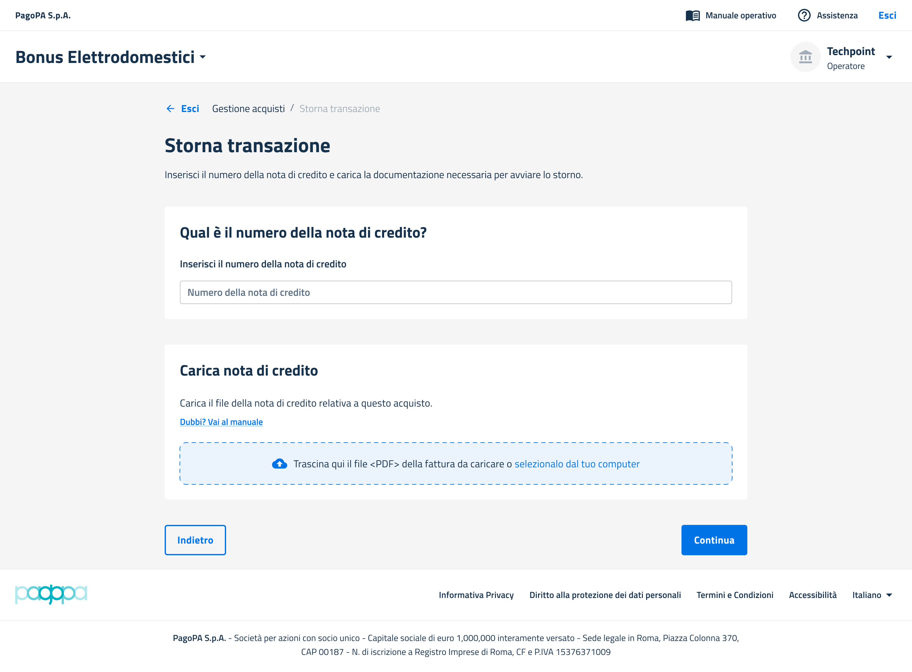

# Gestire uno storno


Al momento è possibile stornare una transazione soltanto se questa è nello stato "[Fattura da caricare](../riferimenti-tecnici/stati-delle-transazioni.md)".


### Prerequisiti

* La transazione deve essere in stato "[Fattura da caricare](../riferimenti-tecnici/stati-delle-transazioni.md)".

***

### Step 1 - Seleziona una transazione

Nella sezione "Gestione acquisti", selezionare la transazione di riferimento cliccando sulla relativa freccia blu, poi su "Storna".

<figure><figcaption></figcaption></figure>

***

### Step 2 - Carica la nota di credito

È necessario caricare una nota di credito, in formato `XML` o `PDF` e inserire il relativo numero.

<figure><figcaption></figcaption></figure>

Completato il caricamento, la transazione passerà in stato "[Stornata](../riferimenti-tecnici/stati-delle-transazioni.md)".

Nel caso in cui un utente intende annullare un ordine per cui il Punto Vendita non ha emesso fattura, è necessario compilare i suddetti campi della procedura di storno in questo modo:

* numero della nota di credito: numero dell'ordine;
* nota di credito: file pdf ad-hoc in cui è riportata una dicitura che spieghi la mancanza della nota di credito in quanto non era stata ancora emessa fattura prima dell'annullamento dell'ordine.
