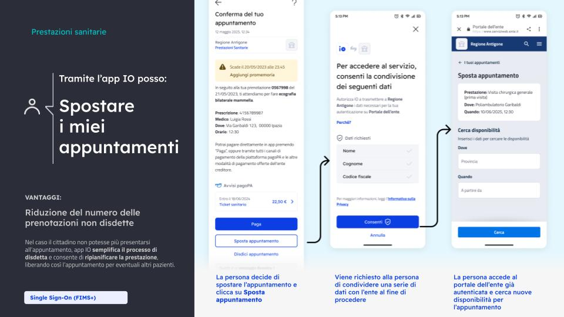

# 4️⃣ Gestione dell’appuntamento

<figure><figcaption></figcaption></figure>

## Cosa fa l'Ente

L’ente, tramite i propri sistemi, configura nel messaggio un [pulsante di azione ](https://www.developer.pagopa.it/app-io/guides/manuale-servizi/come-si-crea-un-servizio/la-scheda-servizio/pulsante-con-call-to-action-cta)collegato a un sistema esterno, come il portale del fascicolo sanitario o il CUP, sfruttando la funzionalità di [**Single Sign-On** ](https://www.developer.pagopa.it/app-io/guides/manuale-servizi/lapp-io/le-funzionalita-di-io-a-disposizione-degli-enti/accedere-tramite-single-sign-on)**(SSO)** tramite IO.

Il cittadino, cliccando il pulsante, atterra già autenticato nella sezione del sito dell’Ente da cui potrà modificare il suo appuntamento, evitando di accedere nuovamente tramite SPID, CIE o passaggi aggiuntivi.

### Migliora l'esperienza dall'inizio alla fine 💡

L'ente può garantire una migliore esperienza all'utente dall'app IO ai propri portali web, seguendo qualche accorgimento:&#x20;

* Il portale dell’ente deve essere accessibile e ottimizzato per un utilizzo tramite mobile;
* Dopo aver cliccato sul pulsante, l’utente deve atterrare direttamente nella pagina delle **prenotazione**, senza passaggi intermedi;
* Mettiti nei panni dei cittadini e fornisci informazioni **proattive**. Per esempio, se il cittadino vuole prenotare un appuntamento per una prestazione, mostragli le migliori disponibilità per l'appuntamento.&#x20;

## Cosa fa il cittadino

Se il cittadino è impossibilitato a partecipare all'appuntamento, può utilizzare i pulsanti contenuti all'interno del messaggio di conferma appuntamento per:

* **modificare la data e l’orario dell'appuntamento**;
* **disdire l'appuntamento.**

## Benefici

* Riduzione del fenomeno del no show (mancata presentazione alla visita senza preavviso)
* Ottimizzazione delle agende sanitarie;
* Comunicazione proattiva e tempestiva con il cittadino.
