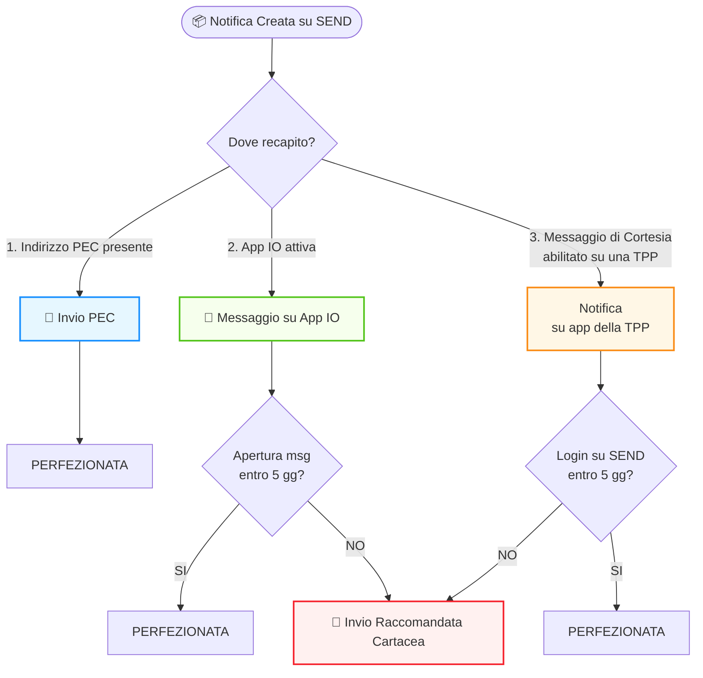

# Valore legale delle notifiche

# Approfondimento sulla distinzione tra la notifica legale depositata su SEND e il Messaggio di Cortesia informativo.

:::info

### Cos'è SEND?

SEND è la piattaforma che si occupa dell’invio ai cittadini, per via digitale o analogica, delle notifiche a valore legale, gestendo l’intero processo di notificazione al posto dell’ente, i quali si limitano a depositare l’atto da notificare.

### Processo di notificazione mediante SEND

1.  **L’Ente crea la richiesta di notifica** conformemente alle regole stabilite e carica gli allegati, fornendo le informazioni di base del destinatario, tra cui il codice fiscale, il domicilio digitale speciale se eletto e l'indirizzo fisico. Se questa richiesta supera i controlli di validazione, _**la notifica viene depositata correttamente sulla piattaforma**_ e l'ente è esonerato legalmente dalla notificazione degli atti.
    
2.  Questa **notifica a valore legale** può essere recapitata in due modi:
    
    -Digitalmente, tramite Posta Elettronica Certificata (PEC): la piattaforma ricerca un indirizzo PEC riconducibile al destinatario della notifica nei suoi archivi e nei registri pubblici.  
    -Fisicamente, tramite raccomandata inviata all'indirizzo fornito dal mittente.
    
    Al momento del deposito della notifica su SEND, vengono inviati _**messaggi di cortesia**_ al cittadino per avvisarlo dell'esistenza di una notifica a valore legale per lui su SEND. Tuttavia, affinché il cittadino riceva tali messaggi, deve averli attivati. Attualmente, i recapiti digitali sui quali l'utente può ricevere un avviso di cortesia sono **l'app IO, l'email e l'SMS**.
    
    Se la piattaforma non riesce a recuperare il **domicilio digitale** e il cittadino non visualizza la notifica dopo l'avviso di cortesia, verrà inviato **un avviso di avvenuta ricezione tramite raccomandata cartacea**.
    
    **NB:** nel caso di messaggio di cortesia in AppIO, se **il cittadino apre un messaggio su IO entro 5 giorni** (120 ore) dal suo invio, la notifica si _**Perfeziona**_ e non riceverà la notifica tramite raccomandata cartacea.
    
    Solo tramite l'app IO, il cittadino riceverà un messaggio informativo che gli consente, tramite un'apposita azione (CTA), di accedere **ai dettagli della notifica** per completarne la procedura (perfezionamento notifica). Tale processo non richiede l'autenticazione sulla piattaforma SEND, poiché si presume che l'autenticazione effettuata dal cittadino sull'app IO e il consenso fornito sulla piattaforma SEND siano sufficienti.
    
    _Inoltre l’utente potrà visualizzare i documenti notificati e pagare eventuali spese direttamente in IO, senza dover accedere a SEND con SPID o CIE_
    
    Mentre per la mail e l’SMS ed in aggiunta con i messaggi push il cittadino riceve un messaggio di cortesia che lo informa della presenza di una notifica per lui e un link con il quale accedere alla piattaforma. Se il cittadino accede **a SEND entro 5 giorni** (120 ore) dall'invio dell'SMS/mail/messaggio PUSH, non riceverà la notifica tramite raccomandata cartacea. In questo caso la notifica si _**Perfeziona**_ solo ed esclusivamente dopo aver **effettuato l’accesso** su SEND e **avere premuto sulla notifica.**
    
3.  Il cittadino **accede a SEND**, dove può **scaricare** i documenti notificati e eventualmente se previsto un pagamento può **pagare** grazie all’integrazione con la piattaforma pagoPA od in caso di messaggi di cortesia di tipo PUSH potrà pagare anche sui sistemi messi a disposizione della terza parte (app bancaria, home banking, etc…).
   
::: 

## Diagramma di Flusso Notifiche
