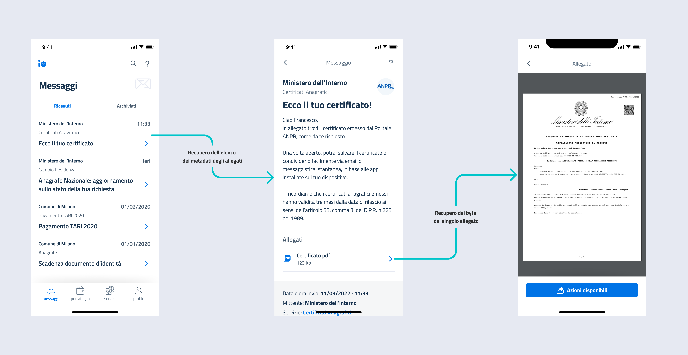

# Aggiungere allegati


Questa funzionalità è riservata agli enti che hanno sottoscritto il [programma Premium](../../abilitazioni/funzionalita-premium.md).


## Cosa sono gli allegati

Sono documenti in formato PDF, mostrati in calce al contenuto del messaggio. Questi allegati vengono recuperati dai sistemi dell'ente mittente **ogni volta** che l'utente accede alla risorsa nell'app IO.

<figure><figcaption><p>Quando l'utente apre un messaggio vengono recuperati, oltre ai metadati del contenuto del messaggio, anche quelli relativi ai metadati (endpoint 1). Il recupero del file vero e proprio avviene tramite l'endpoint 2, ovvero con una GET all'indirizzo <code>{baseUrl}/messages/{id}/{url}</code></p></figcaption></figure>


Per garantire l'accessibilità e la sicurezza dei documenti, _devi_ utilizzare allegati in formato **PDF/A-2a:** assicurati di rispettare tale specifica.


## Come funziona?

<details>

<summary><mark style="color:blue;">Step 1</mark> - Definisci una Configurazione Remota</summary>

Per permettere a IO di conoscere i tuoi sistemi dedicati agli allegati, **devi definire almeno una** [**Configurazione Remota**](../../setup-iniziale/configurazione-remota.md), che indicherai successivamente in [fase di invio di ciascun messaggio](inviare-un-messaggio-a-contenuto-remoto.md).

</details>

<details>

<summary><mark style="color:blue;">Step 2</mark> - Esponi gli endpoint di recupero degli allegati</summary>

Per permettere a IO di recuperare il contenuto di un messaggio e dei suoi allegati, **devi mettere a disposizione un **_**REST web service**_ conforme alla [relativa OpenAPI](https://editor.swagger.io/?url=https://raw.githubusercontent.com/pagopa/io-backend/master/openapi/consumed/api\_remote\_content.yaml).

Per maggiori informazioni, leggi le [openapi-endpoint-di-recupero-dei-contenuti-remotizzati.md](../../api-e-specifiche/openapi-endpoint-di-recupero-dei-contenuti-remotizzati.md "mention").

</details>

Per includere gli allegati in un messaggio, oltre agli step indicati in [.](./ "mention"), devi seguire questi step:

<details>

<summary><mark style="color:blue;">Step 3</mark> - Includi il blocco <a data-mention href="../../api-e-specifiche/api-messaggi/submit-a-message-passing-the-user-fiscal_code-in-the-request-body.md#third_party_data">#third_party_data</a></summary>

Includi il blocco [#third\_party\_data](../../api-e-specifiche/api-messaggi/submit-a-message-passing-the-user-fiscal\_code-in-the-request-body.md#third\_party\_data "mention") specificando la [configurazione-remota.md](../../setup-iniziale/configurazione-remota.md "mention") di riferimento e l'`id` di correlazione remota, che IO ti restituirà quando ti chiederà i metadati e, successivamente, i byte degli allegati al particolare messaggio che stai inviando.

</details>

<details>

<summary><mark style="color:blue;">Step 4</mark> - Specifica il valore <code>TRUE</code> nel campo <a data-mention href="../../api-e-specifiche/api-messaggi/submit-a-message-passing-the-user-fiscal_code-in-the-request-body.md#has_attachments">#has_attachments</a> </summary>

Specifica il valore `true` nel campo [#has\_attachments](../../api-e-specifiche/api-messaggi/submit-a-message-passing-the-user-fiscal\_code-in-the-request-body.md#has\_attachments "mention") presente nel blocco [#third\_party\_data](../../api-e-specifiche/api-messaggi/submit-a-message-passing-the-user-fiscal\_code-in-the-request-body.md#third\_party\_data "mention").

</details>

<details>

<summary><mark style="color:blue;">Step 5</mark> - Specifica il valore <code>ADVANCED</code> nel campo <a data-mention href="../../api-e-specifiche/api-messaggi/submit-a-message-passing-the-user-fiscal_code-in-the-request-body.md#feature_level_type">#feature_level_type</a> </summary>

Specifica il valore `ADVANCED` nel campo [#feature\_level\_type](../../api-e-specifiche/api-messaggi/submit-a-message-passing-the-user-fiscal\_code-in-the-request-body.md#feature\_level\_type "mention") presente nella request.

</details>

### Esempi

Esempio di chiamata per l’invio di un messaggio con allegati:


```shell
curl --location --request POST 'https://api.io.pagopa.it/api/v1/messages' \
--header 'Ocp-Apim-Subscription-Key: <YOUR_API_KEY>' \
--header 'Content-Type: application/json' \
--data-raw '{
  "content": {
    "subject": "Messaggio con allegati",
    "markdown": "# Titolo\n\nTesto del messaggio: contiene **allegati**!",
    "third_party_data": {
      "id": "c7832d5f-5946-48a3-ba9d-2d1e3aa3f7e5", 
      "configuration_id": "0e9852ccb8a04128bd637c807b9d80d3",
      "has_attachments": true
    }
  },
  "feature_level_type": "ADVANCED",
  "fiscal_code": "<validFiscalCode>",
}'
```


Esempio di risposta positiva:


```json
{
  "id": "01BX9NSMKVXXS5PSP2FATZMYYY"
}
```



Nota che non stai effettivamente inviando gli allegati al momento della creazione del messaggio: lo farai successivamente, quando il destinatario vorrà visualizzarli in app e IO invocherà [l'API da te esposta](../../api-e-specifiche/openapi-endpoint-di-recupero-dei-contenuti-remotizzati.md#endpoint-di-recupero-dei-byte-del-singolo-allegato) allo scopo

