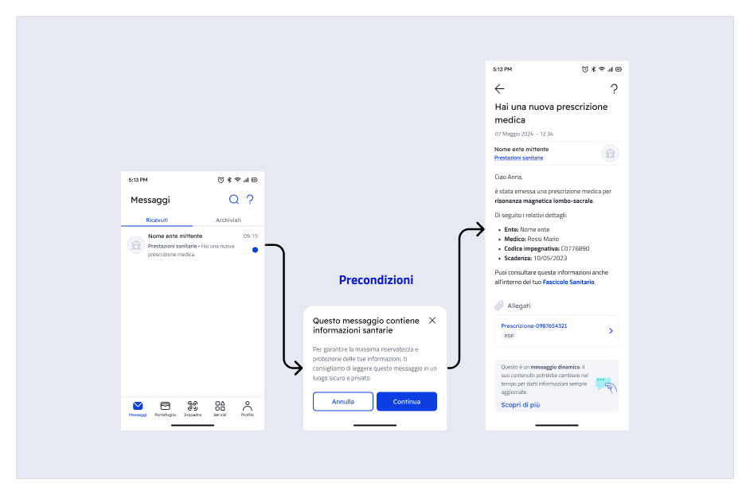

# Inviare un messaggio a contenuto remoto

### Cosa sono i messaggi a contenuto remoto?

I messaggi a contenuto remoto rispondono alla necessità di veicolare tramite IO **comunicazioni contenenti dati personali e/o dati sensibili** dei cittadini, garantendone una gestione conforme alle normative sulla privacy. Infatti, scegliendo questa modalità di invio **le informazioni non vengono memorizzate su IO**, ma recuperate dai tuoi sistemi ogni volta che l'utente accede al messaggio in app.&#x20;

Per un messaggio, i contenuti remotizzabili sono:

* titolo;
* corpo;
* precondizioni di apertura (opzionali, es.: disclaimer);
* allegati (Premium).

### Cosa cambia?

#### 📐 Architettura

A differenza dell'invio tradizionale, in cui è prevista la trasmissione dei contenuti del messaggio ai sistemi di IO al momento della sua creazione, i messaggi remoti prevedono che tali **contenuti risiedano esclusivamente presso i tuoi sistemi** e sarà IO a recuperarli ogni volta che l'utente destinatario vorrà visualizzarli in app.

<figure><figcaption><p>Sequenza delle principali fasi nei due scenari di invio</p></figcaption></figure>

In questo modo, IO fa da canale di **comunicazione in tempo reale** tra te e il tuo utente e detiene unicamente le informazioni necessarie per consentire il recupero del messaggio e verificarne lo stato.


La gestione dei messaggi remotizzati implica che la tua organizzazione è responsabile dei contenuti veicolati tramite IO, con particolare riferimento alla loro **accuratezza** e **disponibilità** verso l'utente.


#### 🕵️‍♂️ Gestione delle informazioni sensibili

Come specificato, i messaggi remotizzati sono pensati per garantire un invio _privacy compliant_ di informazioni personali/sensibili riferite al destinatario, **ove necessarie per l’erogazione del servizio.**&#x20;


Ti ricordiamo che tale modalità d'invio **lascia invariati i tuoi obblighi ai sensi della normativa vigente**, in particolare ai sensi dell'art. 7.3 delle [Linee Guida IO](https://www.agid.gov.it/it/linee-guida#index-8).


Come ulteriore misura a protezione della privacy, il flag [#require\_secure\_channels](../../api-e-specifiche/api-messaggi/submit-a-message-passing-the-user-fiscal\_code-in-the-request-body.md#require\_secure\_channels "mention") ti consente di **marcare un messaggio come contenente informazioni sensibili**, con i seguenti effetti:

* le notifiche push sui dispositivi del destinatario mostreranno un generico invito ad aprire il messaggio, senza riportare il contenuto del titolo;
* i messaggi non verranno inoltrati via email a prescindere dalla preferenza impostata dall'utente destinatario.


Puoi anche impostare il flag `require_secure_channels` [direttamente sul servizio](../pubblicare-un-servizio/dati-obbligatori/attributi.md#require\_secure\_channels), così non devi preoccuparti di farlo per ogni singolo messaggio.


#### ✏️ Aggiornamento dei contenuti nel tempo

A differenza dei messaggi tradizionali, i messaggi a contenuto remoto possono essere modificati **anche dopo l'invio**: potrai ad esempio correggere un refuso, o aggiornare dinamicamente informazioni non più valide o fuorvianti (es.: a seguito della cancellazione di un appuntamento).&#x20;

Nel considerare tale possibilità, è bene ricordare che:

* L'utente destinatario **non riceverà alcun avviso** in caso di aggiornamento del contenuto di un messaggio precedentemente ricevuto. Infatti, il contenuto può essere riattualizzato, richiamandolo dai tuoi sistemi, solo quando e se l'utente apre il messaggio in app;
* La responsabilità delle informazioni trasmesse tramite IO rimane in ogni caso in capo all'ente mittente.


In linea di principio, quando il contesto che ha prodotto un messaggio cambia o devono essere trasmesse nuove informazioni, è sempre preferibile **inviare un nuovo messaggio** per informare il destinatario.

In caso di dubbi, prediligi sempre il mantenimento della **coerenza informativa** nei confronti della tua utenza: i messaggi su IO sono un importante biglietto da visita per la tua organizzazione, [assicurane la qualità](https://docs.pagopa.it/manuale-servizi/comunicare-un-servizio/i-canali)!&#x20;


<details>

<summary>Caso d'uso prenotazione appuntamento - Esempio di aggiornamento dei contenuti di un messaggio dopo l'invio</summary>

1. Il tuo ente invia al cittadino destinatario un messaggio a contenuto remoto per confermare l'avvenuta prenotazione di un appuntamento per una prestazione sanitaria:
2. Il destinatario legge il messaggio e decide di disdire l'appuntamento tramite i canali da te messi a disposizione per la gestione delle prenotazioni;
3. Il tuo ente invia allo stesso utente un **nuovo messaggio** per confermare l'annullamento;
4. Per assicurare la coerenza informativa, il tuo ente **aggiorna i contenuti del primo messaggio** sostituendo e/o eliminando le informazioni di conferma appuntamento e i riferimenti obsoleti.

</details>

Per dare contezza al destinatario del fatto che i contenuti potrebbero essere aggiornati nel tempo, in calce al dettaglio di tutti i messaggi con contenuto remoto è stato incluso il seguente avviso, nella sua versione breve ed estesa:


<figure><figcaption><p>Informativa breve, in calce al messaggio</p></figcaption></figure>

<figure><figcaption><p>Informativa estesa, consultabile tramite la CTA "Scopri di più" </p></figcaption></figure>


**IO non effettua alcun controllo** sull'invariabilità nel tempo dei contenuti di un messaggio a contenuto remoto. L'accuratezza e la disponibilità delle informazioni contenute nel messaggio sono sempre di responsabilità esclusiva dell'Ente mittente.



In qualità di titolare del trattamento, dovrai garantire direttamente agli utenti l'esercizio dei diritti degli interessati ai sensi del GDPR, e ogni richiesta in tal senso verrà reindirizzata a te. Ad esempio, il diritto di accesso ai sensi dell'art. 15 GDPR dovrà essere garantito agli interessati che ne fanno richiesta, anche tramite i recapiti presenti nella scheda servizio.


### Come funziona l’invio di un messaggio a contenuto remoto?


Prima di poter inviare messaggi a contenuto remoto è necessario seguire la procedura illustrata in [configurazione-remota.md](../../setup-iniziale/configurazione-remota.md "mention")


Il ciclo di vita di un messaggio a contenuto remoto si compone di due momenti principali:

* L'**invio** (creazione) da parte dei sistemi della tua organizzazione;
* La **fruizione** (visualizzazione) da parte del destinatario.

<figure><figcaption><p>Le due fasi principali del ciclo di vita di un messaggio a contenuto remoto</p></figcaption></figure>

Entrambe le fasi richiedono un'integrazione tra i tuoi sistemi e quelli di IO.

### Fase di invio del messaggio

#### Creazione del messaggio a contenuto remoto

In questa fase, sono i tuoi sistemi integrati con IO a richiedere la creazione (e quindi l'invio) di un nuovo messaggio a uno specifico destinatario. Per maggiori informazioni sull'invio di un messaggio su IO fai riferimento a [.](./ "mention").

La tabella che segue riepiloga le principali componenti remotizzabili di un messaggio IO:

<table><thead><tr><th width="197">Componente</th><th>Flag da impostare</th><th>Note</th><th data-hidden data-type="checkbox">Remotizzabile?</th></tr></thead><tbody><tr><td>precondizioni</td><td><a data-mention href="../../api-e-specifiche/api-messaggi/submit-a-message-passing-the-user-fiscal_code-in-the-request-body.md#has_precondition">#has_precondition</a></td><td>Si tratta di informazioni <em>opzionali</em>, che vengono mostrate <em>prima dell'apertura del dettaglio del messaggio</em>. </td><td>false</td></tr><tr><td>titolo (subject)</td><td><a data-mention href="../../api-e-specifiche/api-messaggi/submit-a-message-passing-the-user-fiscal_code-in-the-request-body.md#has_remote_content">#has_remote_content</a></td><td>Si tratta del titolo visibile <em>all'apertura del messaggio</em>, che differisce da quello visibile nella lista messaggi (non remotizzabile).</td><td>true</td></tr><tr><td>corpo (markdown)</td><td><a data-mention href="../../api-e-specifiche/api-messaggi/submit-a-message-passing-the-user-fiscal_code-in-the-request-body.md#has_remote_content">#has_remote_content</a></td><td>Si tratta del contenuto testuale del messaggio.</td><td>true</td></tr><tr><td>dettagli di un avviso di pagamento</td><td></td><td>Sono già remotizzati grazie all'integrazione con il nodo pagoPA.</td><td>true</td></tr><tr><td>allegati (PDF)</td><td><a data-mention href="../../api-e-specifiche/api-messaggi/submit-a-message-passing-the-user-fiscal_code-in-the-request-body.md#has_attachments">#has_attachments</a></td><td>Sono contenuti gestibili solo in remoto. Puoi inserirli se hai sottoscritto l'Accordo Premium. Il formato accettato è PDF.</td><td>true</td></tr></tbody></table>

<details>

<summary>Informazioni importanti circa le precondizioni all'apertura del messaggio</summary>

Come ente mittente, puoi decidere che l’apertura del messaggio debba essere preceduta da un contenuto mirato ad informare il destinatario circa aspetti o circostanze particolari relative al messaggio stesso.

Le precondizioni sono una schermata intermedia tra l'elenco dei messaggi e il dettaglio del messaggio selezionato. L’utente accede al dettaglio del messaggio solo se seleziona il bottone "Continua".&#x20;



Di fatto, la visualizzazione delle precondizioni **porta a un’interruzione del flusso di lettura di un messaggio**. Quindi, è bene utilizzarle solo negli scenari in cui portino effettivamente valore alla tua comunicazione o siano altrimenti richiesti dalla normativa vigente, al fine di non degradare l'esperienza utente.

**Quando usarle:**\
Quando è necessario attirare l’attenzione del cittadino su un’informazione fondamentale, e in ogni caso quando richiesto dalla normativa applicabile, ad esempio nelle comunicazioni a valore legale per cui l’apertura del messaggio produce effetti nella sfera giuridica del cittadino.

**Quando non usarle:** \
Per trasmettere avvisi non strettamente correlati al contenuto del messaggio o per aggiungere informazioni di dettaglio che possono essere fornite al suo interno o in altri momenti dell’esperienza utente.

</details>

<details>

<summary>Informazioni importanti circa il titolo (subject) del messaggio in relazione al flag "has_remote_content"</summary>

Il titolo del messaggio è usato da app IO in tre occasioni:

1. come titolo visibile in elenco messaggi ricevuti;
2. come intestazione del dettaglio del messaggio, una volta aperto;
3. nel testo delle notifiche push collegate al messaggio (ove abilitate dall'utente e ove il messaggio / servizio non siano da te contrassegnati come veicolanti informazioni sensibili)

A seconda del valore del flag [#has\_remote\_content](../../api-e-specifiche/api-messaggi/submit-a-message-passing-the-user-fiscal\_code-in-the-request-body.md#has\_remote\_content "mention") che specificherai in [#third\_party\_data](../../api-e-specifiche/api-messaggi/submit-a-message-passing-the-user-fiscal\_code-in-the-request-body.md#third\_party\_data "mention") (vedi più avanti in questo capitolo) il **titolo del messaggio** presenterà comportamenti differenti:

* se [#has\_remote\_content](../../api-e-specifiche/api-messaggi/submit-a-message-passing-the-user-fiscal\_code-in-the-request-body.md#has\_remote\_content "mention")`=true`, il campo [#subject](../../api-e-specifiche/api-messaggi/submit-a-message-passing-the-user-fiscal\_code-in-the-request-body.md#subject "mention") indicato al momento della creazione del messaggio è usato da IO nell'elenco dei messaggi ricevuti, come testo della notifica push e come subject dell'eventuale email di inoltro del messaggio, ma non nella vista di dettaglio del messaggio in app: questa è invece recuperata successivamente (vedi [#cosa-succede-quando-il-destinatario-apre-un-messaggio-remotizzato](inviare-un-messaggio-a-contenuto-remoto.md#cosa-succede-quando-il-destinatario-apre-un-messaggio-remotizzato "mention")).\
  \
  **Questo significa che il destinatario potrebbe vedere testi differenti nel dettaglio del messaggio e fuori**. Consigliamo di non differenziare il titolo in modo sostanziale, in modo da mantenere la coerenza informativa tra i due testi. Inoltre, ti ricordiamo che ai sensi delle Linee Guida IO, non è possibile inserire informazioni sensibili nel titolo del messaggio.

<!---->

* se [#has\_remote\_content](../../api-e-specifiche/api-messaggi/submit-a-message-passing-the-user-fiscal\_code-in-the-request-body.md#has\_remote\_content "mention")`=false` oppure se non includi il flag, il campo [#subject](../../api-e-specifiche/api-messaggi/submit-a-message-passing-the-user-fiscal\_code-in-the-request-body.md#subject "mention") presenta il funzionamento standard di un messaggio tradizionale (non remoto): lo stesso contenuto testuale è usato nel dettaglio del messaggio e in tutti gli altri contesti sopra citati.

</details>

<details>

<summary>Informazioni importanti circa il corpo (markdown) del messaggio</summary>

In fase di creazione di un messaggio a contenuto remoto ( [#has\_remote\_content](../../api-e-specifiche/api-messaggi/submit-a-message-passing-the-user-fiscal\_code-in-the-request-body.md#has\_remote\_content "mention")`=true`) , è comunque necessario, nel rispetto dell’interfaccia API di IO, definire un **testo (markdown) “di cortesia” non remotizzato**, che verrà utilizzato per comporre l’email di inoltro messaggio che gli utenti di IO possono scegliere di ricevere quando gli viene recapitato un messaggio in app.

**Limiti markdown ai fini dell’inoltro:** min 80, max 134 caratteri, oltre il sistema tronca con puntini di sospensione.

**Nota sull'inoltro dei messaggi via email:** Se abilitato dall'utente finale, un messaggio inviato tramite IO può essere inoltrato al suo indirizzo email. L'email contiene l'incipit del corpo del messaggio (i primi 134 caratteri), nonché un invito ad aprire l'app per accedere al contenuto completo tramite CTA che consente il redirect. Ecco un esempio di email di inoltro:

.png>)

</details>


**Nota sugli allegati (Premium)**\
Se hai sottoscritto l’Accordo Premium, i tuoi messaggi potranno includere anche **allegati** in formato PDF: anch'essi saranno quindi trasmessi direttamente dai tuoi sistemi all’app quando il destinatario apre il messaggio. Per maggiori informazioni fai riferimento a [aggiungere-allegati.md](aggiungere-allegati.md "mention")


Per i messaggi a contenuto remoto, è _obbligatorio_ inserire le seguenti informazioni aggiuntive nel blocco [#third\_party\_data](../../api-e-specifiche/api-messaggi/submit-a-message-passing-the-user-fiscal\_code-in-the-request-body.md#third\_party\_data "mention"):

<table><thead><tr><th width="237">Campo</th><th>Descrizione campo</th></tr></thead><tbody><tr><td><a data-mention href="../../api-e-specifiche/api-messaggi/submit-a-message-passing-the-user-fiscal_code-in-the-request-body.md#id">#id</a></td><td>Questo è l'<strong>identificativo di correlazione remota</strong>, che identifica univocamente uno specifico messaggio indirizzato a uno specifico destinatario. Tale identificativo, <strong>determinato da te</strong>, consiste in una stringa che <strong>consente alle API d</strong>i recuperare i contenuti remoti per tale specifico messaggio.</td></tr><tr><td><a data-mention href="../../api-e-specifiche/api-messaggi/submit-a-message-passing-the-user-fiscal_code-in-the-request-body.md#configuration_id">#configuration_id</a></td><td>Indica in questo campo l'identificativo che hai ricevuto in fase di <a data-mention href="../../setup-iniziale/configurazione-remota.md">configurazione-remota.md</a>: IO utilizzerà questo dato per determinare il set di informazioni necessarie per richiamare gli <em>endpoint</em> REST esposti dalla tua Organizzazione che serviranno i dati remoti per questo messaggio.</td></tr><tr><td><a data-mention href="../../api-e-specifiche/api-messaggi/submit-a-message-passing-the-user-fiscal_code-in-the-request-body.md#has_precondition">#has_precondition</a></td><td><p>Imposta questo campo solo se vorrai che, al momento dell' apertura del messaggio in app, al destinatario sia mostrato un testo (con relativo titolo) recante <strong>informazioni di contesto</strong> che indicherai in quel momento (per maggiori informazioni fai riferimento a <a data-mention href="../../api-e-specifiche/openapi-endpoint-di-recupero-dei-contenuti-remotizzati.md#endpoint-di-recupero-delle-precondizioni-allapertura-del-messaggio">#endpoint-di-recupero-delle-precondizioni-allapertura-del-messaggio</a>): letto il testo, <strong>il destinatario potrà scegliere se continuare con l'apertura del messaggio</strong> o se tornare alla lista dei messaggi ricevuti; i valori possibili per questo campo sono:</p><ul><li><code>NEVER</code> (default)</li><li><code>ONCE</code> (le precondizioni sono mostrate solo la prima volta che il destinatario cerca di aprire il messaggio)</li><li><code>ALWAYS</code> (le precondizioni sono mostrate tutte le volte, anche se il messaggio era stato già letto in precedenza)</li></ul></td></tr><tr><td><a data-mention href="../../api-e-specifiche/api-messaggi/submit-a-message-passing-the-user-fiscal_code-in-the-request-body.md#has_remote_content">#has_remote_content</a></td><td>Imposta il campo col valore <code>true</code> <strong>se vuoi che il titolo (soggetto) e il corpo del messaggio siano remotizzati</strong>; quando IO te li richiederà tramite l'apposita API che avrai esposto, dovrai rispondere con una stringa di testo per il titolo e un <em>markdown</em> per il corpo, come li avresti specificati in fase di creazione di un messaggio tradizionale; il default per questo campo è il valore <code>false</code>.<br>Per maggiori informazioni e per comprendere il ruolo del titolo in un messaggio con contenuto remoto fai riferimento a <a data-mention href="../../api-e-specifiche/openapi-endpoint-di-recupero-dei-contenuti-remotizzati.md#endpoint-di-recupero-dei-dettagli-del-messaggio">#endpoint-di-recupero-dei-dettagli-del-messaggio</a></td></tr><tr><td><a data-mention href="../../api-e-specifiche/api-messaggi/submit-a-message-passing-the-user-fiscal_code-in-the-request-body.md#has_attachments">#has_attachments</a></td><td>Imposta il campo col il valore <code>true</code> se al messaggio vuoi che siano <strong>allegati uno o più documenti in formato PDF</strong>: come illustrato in <a data-mention href="../../api-e-specifiche/openapi-endpoint-di-recupero-dei-contenuti-remotizzati.md#endpoint-di-recupero-dei-dettagli-del-messaggio">#endpoint-di-recupero-dei-dettagli-del-messaggio</a>, quando IO ti richiederà i dettagli del messaggio dovrai indicare i metadati degli allegati (nome e relativa URL); quando il destinatario selezionerà un allegato in app, IO recupererà i byte presso i tuoi sistemi, tramite l'apposita API descritta in <a data-mention href="../../api-e-specifiche/openapi-endpoint-di-recupero-dei-contenuti-remotizzati.md#endpoint-di-recupero-dei-byte-del-singolo-allegato">#endpoint-di-recupero-dei-byte-del-singolo-allegato</a>.<br>Ricorda che puoi impostare questo flag solo se l'ente ha sottoscritto l'Accordo Premium di IO.</td></tr></tbody></table>


A prescindere dalla sua remotizzazione, se il messaggio veicola **informazioni sensibili**, _devi sempre_ impostare il flag [#require\_secure\_channels](../../api-e-specifiche/api-messaggi/submit-a-message-passing-the-user-fiscal\_code-in-the-request-body.md#require\_secure\_channels "mention")`=true`


### Fase di fruizione del messaggio

#### Cosa succede quando il destinatario apre un messaggio a contenuto remoto?

In questa fase, IO utilizza i flag che avevi indicato in fase di creazione per determinare come comporre il messaggio in app, e procede quindi all'eventuale recupero dei dati remoti e alla loro integrazione con quelli già in suo possesso per presentare il risultato finale al destinatario.


Ogni chiamata da IO verso i tuoi sistemi è identificata dall'[#id](../../api-e-specifiche/api-messaggi/submit-a-message-passing-the-user-fiscal\_code-in-the-request-body.md#id "mention") di correlazione remota che avevi indicato in fase di [#creazione-del-messaggio-remotizzato](inviare-un-messaggio-a-contenuto-remoto.md#creazione-del-messaggio-remotizzato "mention") e, come _header_, il [#fiscal\_code](../../api-e-specifiche/api-messaggi/submit-a-message-passing-the-user-fiscal\_code-in-the-request-body.md#fiscal\_code "mention") del destinatario.


In particolare, se in fase di [#creazione-del-messaggio-remotizzato](inviare-un-messaggio-a-contenuto-remoto.md#creazione-del-messaggio-remotizzato "mention") avevi indicato [#has\_precondition](../../api-e-specifiche/api-messaggi/submit-a-message-passing-the-user-fiscal\_code-in-the-request-body.md#has\_precondition "mention") con valore `ONCE` o `ALWAYS`, non appena il destinatario seleziona il messaggio dall'elenco messaggi in app non avendolo ancora mai letto (`=ONCE`) o tutte le volte (`=ALWAYS`), IO recupererà l'endpoint da richiamare dalle informazioni di configurazione, e **invocherà i tuoi sistemi** per **ottenere in risposta il titolo e il testo delle precondizioni** da mostrare nel pannello a comparsa delle [#precondizioni-allapertura](inviare-un-messaggio-a-contenuto-remoto.md#precondizioni-allapertura "mention").

A fronte della chiamata API all'[#endpoint-di-recupero-delle-precondizioni-allapertura-del-messaggio](../../api-e-specifiche/openapi-endpoint-di-recupero-dei-contenuti-remotizzati.md#endpoint-di-recupero-delle-precondizioni-allapertura-del-messaggio "mention") dovrai rispondere come nell'esempio:


```json
{
    "title": "Questo è il titolo delle precondizioni",
    "markdown": "Questo è il testo delle precondizioni in formato **markdown**"
}
```


Il pannello delle precondizioni presenta due pulsanti: "Annulla" e "Continua".

Se il destinatario seleziona "**Continua**", IO procederà con la visualizzazione del messaggio in app; in caso contrario, l'utente verrà riportato all'elenco dei messaggi.

Se in fase di [#creazione-del-messaggio-remotizzato](inviare-un-messaggio-a-contenuto-remoto.md#creazione-del-messaggio-remotizzato "mention") avevi indicato [#has\_remote\_content](../../api-e-specifiche/api-messaggi/submit-a-message-passing-the-user-fiscal\_code-in-the-request-body.md#has\_remote\_content "mention")`=true`, titolo e corpo del messaggio saranno recuperati al momento dell'apertura tramite una chiamata che IO farà all'API da te esposta (per i dettagli fai riferimento a [#endpoint-di-recupero-dei-dettagli-del-messaggio](../../api-e-specifiche/openapi-endpoint-di-recupero-dei-contenuti-remotizzati.md#endpoint-di-recupero-dei-dettagli-del-messaggio "mention")).


Come nel modello tradizionale, anche a un messaggio con contenuto remoto puoi aggiungere una data di scadenza ([#due\_date](../../api-e-specifiche/api-messaggi/submit-a-message-passing-the-user-fiscal\_code-in-the-request-body.md#due\_date "mention")) e i dati riferiti a una posizione debitoria ([#payment\_data](../../api-e-specifiche/api-messaggi/submit-a-message-passing-the-user-fiscal\_code-in-the-request-body.md#payment\_data "mention")); tali informazioni sono già remotizzate grazie all'integrazione con il nodo pagoPA.

