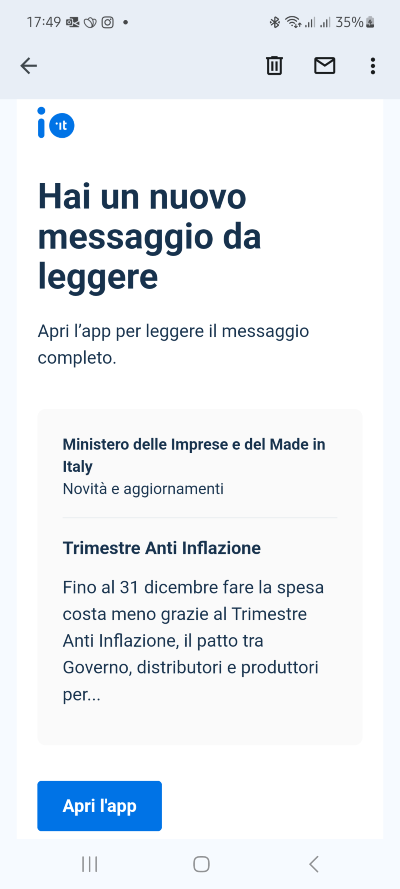

# Inviare un messaggio tradizionale

## Cosa sono i messaggi tradizionali?

Attraverso la modalità di invio dei messaggi tradizionali, l'ente mittente definisce il contenuto del messaggio, depositandolo sui sistemi di IO, e lo invia all'utente destinatario.

Quando l'utente apre il messaggio su IO, le informazioni precedentemente depositate vengono recuperate dal back-end e trasmesse all'app.

## Come funziona l'invio di un messaggio tradizionale?

### Fase di invio del messaggio

I tuoi sistemi integrati con IO possono richiedere la creazione (e quindi l'invio) di un nuovo messaggio a uno specifico destinatario. Per maggiori informazioni sull'invio di un messaggio su IO fai riferimento a [.](./ "mention").

La tabella che segue riepiloga i componenti di un messaggio IO, specificando se sono obbligatori o opzionali:

<table><thead><tr><th width="197">Componente</th><th width="417">Note</th><th>Obbligatorio</th><th data-hidden data-type="checkbox">Remotizzabile?</th></tr></thead><tbody><tr><td>titolo (subject)</td><td>Si tratta del titolo visibile nella lista messaggi e nel dettaglio (dopo l'apertura). La lunghezza deve essere compresa tra <strong>10 e 120 caratteri.</strong></td><td>

<ul class="contains-task-list"><li><input type="checkbox" checked></li></ul></td><td>false</td></tr><tr><td>corpo (markdown)</td><td>Si tratta del contenuto testuale del messaggio. La lunghezza deve essere compresa tra <strong>80 e 10.000 caratteri</strong>.</td><td>

<ul class="contains-task-list"><li><input type="checkbox" checked></li></ul></td><td>true</td></tr><tr><td>data di scadenza (due_date)</td><td>Permette di associare al messaggio un promemoria. Il formato data deve essere ISO-8601 e fuso orario UTC.</td><td>

<ul class="contains-task-list"><li><input type="checkbox"></li></ul></td><td>true</td></tr><tr><td>avviso di pagamento (payment_data)</td><td>Permette di veicolare un avviso di pagamento nel messaggio, pagabile direttamente in app. Per farlo, è necessario richiedere <a href="../../abilitazioni/test-invio-avvisi-pagopa.md">specifica l’abilitazione.</a></td><td>

<ul class="contains-task-list"><li><input type="checkbox"></li></ul></td><td>true</td></tr></tbody></table>

Quando mandi la richiesta di invio messaggio attraverso lo [specifico endpoint](../../api-e-specifiche/api-messaggi/submit-a-message-passing-the-user-fiscal\_code-in-the-request-body.md), riceverai la risposta del server che contiene l'identificativo del messaggio. Potrai utilizzarlo insieme al Codice Fiscale del destinatario per **controllare l'esito dell'invio** messaggio.


Se hai sottoscritto l'accordo Premium, potrai conoscere anche lo **stato di lettura** **e di pagamento** da parte del destinatario. Per maggiori informazioni, consulta la pagina [Inviare messaggi](https://app.gitbook.com/s/xWONfJmawghGo2ekuaKh/che-cosa-puo-fare-un-servizio-su-io/inviare-messaggi "mention") nel [manuale dei Servizi](https://app.gitbook.com/o/KXYtsf32WSKm6ga638R3/s/xWONfJmawghGo2ekuaKh/).



Ricorda che prima di inviare un messaggio, dovrai verificare che il cittadino sia iscritto a IO e che il servizio possa inviare comunicazioni al cittadino stesso. Per maggiori informazioni scopri l'API [get-a-user-profile-using-post.md](../../api-e-specifiche/api-messaggi/get-a-user-profile-using-post.md "mention").


### Fase di fruizione del messaggio

Quando il cittadino destinatario apre il messaggio, l'app verifica le informazioni necessarie per il recupero del messaggio presso i sistemi di IO.&#x20;

Nota su inoltro dei messaggi via email

Gli utenti di IO possono attivare l'inoltro dei messaggi via email dalle preferenze dell'app. In questo modo, un messaggio inviato tramite IO verrà inoltrato anche all'indirizzo email del destinatario.&#x20;

L'email contiene l'incipit del corpo del messaggio (i primi 134 caratteri), nonché un invito ad aprire l'app per accedere al contenuto completo tramite un pulsante che consente il _redirect_.&#x20;

Ecco un esempio di email di inoltro:

​\

