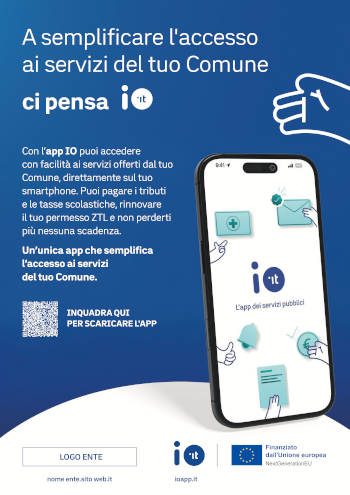
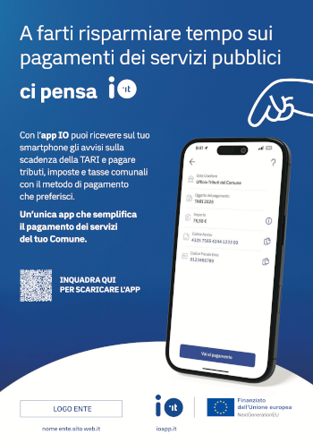
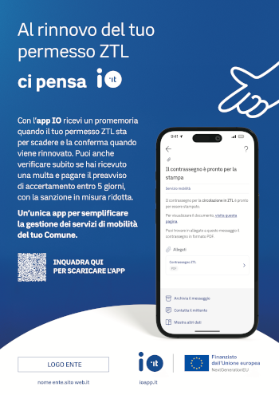

---
metaLinks:
  alternates:
    - >-
      https://app.gitbook.com/s/SpNLdqKSqoCvaOneGN7K/i-materiali/materiali-creativi
---

# 💡 Materiali creativi

I materiali realizzati da PagoPA prevedono gli **asset dedicati ai principali e più diffusi servizi disponibili sull’app IO**: potrai scegliere in base ai servizi di maggior interesse per il tuo ente.

I soggetti sono:

* generale
* servizi scolastici
* tributi
* mobilità
* sanità _(ad uso esclusivo delle ASL)_

<figure><figcaption>GENERALE</figcaption></figure>

<figure><figcaption>SERVIZI SCOLASTICI</figcaption></figure>

<figure><figcaption>TRIBUTI</figcaption></figure>

<figure><figcaption>PERMESSO ZTL e/o MULTE</figcaption></figure>

<figure><figcaption>Servizi sanitari #1 - conferma appuntamento</figcaption></figure>

<figure><figcaption>Servizi sanitari #2 - campagne screening</figcaption></figure>

Puoi decidere in autonomia di procedere con un solo soggetto oppure di usarne più di uno contemporaneamente.


Nelle prossime pagine troverai tutti i template disponibili, che potrai scaricare e utilizzare nelle diverse modalità descritte in base ai materiali che il tuo ente vorrà produrre per la campagna locale.



Le immagini sono rappresentate solo a titolo dimostrativo. Per scaricare i file in alta risoluzione consulta la [sezione dedicata](template-grafici.md)

