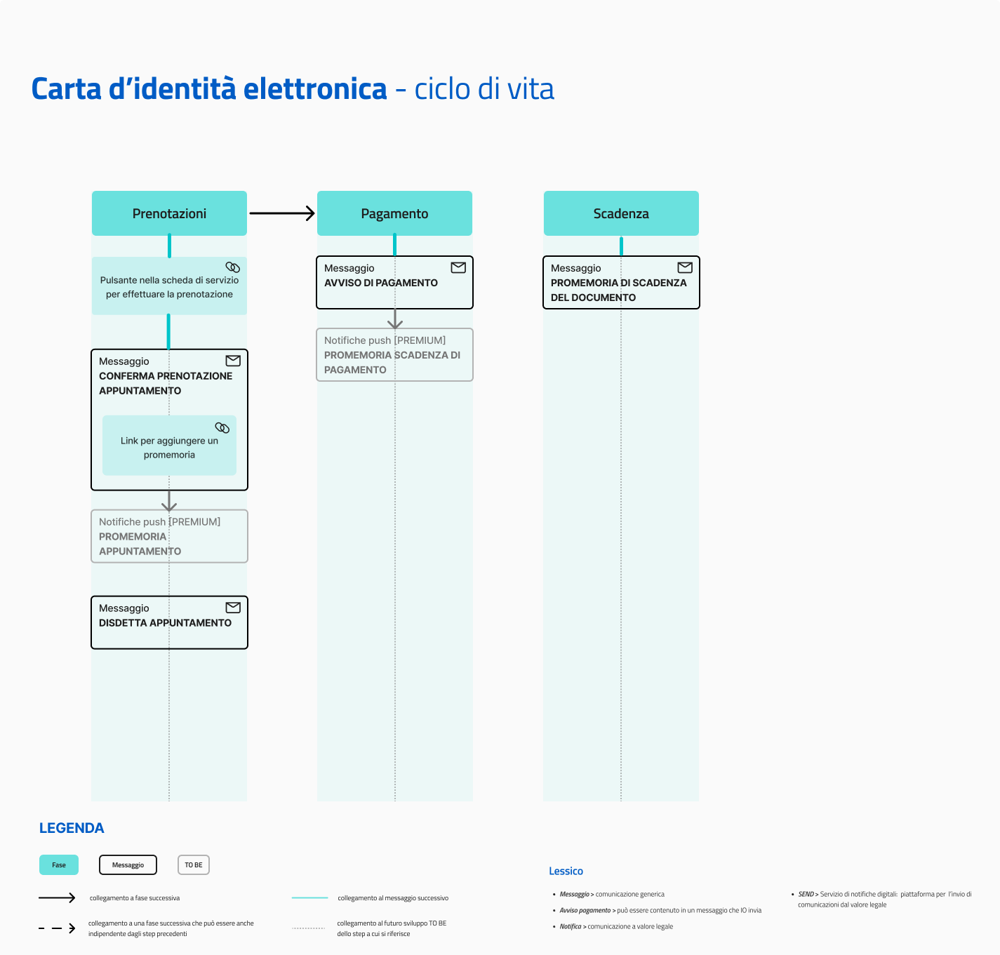

# Carta d'Identità Elettronica

Erogare il servizio "Carta d'Identità Elettronica" tramite IO permette agli enti di:

* fornire ai cittadini comunicazioni puntuali sugli stati della Carta d'Identità Elettronica (CIE), coprendo **l’intero ciclo di vita del servizio**, dall’inizio alla fine;
* integrare le comunicazioni, evitando una duplicazione delle comunicazioni relative allo stato di scadenza della CIE, gestite da ANPR.

[**Scopri tutti i benefici di integrarsi con IO →**](../../lapp-io/cose-io-e-qual-e-il-suo-obiettivo.md#perche-integrarsi-con-io)

## Scheda servizio e attributi

| **Nome servizio**            | Carta d'Identità Elettronica                                                                                                                                                                                                                                                                                                                                                                                                                                                                                                                                                                                                                                        |
| ---------------------------- | ------------------------------------------------------------------------------------------------------------------------------------------------------------------------------------------------------------------------------------------------------------------------------------------------------------------------------------------------------------------------------------------------------------------------------------------------------------------------------------------------------------------------------------------------------------------------------------------------------------------------------------------------------------------- |
| **Argomento**                | Servizi anagrafici e civici                                                                                                                                                                                                                                                                                                                                                                                                                                                                                                                                                                                                                                         |
| **Descrizione del servizio** | 
Il servizio riguarda la richiesta, l'emissione e la scadenza della tua Carta d'Identità Elettronica.

Tramite IO, potrai:
<ul><li>richiedere un appuntamento per l'erogazione o la sostituzione della tua Carta d'Identità;</li><li>ricevere un promemoria che ti ricorda dell'appuntamento;</li><li>ricevere avvisi di pagamento per l'emissione della Carta e pagarli in app;</li><li>ricevere un messaggio che ti informa della scadenza della Carta;</li><li>ricevere altre comunicazioni.</li></ul>
Per maggiori informazioni sulla Carta d'Identità Elettronica, visita <a href="https://www.cartaidentita.interno.gov.it/">questo sito</a>.
 |
| **Pulsante**                 | Richiedi appuntamento                                                                                                                                                                                                                                                                                                                                                                                                                                                                                                                                                                                                                                               |

## **Ciclo di vita del servizio**

<figure><figcaption>
<strong>Ciclo di vita ed eventi del servizio Carta d'Identità Elettronica</strong>
</figcaption></figure>

## **Messaggi del servizio**

Ecco la lista dei diversi messaggi che il servizio può inviare, con le relative regole di invio.


L'insieme di tutti i messaggi rappresenta il servizio ideale. L'ente che intende erogare questo servizio, può valutare quali e quanti messaggi inviare, in base alle proprie possibilità di integrazione. L'obiettivo finale rimane quello di inviarli tutti, rilasciando versioni del servizio sempre più complete.


<strong>Conferma appuntamento</strong>

**🖋 Titolo del messaggio:** Il tuo appuntamento con `<ufficio>`

🗒 **Testo del messaggio**:

Ti ricordiamo l'appuntamento presso l'`<ufficio>` situato in `<indirizzo>` fissato per il giorno `<gg/mm/aaaa>` alle ore `<hh:mm>`.

Ti invitiamo a presentarti con almeno 15 minuti di anticipo e di portare con te tutti i documenti necessari. Per maggiori informazioni su quali documenti ti serviranno, visita il sito di [CIE](https://www.cartaidentita.interno.gov.it/cittadini/rilascio-e-rinnovo-in-italia/).

Puoi disdire l'appuntamento online, sul sito \[nome sito]\(URL).

**🪄 Pulsante**: Aggiungi promemoria

**---**

**Destinatari**: I cittadini che hanno terminato con successo una prenotazione sul sito dell'Ente

**Quando inviarlo**: Alla conclusione del flusso di prenotazione

**User story**: <mark style="color:purple;">Come cittadino voglio ricevere la conferma con i dettagli del mio appuntamento</mark>

<strong>Disdetta appuntamento</strong>

**🖋 Titolo del messaggio:** Disdetta appuntamento con `<ufficio>`

🗒 **Testo del messaggio**:

Il tuo appuntamento presso l'`<ufficio>` situato in `<indirizzo>` fissato per il giorno `<gg/mm/aaaa>` alle ore `<hh:mm>` è stato cancellato per `<descrizione motivazione>`.

Se desideri prenotare un nuovo appuntamento online, puoi utilizzare il servizio di prenotazione (URL) del tuo Comune o recarti all'ufficio Anagrafe più comodo per le tue esigenze.

**🪄 Pulsante**: n/a

**---**

**Destinatari**: I cittadini il cui appuntamento è stato cancellato per scelta dei cittadini o esigenze del Comune

**Quando inviarlo**: Al momento della cancellazione dellla prenotazione

**User story**: <mark style="color:purple;">Come cittadino voglio essere avvisato della cancellazione di un appuntamento</mark>

Avviso di pagamento Carta d'Identità

:sparkles: <mark style="color:blue;">**Messaggio Premium**</mark> — configura questo messaggio come Premium, il cittadino verrà avvisato dell‘avvicinarsi della scadenza tramite _push notification_!

***

**🖋 Titolo del messaggio:** Hai un nuovo avviso di pagamento

🗒 **Testo del messaggio**:

C'è un avviso da pagare intestato a `<nome cognome>` e relativo all'emissione della Carta d'Identità Elettronica.

**Devi pagare:** `<xx,xx>` €

**Entro il:** `<gg/mm/aaaa>`

Puoi pagare direttamente in app premendo “Vedi Avviso”, oppure tramite tutti i canali di pagamento della piattaforma pagoPA.

Se hai già provveduto a pagare l'avviso ignora questo messaggio.

Per maggiori informazioni o per richiedere assistenza, contattaci tramite i canali che trovi nella scheda servizio.

**🪄 Pulsante**: Vedi Avviso

***

**Destinatari**: Tutti i cittadini che devono pagare il documento

**Quando inviarlo**: Quando è stato fissato un appuntamento in Comune e dopo che è stata aperta la posizione debitoria

**User story**: <mark style="color:purple;">Come cittadino voglio ricevere comunicazione quando è possibile effettuare il pagamento per la mia Carta d'Identità</mark>

Avviso di scadenza della Carta d'Identità

**🖋 Titolo del messaggio:** Scadenza Carta d'Identità

🗒 **Testo del messaggio**:

Oggi `<gg/mm/aaaa>` è scaduta la tua Carta d'Identità `<numero>`.

Se non l'hai ancora fatto, puoi prenotare un appuntamento per il rinnovo, direttamente online online, al sito \[nome sito]\(URL), oppure presentarti all'Ufficio Anagrafe più vicino a te, verificando giorni e orari di apertura sul sito del tuo Comune.

**🪄 Pulsante**: n/a

**---**

**Destinatari**: Cittadini in possesso di una Carta d'Identità

**Quando inviarlo**: Il giorno della scadenza

**User story**: <mark style="color:purple;">Come cittadino voglio essere avvisato quando scadrà il mio documento</mark>

<mark style="color:purple;">**---**</mark>

<mark style="color:purple;">ℹ️</mark> <mark style="background-color:yellow;">Il messaggio di preavviso della scadenza (a 180, 90 e 30 giorni) viene mandato dal servizio nazionale di ANPR. Si sconsiglia di duplicare l'invio con le stesse informazioni.</mark>


**Lo sapevi?**\
IO è integrata con SEND - Servizio Notifiche Digitale, per l'invio di comunicazioni a valore legale.

[**Scopri di più su SEND**](https://www.pagopa.it/it/prodotti-e-servizi/piattaforma-notifiche-digitali) [**-->**](https://www.pagopa.it/it/prodotti-e-servizi/piattaforma-notifiche-digitali)



**Un modello da personalizzare**

Le procedure di questo servizio variano molto da ente a ente. Consigliamo di utilizzare i testi dei messaggi come un punto di partenza e di aggiungere ulteriori informazioni.

Il modello è un esempio che non ha carattere vincolante per l’ente e sul quale la Società declina qualsiasi responsabilità, avendo valore esemplificativo.

Puoi copiare i testi dei messaggi da personalizzare da [questo documento](https://docs.google.com/spreadsheets/d/1aTFHoaigZPdJ42-7rijDWTCsNzhc4J4vwZ0Trt7lZug/edit#gid=538647580).

