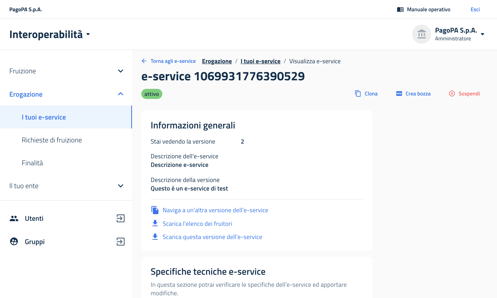

# E-service

## Ciclo di vita

Il ciclo di vita di un e-service inizia con la creazione in bozza di una sua prima versione. Successivamente è possibile pubblicarlo, aggiornarlo (con un versionamento progressivo), sospenderlo, riattivarlo, o archiviarlo. Per facilitare la creazione di servizi multipli, è prevista anche la possibilità di clonare un e-service e modificarne alcune parti prima di pubblicarlo come nuovo servizio a sé stante.

## Informazioni necessarie per la creazione di un e-service

Ogni e-service contiene al suo interno una specifica - definito file di interfaccia - e dettaglia il contenuto dell'API dell'erogatore. Si intende che un e-service eroga dati quando tutti gli endpoint di quell'API sono predisposti per erogare dati; mentre un e-service riceve dati quando tutti gli endpoint di quell'API sono predisposti per ricevere dati.

**Per l'e-service che eroga dati**

Un nuovo e-service viene creato attraverso un processo in quattro fasi dove vengono richiesti:

* un nome e una descrizione che saranno quelli esposti all'interno del catalogo degli e-service sulla piattaforma PDND Interoperabilità;
* con quale tecnologia è scritta l'API attraverso la quale si intende erogare il servizio, se REST o SOAP;
* se l'e-service eroga o riceve dati (in questo caso eroga);

<figure><figcaption><p>Fase 1</p></figcaption></figure>

* essendo gli e-service organizzati in versioni, verrà richiesta una descrizione della versione attuale, sia che si tratti della prima bozza che eventualmente di quelle future, andando a descrivere i cambiamenti rispetto alle versioni precedenti;
* una serie di richieste più tecniche:
  1. audience: il parametro _audience (aud)_ che i fruitori dovranno inserire all'interno del token per le richieste che effettueranno verso questa versione dell'e-service. È discrezione dell'erogatore stabilire la policy relativa alle audience: è possibile utilizzare la stessa audience per più versioni, audience diverse per ogni versione, etc.;
  2. durata della validità del voucher: dopo quanto tempo scade il voucher rilasciato da PDND Interoperabilità valido per accedere a questo servizio;
  3. soglia delle chiamate API: si rimanda alla descrizione del meccanismo della [stima di carico](e-service.md#gestire-il-carico-infrastrutturale-di-una-versione-di-e-service);
* la policy relativa alle richieste di fruizione che l'erogatore riceve: se l'opzione è attiva significa che anche se il fruitore possiede già tutti gli attributi necessari all'attivazione della richiesta di fruizione, l'erogatore si riserverà il diritto di attivarla manualmente. In caso contrario l'attivazione è automatica. Questo meccanismo funziona nel caso in cui il fruitore possegga tutti gli attributi necessari nel momento di inoltro della richiesta di fruizione, altrimenti servirà sempre un'attivazione manuale da parte dell'erogatore;

<figure><figcaption><p>Fase 2</p></figcaption></figure>

* quali [attributi](attributi.md#come-funzionano) deve avere l'ente fruitore per poter inoltrare la richiesta di fruizione;

<figure><figcaption><p>Fase 3</p></figcaption></figure>

* il caricamento del file di specifica dell'API per questa versione dell'e-service: dovrà essere un file OpenAPI per i servizi REST e WSDL per i servizi SOAP, come indicato all'interno del perimetro di sicurezza del ModI;
* eventuale documentazione tecnica aggiuntiva (manuale d'uso, esempi, etc.).

<figure><figcaption><p>Fase 4</p></figcaption></figure>

Alla fine del processo si arriva al riepilogo di tutti i dati inseriti durante la creazione dell'e-service e si può decidere se modificare la bozza, pubblicarla o eliminarla.

**Per l'e-service che riceve dati**

La differenza del processo tra l'e-service che eroga dati e quello che ne riceve è la creazione di una o più finalità con relativa analisi del rischio che il fruitore si troverà precompilata quando andrà a fruire dell'e-service.

<figure><figcaption><p>Come appare la schermata per un erogatore che crea un e-service che riceve dati</p></figcaption></figure>

L'erogatore deve quindi indicare il caso d'uso per cui intende raccogliere i dati e compilare il questionario.

<figure><figcaption><p>Esempio di analisi del rischio</p></figcaption></figure>

## Creare un nuovo e-service

Gli e-service sono costituiti da due parti. Una è fissa ed è costituita delle informazioni di massima che non possono cambiare nel tempo, come ad esempio il nome dell'e-service, la tecnologia che viene utilizzata per erogarlo, o i requisiti di accesso (attributi). Inoltre, c'è una parte variabile, che viene versionata automaticamente da PDND Interoperabilità. Nella parte variabile sono contenute quelle informazioni che invece possono cambiare, come la struttura dell'API del e-service, che può evolvere nel tempo e il flag di controllo manuale delle richieste di fruizione che vengono fatte per ogni versione di e-service. Per questa ragione, la parte fissa può essere modificata solo fintanto che la prima versione dell'e-service non è stata pubblicata.

Se hai permessi di amministrazione o da operatore API, troverai la voce di menù _Erogazione > I tuoi e-service_. Da lì, clicca su _Crea nuovo_. Segui la procedura guidata, inserendo le informazioni indicate. Potrai interrompere il processo di creazione in qualsiasi momento. Ad ogni passaggio è possibile salvare i dati in bozza e riprendere la compilazione in un secondo momento.

<figure><figcaption></figcaption></figure>

## Creare una nuova versione di e-service

Se un e-service esiste già in una versione pubblicata, è sempre possibile aggiornarlo creandone una nuova. La numerazione è assegnata automaticamente da PDND Interoperabilità in ordine crescente.&#x20;

Per creare una nuova versione, nella vista _Erogazione > I tuoi e-service_ si può cliccare sui tre pallini alla voce dell'e-service di interesse, e selezionare _Crea bozza nuova versione_. Per questioni di consistenza, non è possibile avere più bozze dello stesso e-service contemporaneamente.

<figure><figcaption></figcaption></figure>

## Pubblicare una versione di e-service

Un e-service in bozza può essere pubblicato immediatamente al termine della procedura guidata di creazione della versione o in un secondo momento.

Una volta pubblicata una bozza, questa diventerà la nuova versione "attiva" dell'e-service, mandando la versione precedente in stato "deprecato". Le versioni deprecate continueranno a funzionare per garantire ai fruitori continuità di servizio. Ai fruitori sarà indicato che possono aggiornare la loro richiesta di fruizione alla versione più recente dell'e-service.

## Archiviare una versione di e-service

Quando tutte le richieste di fruizione presenti su una versione di e-service sono state aggiornate ad una versione più recente, sarà possibile archiviare una versione di e-service. Quest'azione è irreversibile.&#x20;

Se una versione di e-service è archiviabile, l'opzione per farlo sarà cliccabile. Bisogna andare su _Erogazione > I tuoi e-service_, cliccare sui tre pallini della versione di e-service deprecata di interesse, e su _Archivia_.


Questa funzionalità non è ancora stata rilasciata in ambiente di esercizio


## Cancellare una bozza di e-service

È possibile cancellare una bozza in due casi distinti. Se è già stata pubblicata almeno una versione di un e-service, si potrà cancellare la bozza della nuova versione che è stata eventualmente creata. Se invece il servizio in bozza è alla prima versione e non è mai stato pubblicato, si può cancellare l'intero e-service.

Per cancellare un e-service o una sua versione in bozza, andare su _Erogazione > I tuoi e-service_, cliccare sui tre pallini della versione di e-service in bozza desiderata, e su _Elimina_.

## Sospendere o riattivare una versione di e-service

Se una versione di e-service è in stato "attivo" o "deprecato", l'erogatore può unilateralmente decidere di sospenderla. Allo stesso modo, se è in stato "sospeso", può riattivarla.


La sospensione di una versione di e-service comporta un'interruzione di servizio verso i fruitori e tutti gli utenti intermedi e finali che fruiscono dei loro e-service.


## Clonare un e-service

Per facilitare la procedura di creazione di e-service molto simili, è stata disposta una funzionalità di clonazione. Per farlo, puoi andare su _Erogazione > I tuoi e-service_, cliccare sui tre pallini dell'e-service da clonare e selezionare _Clona_. È possibile clonare solo versioni di e-service in stato "attivo" o "deprecato".

L'e-service creato da questo clone non sarà pubblicato immediatamente, sarà messo in bozza. La sua numerazione di versione partirà dalla 1, indipendentemente dal numero di versione dell'e-service dal quale è stato clonato.

<figure><figcaption></figcaption></figure>

## Esportare ed importare un e-service

È possibile esportare una versione di e-service da un ambiente di PDND Interoperabilità; quindi, la si può importare all'interno di un altro ambiente come nuovo e-service in bozza. Attualmente questa funzionalità è disponibile solo attraverso la UI.

La funzionalità è pensata per facilitare il passaggio di un e-service che ha superato la fase di collaudo ed è pronto per essere portato in produzione, ma può essere usata a discrezione per esportare ed importare gli e-service da un ambiente all'altro, oppure per replicare uno stesso e-service presso più enti (nel caso, ad esempio, di Partner Tecnologici).

Un esempio pratico: c'è un e-service chiamato "Il mio e-service" in versione 5 in collaudo. È possibile esportare questa versione di e-service e reimportarla in produzione come versione 1 in bozza. L'e-service avrà lo stesso nome e le stesse caratteristiche di quello di partenza, con alcuni caveat descritti più sotto.

### Esportare una versione di e-service

Un utente con permessi di gestione per gli e-service (ossia amministratore o operatore API) può entrare nella scheda del singolo e-service in _Erogazione > I tuoi e-service_. A quel punto, tra le azioni disponibili in basso nella scheda _Informazioni generali_, troverà _Scarica questa versione dell'e-service_.

<figure><figcaption><p>L'azione "Scarica questa versione dell'e-service" è l'ultima in basso nella scheda "Informazioni generali"</p></figcaption></figure>

La versione di e-service verrà scaricata in formato .zip, già pronta per essere reimportata nell'altro ambiente.

### Importare un e-service in bozza

Un utente con permessi di gestione per gli e-service (ossia amministratore o operatore API) può entrare nella pagina che elenca gli e-service erogati dal proprio ente (_Erogazione > I tuoi e-service_). Alla sinistra dell'azione _+1 Crea nuovo_, troverà _Importa_.

<figure><figcaption><p>Vista della lista degli e-service in gestione all'ente con, in alto a destra, il pulsante "Importa"</p></figcaption></figure>

Cliccando su _Importa_, si apre un cassetto laterale che offre la possibilità di inserire un file zip. Una volta inserito, verranno elencate le possibili problematiche che impediranno il corretto caricamento. Una volta verificati tutti i punti, si potrà cliccare su _Ho preso visione, e confermo_, e cliccare sul pulsante _Importa_.&#x20;

<figure><figcaption><p>Vista del cassetto laterale che permette di caricare lo .zip</p></figcaption></figure>

Se tutto va a buon fine, l'utente sarà reindirizzato direttamente alla bozza del nuovo e-service che è stata creata a partire dallo .zip importato. In caso contrario, verrà dato un feeback negativo.

#### Caveat all'importazione

I caveat sono chiaramente indicati all'interno del cassetto laterale. Per ragioni tecniche, non è possibile fornire all'utente un'indicazione puntuale dell'errore registrato. Vengono quindi fornite tutte le indicazioni utili per il debugging. Nello specifico:

1. **attributi**: non è possibile portare gli attributi da un ambiente all'altro. Di conseguenza, l'utente dovrà riassegnare manualmente gli attributi nel nuovo ambiente;
2. **duplicato del titolo e-service**: se nell'ambiente di importazione c'è già un e-service con lo stesso nome per lo stesso ente, non sarà possibile importare l'e-service. Il nome dell'e-service può essere modificato all'interno dello .zip, come spiegato nel paragrafo seguente;
3. **struttura archivio**: per assicurare la consistenza del materiale caricato, all'interno dello .zip c'è un file di configurazione, che indica i file da caricare e la loro posizione, oltre ai campi necessari per l'e-service. Se uno o più campi non sono correttamente formattati, sono mancanti, o rimandano a file non disponibili, o se viceversa nello .zip ci saranno file estranei non mappati nel file di configurazione, non sarà possibile importare l'e-service;
4. **interfaccia API**: ricorda che le URL dei server che indichi all'interno del file di interfaccia API potrebbero essere diverse da un ambiente all'altro, in base a come il tuo ente gestisce la propria infrastruttura e il processo di collaudo.

### Cosa contiene il pacchetto .zip?

Potrebbe essere utile modificare manualmente il contenuto del file .zip da importare. Per farlo, presentiamo la struttura in dettaglio. Il pacchetto .zip contiene:

* _configuration.json_: il file descrive il contenuto dell'e-service e la posizione degli altri file contenuti all'interno dello .zip e la loro funzione. Il nome di questo file non deve essere modificato. Se non viene trovato, non sarà possibile importare l'e-service;
* _nome\_file.\[yaml | json | wsdl]_: il file di interfaccia; il suo nome può essere modificato gestendo il valore corrispondente all'interno del file di configurazione;
* _gli altri file_: tutti gli altri file sono verosimilmente la documentazione tecnica allegata all'e-service, il cui percorso in cartella deve corrispondere a quanto indicato nel file di configurazione.

#### Il file di configurazione in dettaglio

Tutti i campi del _configuration.json_ sono obbligatori. Anche quelli che non vengono utilizzati, devono comunque essere inseriti mantenendo il loro valore di default.

**E-service**

<table><thead><tr><th width="246">Nome campo</th><th width="161">Tipo</th><th>Descrizione</th></tr></thead><tbody><tr><td>name</td><td>String</td><td>Il nome dell'e-service. Lunghezza tra i 5 e i 60 caratteri, spazi inclusi. Non deve essere uguale a quello di nessun altro e-service erogato dallo stesso ente.</td></tr><tr><td>description</td><td>String</td><td>La descrizione dell'e-service. Lunghezza tra i 10 e i 250 caratteri, spazi inclusi.</td></tr><tr><td>technology</td><td>REST |  SOAP</td><td>La tecnologia dell'API che l'aderente eroga. Il file di interfaccia (descriptor.interface) dovrà avere estensione corrispondente. Ad es. se inserisco REST, il file di interfaccia atteso sarà .yaml o .json</td></tr><tr><td>mode</td><td>DELIVER | RECEIVE</td><td>La modalità dell'e-service, se erogazione diretta (DELIVER) o erogazione inversa (RECEIVE). In caso di erogazione inversa, è necessario che sia presente almeno un'analisi del rischio (riskAnalysis); in caso di erogazione diretta, non deve essercene nessuna.</td></tr><tr><td>descriptor</td><td>Descriptor</td><td>Il descrittore, ossia il contenuto della versione dell'e-service. I campi sono dettagliati sotto.</td></tr><tr><td>riskAnalysis</td><td>Array&#x3C;RiskAnalysis></td><td>Le analisi del rischio necessarie per gli e-service in erogazione inversa, come descritto nel parametro <em>mode</em>. Il valore di default è array vuoto (<code>[]</code>).</td></tr></tbody></table>

**Descriptor**

<table><thead><tr><th width="241">Nome campo</th><th width="169">Tipo</th><th>Descrizione</th></tr></thead><tbody><tr><td>description</td><td>String</td><td>La descrizione della versione di e-service. Lunghezza tra i 10 e i 250 caratteri, spazi inclusi.</td></tr><tr><td>interface</td><td>Document</td><td>Il documento che descrive l'interfaccia API erogata dall'aderente.</td></tr><tr><td>docs</td><td>Array&#x3C;Document></td><td>La lista di documenti allegati alla versione di e-service (es. documentazione tecnica). È possibile non inserire alcun documento di accompagnamento. Il valore di default è array vuoto (<code>[]</code>).</td></tr><tr><td>audience</td><td>Array&#x3C;String></td><td>L'audience della tua risorsa presso la quale sarà inoltrata la richiesta dal fruitore. Benché la struttura dati sia sotto la forma di array di stringhe, di norma viene inserita una sola stringa.</td></tr><tr><td>voucherLifespan</td><td>Number</td><td>La durata del voucher che PDND Interoperabilità rilascerà al fruitore. Il valore è espresso in secondi. Sono permessi valori tra 60 (1 minuto) e 86.400 (1.440, ossia 24 ore).</td></tr><tr><td>dailyCallsPerConsumer</td><td>Number</td><td>La soglia delle chiamate API/giorno permesse per ogni fruitore. Non è possibile impostare valori inferiori a 1.</td></tr><tr><td>dailyCallsTotal</td><td>Number</td><td>La soglia delle chiamate API/giorno permesse sommando quelle di tutti i fruitori. Il valore non può essere inferiore a quello di <em>dailyCallsPerConsumer</em>.</td></tr><tr><td>agreementApprovalPolicy</td><td>AUTOMATIC | MANUAL</td><td>La politica di approvazione delle richieste di fruizione da parte dell'e-service, automatica (ossia senza necessità di un intervento manuale da parte dell'erogatore), o manuale.</td></tr></tbody></table>

**Document**

<table><thead><tr><th width="246">Nome campo</th><th width="190">Tipo</th><th>Descrizione</th></tr></thead><tbody><tr><td>prettyName</td><td>String</td><td>Il nome del file che viene mostrato agli utenti, per i quali deve essere significativo. Lunghezza tra i 5 e i 60 caratteri, spazi inclusi.</td></tr><tr><td>path</td><td>String</td><td>Il percorso al quale si trova il file da caricare a partire dal punto nel quale si trova il file di configurazione.</td></tr></tbody></table>

**RiskAnalysis**

<table><thead><tr><th width="246">Nome campo</th><th width="190">Tipo</th><th>Descrizione</th></tr></thead><tbody><tr><td>name</td><td>String</td><td>Il nome da assegnare all'analisi del rischio per facilitarne l'identificazione. Lunghezza tra i 5 e i 60 caratteri, spazi inclusi.</td></tr><tr><td>riskAnalysisForm</td><td>RiskAnalysisForm</td><td>Il contenuto dell'analisi del rischio.</td></tr></tbody></table>

**RiskAnalysisForm**

<table><thead><tr><th width="246">Nome campo</th><th width="190">Tipo</th><th>Descrizione</th></tr></thead><tbody><tr><td>version</td><td>String</td><td>La versione dell'analisi del rischio per quella specifica tipologia di ente. Ad esempio, l'ultima versione di analisi del rischio rilasciata per le PA è la 3.0.</td></tr><tr><td>singleAnswers</td><td>Array&#x3C;RiskAnalysisSingleAnswer></td><td>Il contenuto delle risposte a scelta singola dell'analisi del rischio.</td></tr><tr><td>multiAnswers</td><td>Array&#x3C;RiskAnalysisMultiAnswer></td><td>Il contenuto delle risposte a scelta multipla dell'analisi del rischio.</td></tr></tbody></table>

**RiskAnalysisSingleAnswer**

<table><thead><tr><th width="246">Nome campo</th><th width="190">Tipo</th><th>Descrizione</th></tr></thead><tbody><tr><td>key</td><td>String</td><td>La chiave che identifica la specifica domanda rispetto al template inserito nella codebase. Ad esempio la chiave <code>institutionalPurpose</code> identifica il campo di testo libero nel quale si inserisce la risposta a quale finalità si stia perseguendo.</td></tr><tr><td>value</td><td>String</td><td>La risposta alla domanda identificata dalla chiave.</td></tr></tbody></table>

**RiskAnalysisMultiAnswer**

<table><thead><tr><th width="246">Nome campo</th><th width="190">Tipo</th><th>Descrizione</th></tr></thead><tbody><tr><td>key</td><td>String</td><td>La chiave che identifica la specifica domanda rispetto al template inserito nella codebase. Ad esempio la chiave <code>institutionalPurpose</code> identifica il campo di testo libero nel quale si inserisce la risposta a quale finalità si stia perseguendo.</td></tr><tr><td>values</td><td>Array&#x3C;String></td><td>Le risposte alla domanda identificata dalla chiave.</td></tr></tbody></table>

### Un esempio pratico

Poniamo di aver esportato il seguente pacchetto attraverso la funzionalità di esportazione.



Come si vede, presenta il seguente file di configurazione:

```
{
  "name" : "E-service erogazione inversa esempio",
  "description" : "Questo è un esempio di un e-service di erogazione inversa per documentare la funzionatità dell'importazione-esportazione e-service",
  "technology" : "REST",
  "mode" : "RECEIVE",
  "descriptor" : {
    "interface" : {
      "prettyName" : "Specifica API",
      "path" : "api.yaml"
    },
    "docs" : [
      {
        "prettyName" : "Documento tecnico esempio 01",
        "path" : "documents/example_documentation_1.pdf"
      },
      {
        "prettyName" : "Documento tecnico esempio 02",
        "path" : "documents/example_documentation_2.pdf"
      }
    ],
    "audience" : [
      "api/v1/test"
    ],
    "voucherLifespan" : 600,
    "dailyCallsPerConsumer" : 100000,
    "dailyCallsTotal" : 10000000,
    "description" : "Inseriti i primi due endpoint per la ricezione dei dati",
    "agreementApprovalPolicy" : "AUTOMATIC"
  },
  "riskAnalysis" : [
    {
      "name" : "La mia prima finalità",
      "riskAnalysisForm" : {
        "version" : "2.0",
        "singleAnswers" : [
          {
            "key" : "institutionalPurpose",
            "value" : "Come previsto dalla norma XX/YYYY"
          },
          {
            "key" : "purpose",
            "value" : "INSTITUTIONAL"
          },
          {
            "key" : "usesPersonalData",
            "value" : "NO"
          },
          {
            "key" : "usesThirdPartyPersonalData",
            "value" : "NO"
          }
        ],
        "multiAnswers" : [
        ]
      }
    }
  ]
}
```

Una struttura di cartella ben formattata, che permetta di trovare sia i due file `docs` che il file `interface`, secondo come sono mappati all'interno del file di configurazione, è la seguente:

```
- configuration.json
- api.yaml // Il file di interfaccia
- documents/
  - example_documentation_1.pdf
  - example_documentation_2.pdf
```

Il `voucherLifespan` dura 600 secondi, dunque la scadenza del voucher dei fruitori è impostata su 10 minuti.

La tecnologia impostata nel campo technology è REST, e dunque il file di interfaccia caricato è uno .yaml, concordemente con&#x20;

Inoltre, all'interno del file si vede che il `mode` dell'e-service è `RECEIVE`, e dunque si tratta di un e-service in erogazione inversa. Per questo motivo, il campo `riskAnalysis` presenta un'analisi del rischio compilata (il numero di analisi del rischio è discrezionale, ma non può essercene meno di una).

La struttura del `riskAnalysisForm` varia in base alla versione e al tipo di ente che la compila (se PA o non PA). Per un elenco completo dei campi presenti nelle `riskAnalysis` si rimanda direttamente alla [codebase](https://github.com/pagopa/interop-be-monorepo/tree/bca7ff2cf1504fc22c8cbce8f7f7f33764d2b70c/packages/commons/src/risk-analysis/rules). Si sconsiglia fortemente di generare manualmente l'analisi del rischio; i campi da riempire sono potenzialmente molti e cambiano in base alle risposte date nelle domande precedenti.

## Gestire il carico infrastrutturale di una versione di e-service


La funzionalità di filtraggio ed evasione granulare delle finalità sopra soglia è attualmente in sviluppo e sarà disponibile a breve


Quando un erogatore crea una nuova versione di e-service, deve indicare due soglie di tolleranza per la propria infrastruttura. La prima indica il numero di chiamate API al giorno permesse al singolo fruitore; la seconda la soglia totale data dalla somma delle chiamate di tutti i fruitori.

Il fruitore che ha una richiesta di fruizione attiva per una versione di e-service potrà continuare a dichiarare finalità fino al raggiungimento della prima o della seconda soglia. Una volta superata una delle due soglie, le nuove finalità non saranno più approvate automaticamente da PDND Interoperabilità. L'erogatore troverà in _Erogazione > Finalità_ l'elenco delle finalità presentate dai fruitori e potrà filtrarle per quelle che sono sopra soglia e dunque in attesa di approvazione.

L'erogatore potrà attivare manualmente ognuna di quelle finalità, o definire una data di completamento attività che sarà comunicata al fruitore, entro la quale completerà le operazioni di adeguamento dell'infrastruttura. La data di completamento è eventualmente modificabile unilateralmente dall'erogatore.


Gli obiettivi di questa gestione sono:

* dare la possibilità all’erogatore di pianificare la disponibilità delle proprie risorse supportandolo nella mitigazione di casi di DDoS;&#x20;
* guidare i fruitori in una pratica virtuosa di dimensionamento delle proprie esigenze;
* costruire un modello che sia osservabile e nel tempo possa condurre all’ottimizzazione delle risorse.


Maggiori informazioni sono disponibili nella sezione [Finalità](finalita.md).
