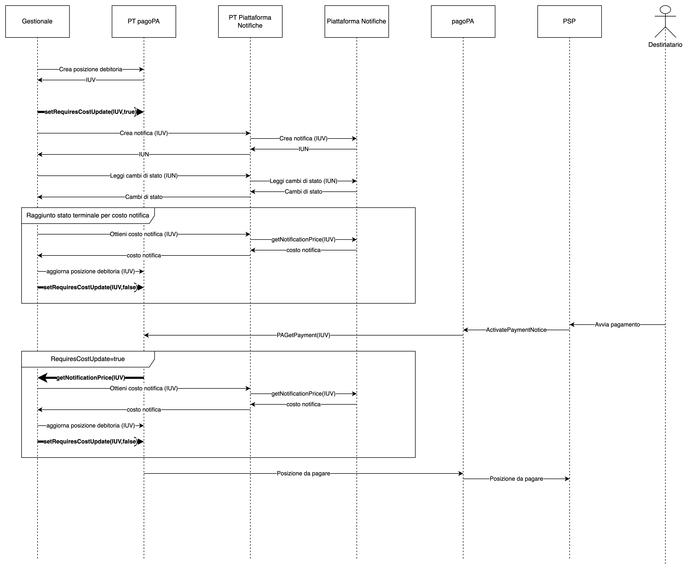

# Modello di integrazione di Piattaforma Notifiche Digitali

Questo documento descrive i diversi scenari di integrazione di Piattaforma Notifiche Digitali (da qui in poi Piattaforma Notifiche o PND). Questi scenari si differenziano sulla base della tipologia di notifica inviata, la presenza o meno di un pagamento e le modalità previste per il pagamento stesso. Il documento fornisce anche indicazioni circa l'accesso a Piattaforma Notifiche attraverso PDND Interoperabilità. Per gli enti che hanno aderito ai bandi della Misura PNRR 1.4.5 è presente una documentazione specifica a questo [link](https://docs.pagopa.it/misura-1.4.5-modello-integrazione-pnd/) che sostituisce quanto presente in questo documento.

## Integrazione manuale 

n questo tipo di integrazione non è prevista alcuna forma di comunicazione tra i sistemi informatici di Piattaforma Notifiche e quelli dell’ente. L’effetto collaterale di questa assenza è l’impossibilità di verificare automaticamente lo stato della notifica stessa, verifica che richiede perciò l’accesso manuale alle notifiche e l’eventuale recupero, anch’esso manuale, delle attestazioni comprovanti la regolare esecuzione della notifica. Manuale sarà anche la verifica dei dati di fatturazione che PagoPA manderà periodicamente all’ente mittente. Ancora più rilevante è l’impossibilità di adeguare tempestivamente i costi di notifica eventualmente posti a carico del destinatario.&#x20;

In uno scenario di questo tipo quindi, l’integrazione con PND di tipo manuale risulterebbe accettabile, sia per l’Ente sia per la qualità del servizio erogato da PND, solamente per la gestione di notifiche che non prevedono alcun pagamento da parte del destinatario.&#x20;

Inoltre, viste le difficoltà introdotte da una gestione puramente manuale del processo di notificazione e quanto sopra specificato circa la verifica della fatturazione, l’approccio manuale è utilizzabile solamente in caso di volumi di notificazione molto bassi, ad esempio nei casi in cui già oggi non è previsto l’utilizzo di un sistema di gestione documentale a supporto del processo di notifica.

Per sintetizzare, i casi di notifica che possono essere gestiti in questa modalità sono i seguenti:

* Notifiche di un limitato numero di atti che non richiedono un pagamento e per i quali l’ente si accolla i costi di notifica

NOTA: l'invio manuale di notifiche che richiedono un pagamento è possibile nel momento in cui è comunque garantito l'aggiornamento del costo della notifica. Tale aggiornamento richiede un'integrazione tecnologica con Piattaforma Notifiche che deve essere effettuata con le modalità descritte nell'ambito dell'integrazione automatica.

## Integrazione automatica 

In questo tipo di integrazione i sistemi informatici di Piattaforma Notifiche sono messi in comunicazione con quelli dell’ente. In questa situazione possono essere gestiti automaticamente sia lo stato della notifica, con relativo recupero delle attestazioni comprovanti la regolare esecuzione della notifica, sia l’attualizzazione dei costi di notifica. Sarà inoltre possibile la verifica automatica dei dati di fatturazione. Con questo tipo di integrazione è possibile gestire qualsiasi tipologia di notifica e di modalità di pagamento.

Esistono diverse sotto-varianti di questa integrazione automatica, differenti sulla base della modalità di aggiornamento del costo di notifica e del numero di servizi informatici presenti nell’ente o da chi gestisce gli stessi.

### Aggiornamento del costo di notifica 

Sono presenti due diverse possibili modalità di aggiornamento:

#### Aggiornamento sulla base delle informazioni di cambio stato della notifica 

In questo scenario, il sistema informatico che si occupa della gestione della notifica è collegato allo stream che riporta le variazioni di stato di ogni singola notifica, incluse quelle che comportano un cambio del costo della notifica stessa. A fronte della ricezione di questi eventi questo sistema informatico può acquisire i costi di notifica che saranno fatturati da PagoPA S.p.A. all'ente ma non può utilizzare questi eventi come unica modalità di attualizzazione del costo di notifica a carico del cittadino, in quanto questa attualizzazione potrebbe avvenire con ritardo rispetto ad un possibile pagamento iniziato dal destinatario della notifica.

Conseguentemente, **questa modalità di gestione è applicabile solamente** alle seguenti casistiche:

* Notifiche di atti che non richiedono un pagamento e per i quali l’ente si accolla i costi di notifica

#### Aggiornamento all’atto del pagamento in modalità sincrona

In questo scenario l’attualizzazione della posizione debitoria è prevista anche all’atto del pagamento attraverso piattaforma pagoPA in modalità sincrona, annullando di fatto la possibilità che il destinatario paghi un importo non corretto. Durante il pagamento, il Nodo pagoPA contatta l’ente creditore associato al pagamento per richiedere l’attivazione della posizione debitoria. In questa fase l’ente comunica al Nodo il valore attualizzato della posizione debitoria stessa. Per permettere l’attualizzazione, Piattaforma Notifiche prevede un’API che, dati gli estremi di un avviso pagoPA, restituisce, tra le altre cose, il costo della notifica associata a quel pagamento. **Per permettere al sistema informatico che gestisce le posizioni debitorie di utilizzare correttamente questa API è obbligatorio che lo stesso sia a conoscenza del fatto che un avviso pagoPA debba essere o meno attualizzato con i dati forniti da Piattaforma Notifiche**. Questa è un’informazione che deve essere fornita, dal sistema informatico di gestione degli atti, all’atto della creazione della posizione debitoria.

Nel momento in cui il sistema di gestione delle posizioni debitorie riceve una richiesta di attivazione da parte del Nodo pagoPA, il sistema verificherà se l’avviso deve essere attualizzato con i dati di Piattaforma Notifiche. Nel caso in cui debba essere contattata Piattaforma Notifiche, questo può avvenire richiedendo l’informazione al sistema di gestione dell’atto, che si fa tramite verso Piattaforma Notifiche

L’operazione di attualizzazione deve avvenire nell’arco di 2 secondi.

L'attualizzazione richiede la comunicazione tra sistemi diversi dell’ente. Rappresentiamo qui la soluzione raccomandata ed una proposta di API che devono essere previste per poter gestire il processo di attualizzazione.&#x20;

La soluzione permette l’attualizzazione complessiva della posizione debitoria, non solo per incorporare variazioni del costo di notifica ma anche altre variazioni (es. interessi di mora)

<figure><figcaption></figcaption></figure>

#### Aggiornamento della posizione debitoria in modalità asincrona

In questo scenario l’attualizzazione dell'importo della posizione debitoria è gestita direttamente da PagoPA grazie all'adesione dell'Ente alla modalità di integrazione asincrona ([link](https://docs.pagopa.it/sanp/ente-creditore/modalita-dintegrazione/integrazione-tramite-api-asincrone)).

In questo tipo di integrazione la comunicazione tra i sistemi informatici di Piattaforma Notifiche e Piattaforma pagoPA è centralizzata, non è necessario alcun tipo di intervento da parte dell'Ente.

Questa forma di aggiornamento richiede che la posizione debitoria non sia composta da componenti separate di costo.

## Accesso attraverso PDND Interoperabilità 

Al fine di rendere maggiormente certa l'identità del mittente è possibile effettuare le chiamate alle API di Piattaforma Notifiche attraverso il modello di fruizione introdotto da PDND Interoperabilità e descritto nella documentazione accessibile da questa [pagina](https://www.interop.pagopa.it/). PDND Interoperabilità offre un meccanismo di verifica dell'identità del chiamante che supera nelle LL.GG. AgID il precedente modello che utilizzava mTLS allo scopo. E' suggerito utilizzare PDND Interoperabilità come complemento agli elementi di sicurezza già previsti in Piattaforma Notifiche.

Per sfruttare questa funzionalità, l'ente mittente di Piattaforma Notifiche dovrà aderire all'utilizzo di PDND Interoperabilità attraverso il portale SelfCare e richiedere la fruizione dell'eService erogato da PagoPA S.p.A. al fine di esporre i servizi di Piattaforma Notifiche. L'eService è disponibile sia in ambiente di Collaudo che di Produzione di Interoperabilità. La fruizione nell'ambiente di Produzione sarà attivata a seguito della conclusione dei test da parte dell'Ente nell'ambiente di Collaudo e successivamente alla fornitura da parte dell'Ente delle risultanze delle verifiche effettuate utilizzando il tool di validazione di Piattaforma Notifiche.

Ulteriore documentazione relativa all'e-service di Piattaforma Notifiche sarà disponibile nel Catalogo API messo a disposizione da PDND Interoperabilità.

### Definizione della finalità di accesso all'eService di Piattaforma Notifiche

Nel processo di adesione all'eService di Piattaforma Notifiche attraverso il portale di PDND è necessario compilare un modulo di definizione della finalità di accesso all'eService stesso. Al fine di supportare gli enti in questo processo e velocizzare la procedura di adesione, si forniscono in questa sezione alcune indicazioni utili alla compilazione di tale modulo, che non hanno carattere vincolante, essendo rimessa a ciascun ente ogni diversa valutazione, nonché la responsabilità della veridicità di quanto dichiarato. Il modulo prevede una serie di domande che qui riportiamo assieme alla risposta suggerita per ciascuna di esse:

**Domanda:** Indicare per quale finalità si intende accedere ai dati messi a disposizione con la fruizione del presente E-service \
**Risposta:** Per fini istituzionali che non richiedano prestazioni di elaborazioni aggiuntive

**Domanda:** Specificare il fine perseguito per fini istituzionali che non richiedano prestazioni di elaborazioni aggiuntive \
**Risposta:** Comunicazioni a valore legale verso persone fisiche e giuridiche nel perimetro dell'art. 26 DL 76/2020

**Domanda:** Indicare la tipologia di dati personali cui si avrà accesso attraverso la fruizione del presente E-service, tenuto conto delle definizioni contenute nell’art. 4, nn. 1, 13, 14 e 15 del GDPR\
**Risposta:** Selezionare la voce "Dati personali comuni identificativi (es. codice fiscale)"

**Domanda:** Indicare sulla base di quale, fra le seguenti basi giuridiche ex art. 6 del GDPR, ritiene di essere titolato ad accedere ai dati personali messi a disposizione con la fruizione dell’E-Service\
**Risposta:** Esecuzione di compito di interesse pubblico o connesso all'esercizio di pubblici poteri

**Domanda:** Specificare le motivazioni di esecuzione di un compito di interesse pubblico o connesso all'esercizio di pubblici poteri di cui sei investito \
**Risposta:** Norma di legge o di regolamento ai sensi dell’art. 2-ter, comma 1, del Codice Privacy per quanto attiene ai dati personali comuni e ai sensi dell’art. 2- sexies, comma 1 del Codice Privacy per quanto attiene alle categorie particolari di dati

**Domanda:** Indicare se si conosce la quantità di dati personali di cui si entrerà in possesso attraverso la fruizione del presente E-Service \
**Risposta:** No

**Domanda:** Modalità di erogazione \
**Risposta:** In chiaro

**Domanda:** Indicare se è stata fornita un’informativa all’interessato circa l’accesso ai dati cui si intende accedere/che si intende ricevere tramite la fruizione dell’E-Service e le relative attività di trattamento effettuate dal Fruitore \
**Risposta:** Si \
**Nota:** Nel caso in cui l'ente non abbia predisposto un'informativa relativa all'utilizzo della Piattaforma Notifiche sarà necessario rispondere "No" a questa domanda e indicare la motivazione in "Inserire le ragioni per cui non è stata fornita informativa specifica ai sensi dell’art. 14, paragrafo 5, del GDPR"

**Domanda:** Confermare se - in linea con il principio di integrità e riservatezza di cui all’art. 5, paragrafo 1, lett. f), del GDPR - sono state adottate tutte le misure tecniche e organizzative necessarie a garantire un’adeguata sicurezza dei dati personali cui si avrà accesso in sede di fruizione del presente E-service, compresa la protezione da trattamenti non autorizzati o illeciti e dalla perdita, dalla distruzione o dal danno accidentali \
**Risposta:** Confermo

**Domanda:** Indicare se è stata fatta un’apposita Valutazione di Impatto (c.d. DPIA) relativamente alle attività di trattamento dei dati personali che saranno effettuate attraverso la fruizione del presente E-service \
**Risposta:** Si \
**Nota:** Nel caso in cui l'ente abbia stabilito di non dover procedere alla stesura di una DPIA la risposta dovrà essere "No"

**Domanda:** Indicare se si è proceduto alla consultazione preventiva al Garante per la protezione dei dati personali \
**Risposta:** No

**Domanda:** In caso di download dei dati cui si avrà accesso attraverso il presente E-service, dichiarare se è stato individuato un periodo di conservazione dei dati \
**Risposta:** Confermo

**Domanda:** Ai sensi del principio di minimizzazione di cui all’art. 5, paragrafo 1, let. c) del GDPR, per perseguire la finalità di cui al punto 1, indicare se \
**Risposta:** È necessario ricevere ex novo una/o determinata/o informazione/dato personale

**Domanda:** Indicare se è stato verificato se occorrono necessariamente tutte le informazioni e i dati personali messi a disposizione con il presente E-service \
**Risposta:** Si

**Domanda:** Indicare se si accede a dati su richiesta/per conto di terzi soggetti \
**Risposta:** No \
**Nota:** Nel caso in cui l'ente notificasse per conto di altri enti (es. Unioni di Comuni, Agenti di Riscossione, ecc.) la risposta dovrà essere "Si"

**Domanda:** Indicare se è stato verificato se occorrono necessariamente tutte le informazioni e i dati personali messi a disposizione con il presente E-service \
**Risposta:** Si

**Domanda:** Dichiara di essere consapevole degli obblighi di cui al GDPR in tema di trattamento di dati personali e dichiara di essere in grado di comprovarne il rispetto (principio di responsabilizzazione di cui all’art. 5, paragrafo 2, del GDPR) \
**Risposta:** Confermo
