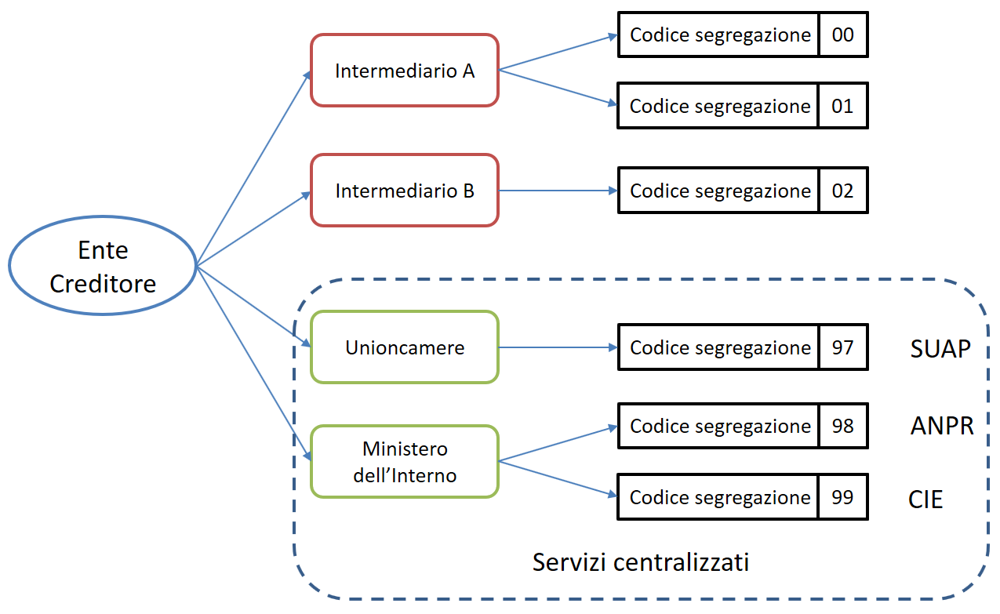

# Generation of Univocal Payment Identifier

As defined in [paragraph 7.1 of the Guidelines](https://www.gazzettaufficiale.it/eli/id/2018/07/03/18A04494/sg), the generation of an IUV code that is **univocal** over time is the responsibility of the Creditor, which is free to structure its composition according to its own needs, taking care that such coding complies with the existing international standards and takes into account the number of "generation points" of the code itself ([IUV Code Generation Points](generation-of-univocal-payment-identifier.md#punti-di-generazione-del-codice-iuv)).

## **IUV Code Generation Points**

The pagoPA system allows a Creditor to use one or more intermediaries and/or technology partners: this circumstance means that the IUV can be generated independently at multiple entities and possibly not under the direct control of the Creditor.

This situation may also be present at Creditors with a complex, well-structured organization consisting of several autonomous organizational units, which need to generate the IUV code independently.

Therefore, an "IUV code generation point" is defined as any entity, whether or not part of the Creditor's organization, which is assigned by the Creditor to associate an IUV code with a single payment in the pending payment archive referred to in [paragraph 7 of the Guidelines](https://www.gazzettaufficiale.it/eli/id/2018/07/03/18A04494/sg).

PagoPA S.p.A. will assign one or more segregation codes (progressively ascending: from 00 to 45) to each of the intermediaries/technology partners, i.e. autonomous entities of the Creditor as requested by these.

If a Creditor generates its own IUV code through autonomous entities and uses an intermediary or technology partner at the same time, the autonomous entities should be surveyed as intermediary/partners of the same institution.

## **The segregation code**

All this being said, rules must be defined so that the payment coding is effectively univocal within the Creditor over time: this is achieved by associating a particular code that serves to segregate the institution's payment management domains with each IUV code generation point.

This code is referred to as the ‘segregation code’.

PagoPA S.p.A. assigns the segregation code to each IUV code generation point depending on the entity playing the role of intermediary or technology partner, according to the following classification:

1. **Centralized service providers**: technological intermediaries, which deliver services in a centralized mode at the national level;
2. **IUV Code Generation Points**: any intermediary or technological partner that does not fall under the previous classification, as well as autonomous units of the institution.

An outline of how the Segregation Code is attributed is shown in Figure 1.

### **Centralized service providers**

These are those entities, surveyed at the general level, that provide centralized services for a community of Creditors with reference to specific procedures: such as, for example, SUAP  (One Stop Shop for Productive Activities), on-line issuance of the Electronic Identity Card, issuance of registry certificates through ANPR (National Registry of the Resident Population), etc.

In some cases, such as that related to the on-line issuance of the CIE (Electronic Identity Card) or registry certificates, which allow simultaneous payment for the service, the use of the centralized procedure will be mandatory for all Italian municipalities.

The qualification as a centralized service provider must be requested from PagoPA SpA, which will update the list shown in Table 1.

#### Table 1 - Segregation codes for centralized services

<table><thead><tr><th width="157.3560034943871">segregation code</th><th width="256.4239379394335">Service provider</th><th>Service</th></tr></thead><tbody><tr><td>99</td><td>Ministry of the Interior</td><td>CIE (Electronic Identity Card) on-line issuance</td></tr><tr><td>98</td><td>Ministry of the Interior</td><td>Emission of certificates from ANPR (National Registry of the Resident Population)</td></tr><tr><td>97</td><td>Unioncamere</td><td>SUAP (One Stop Shop for Productive Activities)</td></tr><tr><td>96</td><td>Automobile Club d&rsquo;Italia</td><td>Road Tax</td></tr><tr><td>85</td><td>PagoPA S.p.A.</td><td>TARI (tax on waste)/TEFA subsidiarity</td></tr><tr><td>81</td><td>PagoPA S.p.A.</td><td>N/A</td></tr><tr><td>47</td><td>PagoPA S.p.A.</td><td>Single Fee</td></tr></tbody></table>

## Composition of the Notice Code

For all types of payment there must always be a payment notice (analog or digital) with which a Notice Number is associated, containing the IUV code within it. 

#### Template A

The structure of the Notice Number, which conforms to pre-existing and established de facto practices and standards at PSPs, is specified by the following template, where the indicated components take on the following meaning:

$$ \<aux digit (1n)>\<IUV code (17n)> $$

| **Aux Digit**| Numeric value that defines the structure of the IUV code according to the number of points of its generation. **The values 0-1-2 must no longer be used**.|
|----------|----------|
| **IUV code**| 
Represents the unique payment identifier as defined in <a href="https://www.gazzettaufficiale.it/eli/id/2018/07/03/18A04494/sg">paragraph 7.1 of the Guidelines</a>. A single pending payment can be associated with one and only one IUV code, regardless of the possible different tools made available by the PSP.

For the structure of the IUV code, refer to <a href="generation-of-univocal-payment-identifier.md#composizione-del-codice-iuv">Composition of the IUV code</a>
|

## **Composition of the IUV code**

#### Template B

The composition of the **IUV code** is represented by the template as a concatenation of its components, which take the following meaning:

$$ \<Segregation code (2n)>\<base IUV (13n)>\<IUV check digit (2n)> $$

| **Segregation code**| Numerical value that represents the [Segregation Code](generation-of-univocal-payment-identifier.md#il-codice-di-segregazione).|
|----------|----------|
| **Base IUV**| Numerical value that each Creditor is free to structure according to its needs, within the limits indicated by these implementation specifications.|
| **IUV check digit**| It represents the IUV control code, calculated using the algorithm specified in the following paragraphs.|

The provision of the IUV check digit (`<IUV check digit (2n)>`) does not imply for the PSP the obligation to verify but rather the power to verify, allowing the PSP itself to check the Notice Number, with an obvious streamlining effect on the payment process as it preempts the receipt of negative responses sent by the Creditor.

## **Generation of the Notice Number and IUV code.**

### **Value 3 of the `<Aux Digit>`component**

This is a template provided to manage institutions that have one or more than one intermediary/technology partner, i.e., institutions for which the "IUV code generation point" may not be univocal.

#### NAV.3  template

The template shows the composition to use for the Notice Number:

$$ 3\<segregation code (2n)>\<base IUV (13n)>\<IUV check digit (2n)> $$

#### IUV.3 template

The composition of the IUV code is defined by the following template:

$$ \<segregation code (2n)>\<base IUV (13n)>\<IUV check digit (2n)> $$

where the component `<IUV check digit>` is calculated as the remainder of the division by 93 of the number obtained by concatenating the components , `<aux digit>`, `<codice segregazione>` and `<IUV base>`.

It is understood that it is the responsibility of the Creditor and/or its Intermediaries/technology partners to properly activate the portion of the APA archive affected by the payment.