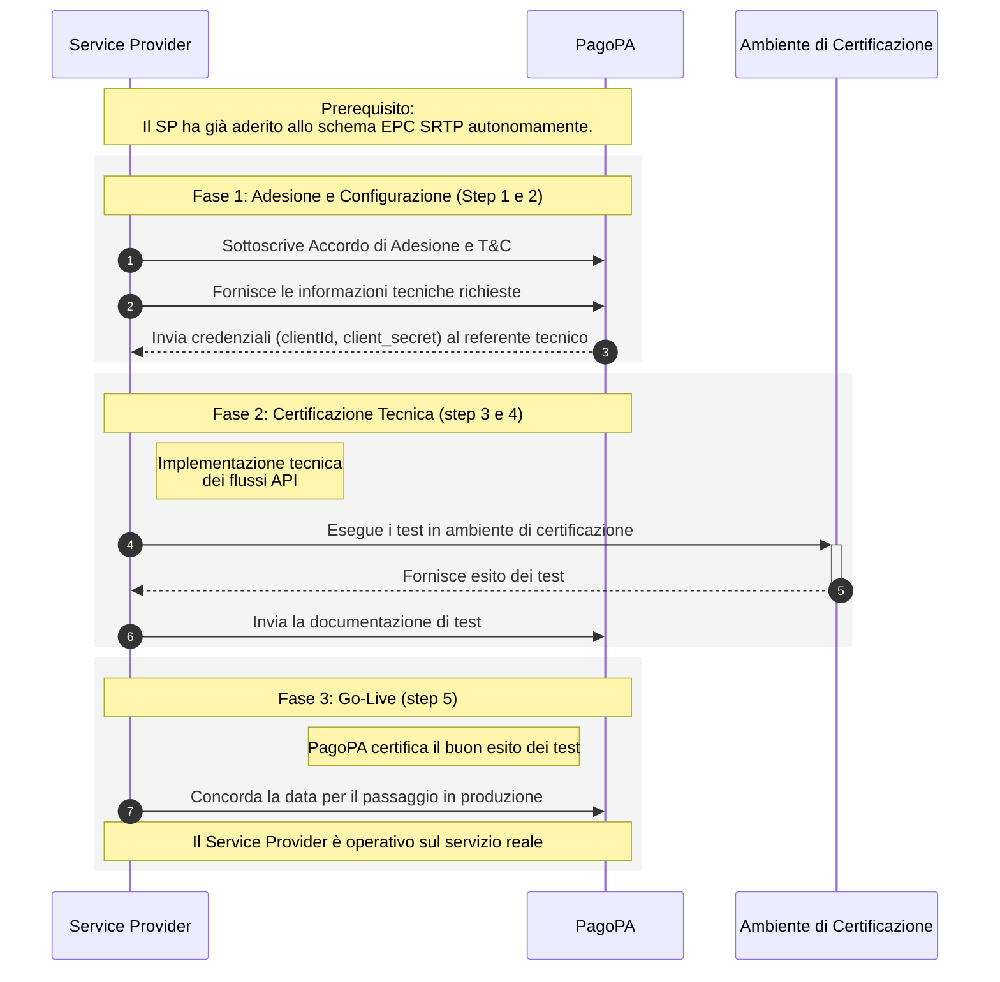

# Come aderire al servizio

Questo tutorial descrive il processo di **Onboarding**, ovvero i passaggi che un Service Provider deve seguire per aderire al servizio RTP, ottenere le credenziali necessarie per l'integrazione tecnica e diventare pienamente operativo.

## **Prerequisito: Adesione allo schema EPC**

Prima di avviare il processo di onboarding con PagoPA, è necessario che il tuo istituto abbia aderito allo schema SEPA Request-to-Pay (SRTP) seguendo le regole definite nel Rulebook dell'European Payments Council (EPC). Questa attività non è gestita da PagoPA.

## **Step 1: Sottoscrivere l'Accordo di Adesione con PagoPA**

Il primo passo consiste nel formalizzare l'adesione al servizio tramite la sottoscrizione della convenzione e dei Termini e Condizioni (T\&C) forniti da PagoPA.

## **Step 2: Fornire le Informazioni Tecniche**

Durante la fase di adesione, dovrai compilare un allegato tecnico con tutte le informazioni necessarie alla configurazione del tuo servizio sulla piattaforma. I dati richiesti includono:

* **Identificativo del Service Provider**: Il tuo Bank Identifier Code (BIC) o, in sua assenza, il codice fiscale della tua organizzazione.
* **Eventuale TPSP:** Se ti avvali di un Technical Service Provider (TPSP) per l'integrazione, dovrai fornire anche il suo identificativo.
* **Ruolo ricoperto**: In questo contesto, "Service Provider del Debitore".
* **Identificativo del canale pagoPA**: Il canale che verrà utilizzato per i pagamenti degli avvisi notificati tramite SRTP.
* **Contatti**: L'indirizzo email di un referente tecnico per il supporto all'integrazione e l'elenco degli utenti (beta-tester) che opereranno in ambiente di test.

## **Step 3: Ricevere le Credenziali di Accesso**

A seguito della sottoscrizione del contratto e della fornitura dei dati tecnici, il referente tecnico indicato riceverà via email le credenziali di accesso ai servizi. Nello specifico, verranno comunicati `clientId` e `client_secret`, indispensabili per l'autenticazione OAuth2 e per l'utilizzo delle API.

## **Step 4: Eseguire i Test in Ambiente di Certificazione (UAT)**

Una volta ottenute le credenziali, dovrai procedere con l'integrazione tecnica e la certificazione in ambiente di test (UAT). Questa fase prevede l'implementazione dei flussi API e l'esecuzione di una serie di prove per verificare il corretto funzionamento della tua integrazione, che andranno documentate secondo le modalità fornite.

## **Step 5: Pianificare il Passaggio in Produzione**

Dopo aver completato con successo la fase di test e ottenuto la certificazione, potrai concordare con PagoPA la data per il passaggio in produzione e iniziare a operare nel servizio reale.
