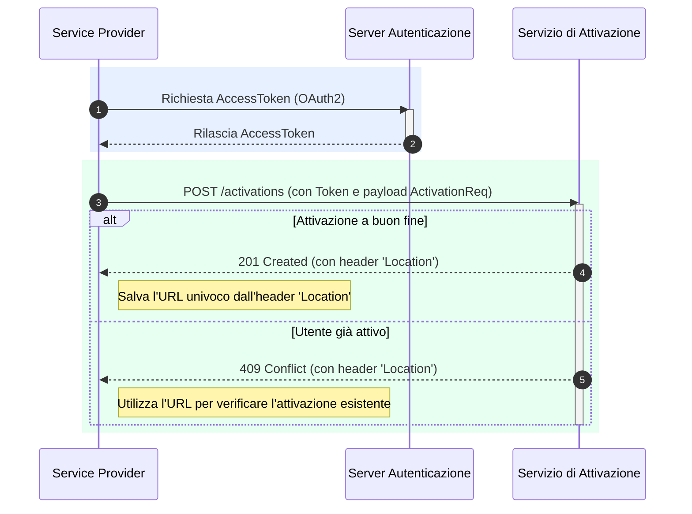

# Come attivare un utente al servizio

Questo tutorial ti guida attraverso il processo tecnico di **Enrollment** e **Attivazione** di un utente (Debitore). Questa operazione, eseguita dal Service Provider del Debitore, è fondamentale per registrare il consenso dell'utente a ricevere notifiche SRTP e renderlo raggiungibile dai Service Provider dei Creditori.

Il flusso si basa sull'invocazione delle API del Servizio di Attivazione, dopo essersi autenticati.



## **Step 1: Ottenere l'AccessToken (Autenticazione)**

Come per tutte le operazioni verso la piattaforma, il primo passo consiste nell'ottenere un token di autenticazione valido.

1. Effettua una chiamata al server di autenticazione PagoPA utilizzando lo schema **OAuth2 Client Credential Grant Type**.
2. Includi nella richiesta il tuo `client_id` e `client_secret`, che hai ricevuto durante il processo di adesione.
3. Il server risponderà con un `AccessToken` che dovrai utilizzare nel passo successivo.

## **Step 2: Preparare il corpo della richiesta (`ActivationReq`)**

Per attivare un utente, dovrai costruire un semplice oggetto JSON che contiene i suoi dati identificativi e quelli del tuo servizio.

**Esempio di Payload di Attivazione**

```json
{
  "payer": {
    "fiscalCode": "RSSMRA85T10A562S",
    "rtpSpId": "12345678911"
  }
}
```

* `payer.fiscalCode`: Il Codice Fiscale dell'utente che ha dato il consenso.
* `payer.rtpSpId`: L'identificativo (BIC o P.IVA) del tuo servizio di Service Provider.

## **Step 3: Invocare l'API di Attivazione**

Una volta ottenuto l'`AccessToken` e preparato il payload, puoi procedere con la richiesta di attivazione.

**Endpoint**

```http
POST /activations
```

Includi l'`AccessToken` nell'header `Authorization` come Bearer Token e il JSON `ActivationReq` nel corpo della richiesta.

## **Step 4: Gestire la risposta del servizio**

L'esito della chiamata ti informa se l'attivazione è andata a buon fine o se l'utente era già attivo.

* **Caso di Successo (`201 Created`)** La risposta indica che l'utente è stato attivato con successo. **Importante**: recupera e salva il valore dell'header `Location` della risposta. Contiene l'URL univoco dell'attivazione, che include l'`activationId` necessario per gestire la risorsa in futuro (es. per cancellarla).
* **Caso di Utente Già Attivo (`409 Conflict`)** Questo errore indica che esiste già un'attivazione per il Codice Fiscale fornito. L'header `Location` conterrà l'URL dell'attivazione esistente. Puoi utilizzare questo URL per recuperare i dettagli (`GET /activations/{activationId}`) e verificare se l'attivazione è già associata al tuo SP o se è necessario avviare un processo di subentro (takeover).
