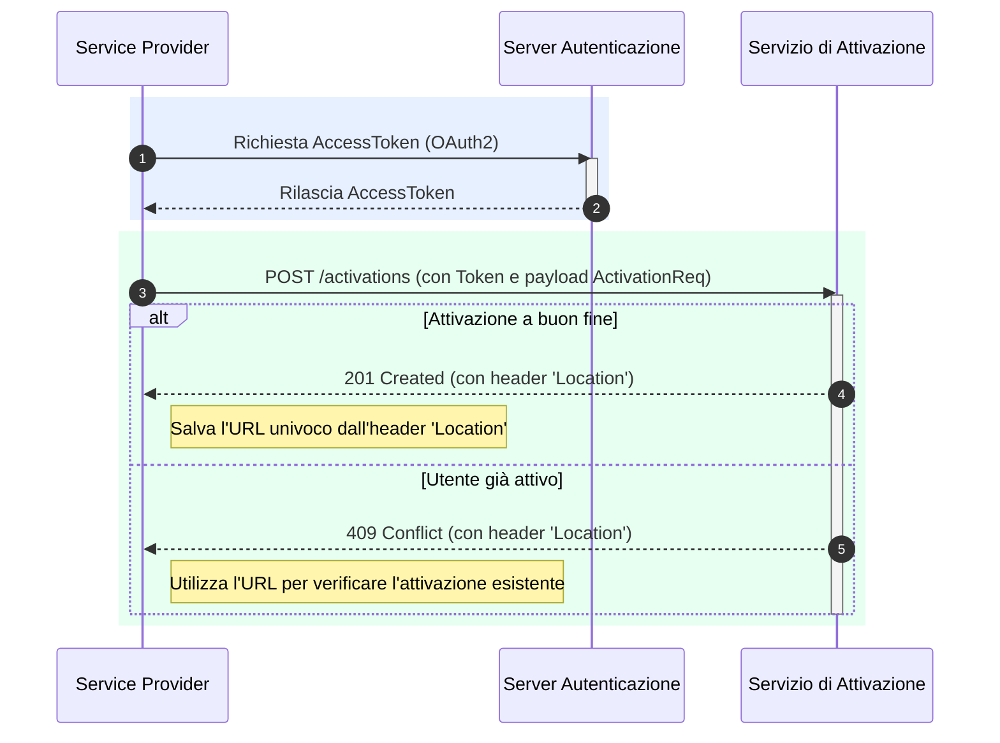

---
argomenti_correlati:
  - /docs/srtp/guida-tecnica/autenticazione
funzione: tutorial
livello: intermedio
prodotto:
  nome: PagoPA SRTP
  versione: v1.0.0
schema:
  '@context': https://schema.org
  '@type': HowTo
  author:
    '@type': Organization
    name: PagoPA S.p.A.
  description: >-
    Tutorial tecnico che guida un Service Provider attraverso il processo di
    enrollment e attivazione di un utente (Debitore) tramite API, per abilitarlo
    a ricevere notifiche.
  keywords:
    - attivazione utente
    - enrollment
    - SRTP
    - API
    - AccessToken
    - OAuth2
  name: Come attivare un utente al servizio SRTP
  step:
    - '@type': HowToStep
      name: 'Step 1: Ottenere l''AccessToken (Autenticazione)'
      text: >-
        Effettuare una chiamata al server di autenticazione PagoPA con lo schema
        OAuth2 Client Credential Grant Type, usando il proprio client_id e
        client_secret per ottenere un AccessToken.
    - '@type': HowToStep
      name: 'Step 2: Preparare il corpo della richiesta (ActivationReq)'
      text: >-
        Costruire un oggetto JSON contenente il Codice Fiscale dell'utente
        (payer.fiscalCode) e l'identificativo del Service Provider
        (payer.rtpSpId).
    - '@type': HowToStep
      name: 'Step 3: Invocare l''API di Attivazione'
      text: >-
        Eseguire una richiesta POST all'endpoint /activations, includendo
        l'AccessToken come Bearer Token nell'header Authorization e il payload
        ActivationReq nel corpo.
    - '@type': HowToStep
      name: 'Step 4: Gestire la risposta del servizio'
      text: >-
        Interpretare la risposta HTTP: in caso di successo (201 Created),
        salvare l'URL univoco dall'header 'Location'; in caso di utente già
        attivo (409 Conflict), usare l'URL fornito per verificare l'attivazione
        esistente.
status: pubblicato
tecnologia:
  - REST
  - OAuth2
  - JSON
utente:
  ruolo: erogatore
  tag:
    - attivazione
    - enrollment
    - API
    - autenticazione
    - AccessToken
  tipo_ente: partner_tecnologico
---

# Come attivare un utente al servizio

Questo tutorial guida attraverso il processo tecnico di **Enrollment** e **Attivazione** di un utente (Debitore). Questa operazione, eseguita dal Service Provider del Debitore, è fondamentale per registrare il consenso dell'utente a ricevere notifiche SRTP e renderlo raggiungibile dai Service Provider dei Creditori.

Il flusso si basa sull'invocazione delle API del Servizio di Attivazione, dopo essersi autenticati.



## Step 1: Ottenere l'AccessToken (Autenticazione)

Come per tutte le operazioni verso la piattaforma, il primo passo consiste nell'ottenere un token di autenticazione valido.

1. Effettuare una chiamata al server di autenticazione PagoPA utilizzando lo schema **OAuth2 Client Credential Grant Type**.
2. Includere nella richiesta il tuo `client_id` e `client_secret`, che hai ricevuto durante il processo di adesione.
3. Il server risponderà con un `AccessToken` da utilizzare nel passo successivo.

## Step 2: Preparare il corpo della richiesta (`ActivationReq`)

Per attivare un utente, occorrerà costruire un semplice oggetto JSON che contiene i suoi dati identificativi e quelli del tuo servizio.

**Esempio di Payload di Attivazione**

```json
{
  "payer": {
    "fiscalCode": "RSSMRA85T10A562S",
    "rtpSpId": "12345678911"
  }
}
```

* `payer.fiscalCode`: Il Codice Fiscale dell'utente che ha dato il consenso.
* `payer.rtpSpId`: L'identificativo (BIC o P.IVA) del tuo servizio di Service Provider.

## Step 3: Invocare l'API di Attivazione

Una volta ottenuto l'`AccessToken` e preparato il payload, sarà possibile procedere con la richiesta di attivazione.

**Endpoint**

```http
POST /activations
```

Occorrerà includere l'`AccessToken` nell'header `Authorization` come Bearer Token e il JSON `ActivationReq` nel corpo della richiesta.

## Step 4: Gestire la risposta del servizio

L'esito della chiamata  informa se l'attivazione è andata a buon fine o se l'utente era già attivo.

* **Caso di Successo (`201 Created`)** La risposta indica che l'utente è stato attivato con successo. **Importante**: è ncessario recuperare e salvare il valore dell'header `Location` della risposta. Contiene l'URL univoco dell'attivazione, che include l'`activationId` necessario per gestire la risorsa in futuro (es. per cancellarla).
* **Caso di Utente Già Attivo (`409 Conflict`)** Questo errore indica che esiste già un'attivazione per il Codice Fiscale fornito. L'header `Location` conterrà l'URL dell'attivazione esistente. Sarà possibile utilizzare questo URL per recuperare i dettagli (`GET /activations/{activationId}`) e verificare se l'attivazione è già associata al Service Provider o se è necessario avviare un processo di subentro (takeover).
