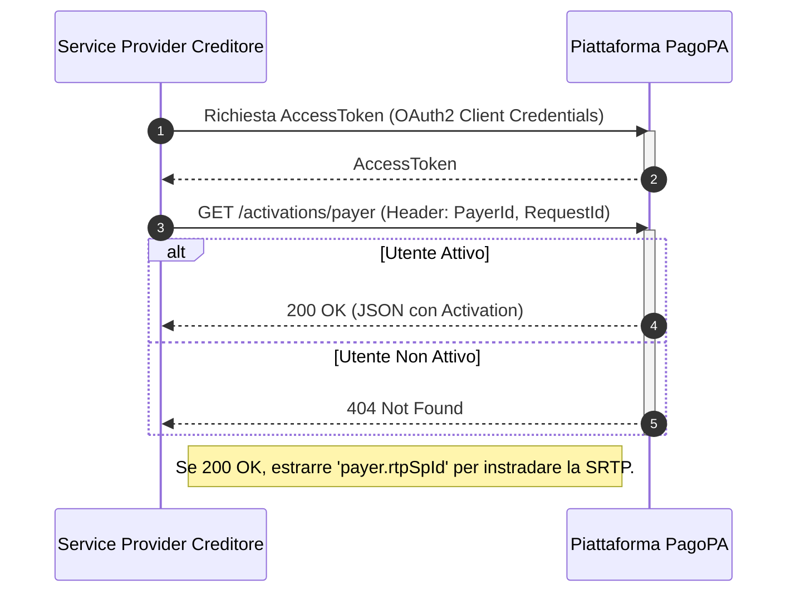

# Come individuare le informazioni di un Service Provider

Questo tutorial dedicato ai **Service Provider del Creditore diversi da PagoPA** spiega come utilizzare il Discovery Service, esposto tramite le API di Attivazione, per verificare se un utente è attivo al servizio RTP e per ottenere l'identificativo tecnico del suo Service Provider del Debitore. Questa informazione è indispensabile per poter instradare correttamente una richiesta di pagamento.



## **Step 1: Ottenere un AccessToken**

Come per tutte le chiamate API verso la piattaforma, il primo passo consiste nell'ottenere un `AccessToken` valido tramite il flusso OAuth2 Client Credentials, utilizzando le proprie credenziali.

## **Step 2: Interrogare il Discovery Service**

Per scoprire le informazioni di raggiungibilità di un utente, è necessario interrogare l'endpoint di ricerca del Servizio di Attivazione.

### **Endpoint**

```http
GET /activations/payer
```

#### **Parametri Header**

* `PayerId` (header, obbligatorio): Il Codice Fiscale dell'utente (pagatore) di cui si vogliono conoscere le informazioni di attivazione.
* `RequestId` (header, obbligatorio): Un UUID per identificare la richiesta.

## **Step 3: Interpretare la Risposta (Come vengono erogate le informazioni)**

L'esito della chiamata determina se è possibile o meno inviare una SRTP all'utente.

* **Caso di Successo (`200 OK`)** PagoPA eroga le informazioni restituendo un oggetto `Activation` in formato JSON. Il campo chiave da estrarre per l'instradamento della SRTP è:
  * **`payer.rtpSpId`**: Questo valore è l'identificativo tecnico (BIC o P.IVA) del Service Provider del Debitore a cui dovrai inviare la successiva richiesta di pagamento.
* **Caso di Utente Non Attivo (`404 Not Found`)** Se ricevi questo codice di errore, significa che l'utente identificato dal Codice Fiscale non ha un'attivazione valida per il servizio RTP. **Non è possibile inviargli una richiesta di pagamento**.
