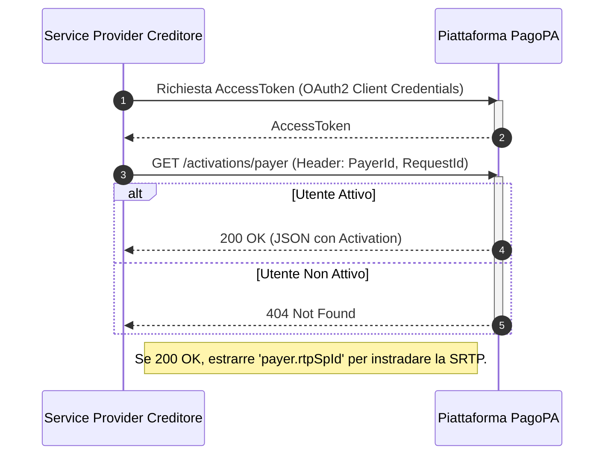

---
argomenti_correlati:
- /guida-tecnica/attivazione/api
funzione: tutorial
livello: intermedio
prodotto:
  nome: PagoPA SRTP
  versione: v1.0.0
schema:
  '@context': https://schema.org
  '@type': HowTo
  author:
    '@type': Organization
    name: PagoPA S.p.A.
  description: Questo tutorial spiega ai Service Provider del Creditore come utilizzare
    il Discovery Service per verificare l'attivazione di un utente al servizio RTP
    e ottenere l'identificativo del suo Service Provider, informazione indispensabile
    per instradare una richiesta di pagamento.
  keywords:
  - Discovery Service
  - RTP
  - SRTP
  - Service Provider
  - PayerId
  - Activation
  name: Come individuare le informazioni di un Service Provider per SRTP
  step:
  - '@type': HowToStep
    name: Ottenere un AccessToken
    text: Ottenere un AccessToken valido tramite il flusso OAuth2 Client Credentials
      utilizzando le proprie credenziali.
  - '@type': HowToStep
    name: Interrogare il Discovery Service
    text: Inviare una richiesta GET all'endpoint /activations/payer, includendo negli
      header i parametri PayerId (Codice Fiscale dell'utente) e RequestId (UUID per
      la richiesta).
  - '@type': HowToStep
    name: Interpretare la Risposta
    text: Una risposta 200 OK contiene un oggetto Activation con il campo 'payer.rtpSpId',
      necessario per l'instradamento. Una risposta 404 Not Found indica che l'utente
      non è attivo sul servizio RTP.
  tool:
  - '@type': HowToTool
    name: Client HTTP
  - '@type': HowToTool
    name: Credenziali OAuth2 per la piattaforma PagoPA
  totalTime: PT2M
status: pubblicato
tecnologia:
- REST
- OAuth2
- JSON
utente:
  ruolo: fruitore
  tag:
  - Discovery Service
  - RTP
  - SRTP
  - Activation
  tipo_ente: partner_tecnologico
---

# Come individuare le informazioni di un Service Provider

Questo tutorial dedicato ai **Service Provider del Creditore diversi da PagoPA** spiega come utilizzare il Discovery Service, esposto tramite le API di Attivazione, per verificare se un utente è attivo al servizio RTP e per ottenere l'identificativo tecnico del suo Service Provider del Debitore. Questa informazione è indispensabile per poter instradare correttamente una richiesta di pagamento.



## Step 1: Ottenere un AccessToken

Come per tutte le chiamate API verso la piattaforma, il primo passo consiste nell'ottenere un `AccessToken` valido tramite il flusso OAuth2 Client Credentials, utilizzando le proprie credenziali.

## Step 2: Interrogare il Discovery Service

Per scoprire le informazioni di raggiungibilità di un utente, è necessario interrogare l'endpoint di ricerca del Servizio di Attivazione.

### Endpoint

```http
GET /activations/payer
```

#### Parametri Header

* `PayerId` (header, obbligatorio): Il Codice Fiscale dell'utente (pagatore) di cui si vogliono conoscere le informazioni di attivazione.
* `RequestId` (header, obbligatorio): Un UUID per identificare la richiesta.

## Step 3: Interpretare la Risposta (Come vengono erogate le informazioni)

L'esito della chiamata determina se è possibile o meno inviare una SRTP all'utente.

* **Caso di Successo (`200 OK`)** PagoPA eroga le informazioni restituendo un oggetto `Activation` in formato JSON. Il campo chiave da estrarre per l'instradamento della SRTP è:
  * **`payer.rtpSpId`**: Questo valore è l'identificativo tecnico (BIC o P.IVA) del Service Provider del Debitore a cui dovrai inviare la successiva richiesta di pagamento.
* **Caso di Utente Non Attivo (`404 Not Found`)** Se ricevi questo codice di errore, significa che l'utente identificato dal Codice Fiscale non ha un'attivazione valida per il servizio RTP. **Non è possibile inviargli una richiesta di pagamento**.
