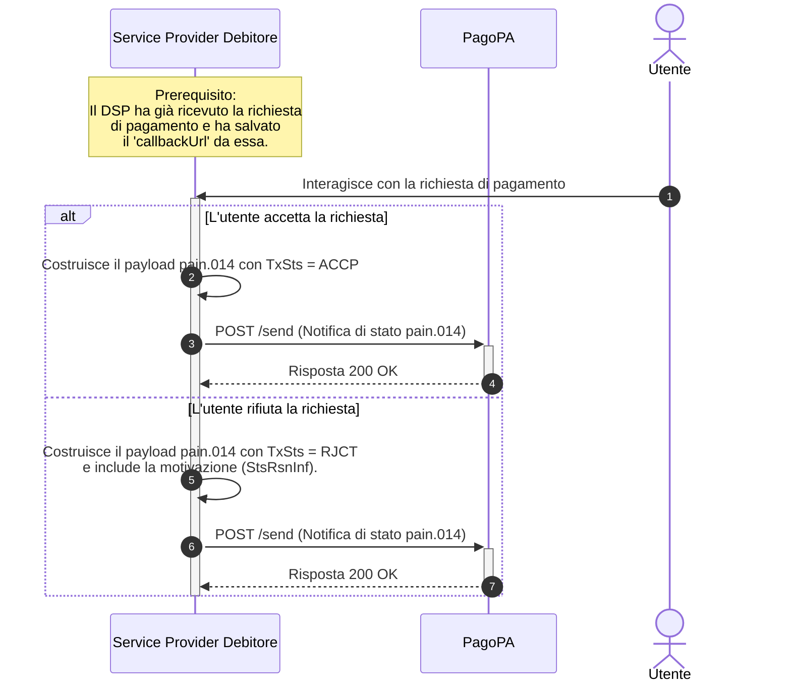

---
argomenti_correlati:
  - /docs/pago-pa-srtp/ricezione-richiesta-pagamento
funzione: tutorial
livello: intermedio
prodotto:
  nome: PagoPA SRTP
  versione: v1.0.0
schema:
  '@context': https://schema.org
  '@type': HowTo
  author:
    '@type': Organization
    name: PagoPA S.p.A.
  description: >-
    Guida passo-passo per i Service Provider del Debitore su come notificare a
    PagoPA l'esito di una richiesta di pagamento (accettata o rifiutata) tramite
    una chiamata di callback asincrona con un messaggio pain.014.
  keywords:
    - callback
    - pain.014
    - notifica stato
    - pagoPA
    - SRTP
    - SEPA Request-to-Pay
  name: Come inviare una Risposta di Stato via Callback in PagoPA SRTP
  step:
    - '@type': HowToStep
      name: Identifica l'URL di Callback
      text: >-
        Recupera dinamicamente l'URL dal campo `callbackUrl` presente nella
        richiesta di pagamento originale e associalo alla transazione corrente.
    - '@type': HowToStep
      name: Costruisci il corpo della richiesta (pain.014)
      text: >-
        Crea il messaggio `pain.014` in formato JSON, valorizzando i campi di
        correlazione con i dati della richiesta originale e impostando lo stato
        `TxSts` su 'ACCP' (accettato) o 'RJCT' (rifiutato).
    - '@type': HowToStep
      name: Invia la notifica di stato
      text: >-
        Esegui una chiamata HTTP POST all'URL di callback recuperato, includendo
        il payload JSON `pain.014` nel corpo della richiesta.
    - '@type': HowToStep
      name: Gestisci la risposta alla callback
      text: >-
        Verifica di ricevere uno status code `200 OK` da PagoPA, che conferma la
        corretta ricezione della notifica di stato.
  tool:
    - '@type': HowToTool
      description: >-
        Un'applicazione o libreria in grado di effettuare chiamate API REST con
        metodo POST e di costruire un payload JSON.
      name: Client HTTP
status: pubblicato
tecnologia:
  - pain.014
  - JSON
  - REST API
  - Callback
utente:
  ruolo: service_provider_debitore
  tag:
    - callback
    - notifica di stato
    - pain.014
    - risposta
  tipo_ente: partner_tecnologico
---

# Come inviare una Risposta di Stato via Callback

Dopo che un utente ha interagito con una richiesta di pagamento nell' applicazione (accettandola o rifiutandola), il Service Provider del Debitore ha il compito di comunicare questa decisione al mittente (PagoPA).

Questa operazione viene eseguita in modo asincrono, invocando un endpoint di callback con un messaggio di stato `pain.014`.



## Step 1: Identifica l'URL di Callback

L'URL a cui inviare la notifica di stato non è un indirizzo statico. Occorre recuperare dinamicamente l'URL corretto dal campo `callbackUrl` presente nel corpo della richiesta di pagamento (`SepaRequestToPayRequestResource`) originale che hai ricevuto.

È fondamentale che il tuo sistema associ questo `callbackUrl` alla richiesta di pagamento per poterlo utilizzare in questo passaggio.

## Step 2: Componi il corpo della richiesta (`pain.014.001.07`)

Occorre comporre un messaggio `pain.014` che contenga l'esito dell'operazione. Questo messaggio sarà incapsulato in un oggetto `AsynchronousSepaRequestToPayResponseResource`.

Campi Chiave da Valorizzare:

* Correlazione: Compila i campi `OrgnlMsgId` e `OrgnlEndToEndId` con i valori esatti ricevuti nella richiesta `pain.013` originale. Questo permette al mittente di associare la tua risposta alla richiesta corretta.
* Stato: Il campo `TxSts` è il più importante e deve essere valorizzato con:
  * `ACCP`: Se l'utente ha accettato la richiesta.
  * `RJCT`: Se l'utente ha rifiutato la richiesta.
* Motivazione: In caso di rifiuto, è buona norma compilare il blocco `StsRsnInf` per specificarne il motivo.

### Esempio di Payload di Accettazione (`pain.014`)

```json
{
    "Document": {
        "CdtrPmtActvtnReqStsRpt": {
            "GrpHdr": {
                "MsgId": "MSG-ID-RISPOSTA-UNIVOCO",
                "CreDtTm": "2025-07-28T17:30:00.000Z",
                "InitgPty": {
                    "Nm": "Mario Rossi",
                    "Id": { "OrgId": { "Othr": { "Id": "RSSMRA85T10A562S", "SchmeNm": { "Cd": "POID" } } } }
                }
            },
            "OrgnlGrpInfAndSts": {
                "OrgnlMsgId": "ab85fbb7a48a4a669b5436ee5b497036",
                "OrgnlMsgNmId": "pain.013.001.10",
                "OrgnlPmtInfAndSts": [
                    {
                        "OrgnlPmtInfId": "ab85fbb7a48a4a669b5436ee5b497036",
                        "TxInfAndSts": {
                            "OrgnlEndToEndId": "311111111112222222",
                            "TxSts": "ACCP"
                        }
                    }
                ]
            }
        }
    }
}
```

## Step 3: Invia la notifica di stato

Una volta preparato il payload, occorre eseguire la chiamata API.

### Endpoint

```
POST /send
```

Di seguito occorrerà:

1. Effettuare una chiamata `POST` all'URL di `callback` recuperato nello Step 1.
2. Inserire il payload JSON che hai costruito nel corpo della richiesta.

## Step 4: Gestisci la risposta alla callback

Se il messaggio è stato ricevuto correttamente dal server di PagoPA, verrà ricevuta una risposta immediata con uno status code `200 OK`. Questo conferma che la comunicazione è avvenuta con successo.
