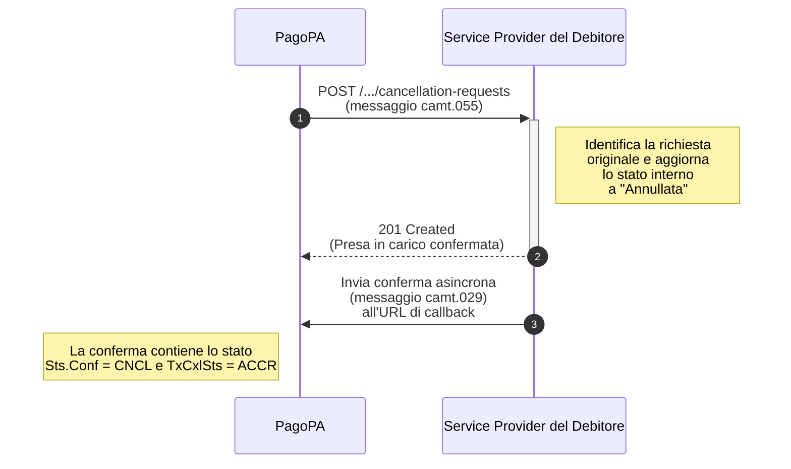

---
argomenti_correlati:
  - /docs/pago-pa-srtp/tutorial/come-inviare-richiesta-pagamento
funzione: tutorial
livello: intermedio
prodotto:
  nome: PagoPA SRTP
  versione: v1.0.0
schema:
  '@context': https://schema.org
  '@type': HowTo
  author:
    '@type': Organization
    name: PagoPA S.p.A.
  description: >-
    Questo tutorial guida i Service Provider del Debitore attraverso i passaggi
    per gestire una richiesta di cancellazione (RfC) in entrata, avviata da
    PagoPA quando un avviso di pagamento viene annullato o pagato tramite altri
    canali.
  keywords:
    - cancellazione
    - RfC
    - camt.055
    - camt.029
    - callback
    - SRTP
    - SEPA Request-to-Pay
  name: Come ricevere e gestire una richiesta di cancellazione
  step:
    - '@type': HowToStep
      name: Implementa l'endpoint di ricezione della cancellazione
      text: >-
        Esporre un endpoint POST
        /sepa-request-to-pay-requests/{sepaRequestToPayRequestResourceId}/cancellation-requests
        per ricevere le richieste di cancellazione da PagoPA.
    - '@type': HowToStep
      name: Ricevi e processa il messaggio di cancellazione (camt.055)
      text: >-
        All'arrivo di una richiesta, identifica la richiesta di pagamento
        originale usando sepaRequestToPayRequestResourceId. Aggiorna lo stato
        interno a 'Annullata' per impedire ulteriori pagamenti e rispondi con
        status 201 Created.
    - '@type': HowToStep
      name: Invia la conferma di cancellazione asincrona (camt.029)
      text: >-
        Invia un messaggio di conferma camt.029 all'URL di callback del
        mittente. Imposta il campo Sts.Conf a 'CNCL' e TxCxlSts a 'ACCR' per
        confermare l'avvenuta cancellazione.
status: pubblicato
tecnologia:
  - REST API
  - HTTP
  - JSON
  - camt.055
  - camt.029
utente:
  ruolo: erogatore
  tag:
    - cancellazione
    - RfC
    - callback
    - asincrono
    - SRTP
  tipo_ente: partner_tecnologico
---

# Come ricevere e gestire una richiesta di cancellazione

Questo tutorial guida il Service Provider del Debitore attraverso i passaggi necessari per gestire correttamente una richiesta di cancellazione (RfC) in entrata. Questa operazione viene avviata da PagoPA quando un avviso di pagamento è stato annullato o pagato tramite altri canali.

Il processo prevede la ricezione di una richiesta, l'aggiornamento dello stato nei sistemi del Service Provider del Debitore e l'invio di una notifica di conferma asincrona.



## **Step 1: Implementa l'endpoint di ricezione della cancellazione**

Il sistema del l Service Provider del Debitore deve esporre un endpoint in grado di ricevere le richieste di cancellazione inviate da PagoPA.

### **Endpoint (da implementare)**

```http
POST /sepa-request-to-pay-requests/{sepaRequestToPayRequestResourceId}/cancellation-requests
```

## **Step 2: Ricevi e processa il messaggio di cancellazione (`camt.055`)**

Quando si riceve una chiamata su questo endpoint, il corpo della richiesta contiene un oggetto `SepaRequestToPayCancellationRequestResource`, che incapsula un messaggio `camt.055.001.08`.

Sarà quindi necessario:

1. **Identificare la richiesta originale:** Si userà il `sepaRequestToPayRequestResourceId` ricevuto nel path e i dati di correlazione all'interno del messaggio (es. `OrgnlEndToEndId`) per individuare la richiesta di pagamento da annullare nel tuo sistema.
2. **Aggiornare lo stato:** occorre modificare lo stato della richiesta nell'applicazione, mostrandola all'utente come "Annullata" o "Già pagata". Questo è un passaggio cruciale per impedire all'utente di tentare un pagamento non più dovuto.
3. **Rispondere alla chiamata**: Occorre inviare una risposta sincrona con status code **`201 Created`** per confermare la presa in carico della richiesta di cancellazione.

## **Step 3: Invia la conferma di cancellazione asincrona (`camt.029`)**

Dopo aver processato la richiesta, occorrerà inviare una conferma asincrona all'URL di `callback` del mittente (ricevuto nella richiesta di pagamento originale).

### **Campi Chiave da Valorizzare:**

* **Correlazione**: andranno inclusi gli identificativi della richiesta di cancellazione (`camt.055`) a cui stai rispondendo.
* **Stato**: si dovrà impostare il campo `Sts.Conf` su `CNCL` (Cancelled) e `TxCxlSts` su `ACCR` (AcceptedCancellationRequest) per confermare l'esito positivo.

### **Esempio di Payload di Conferma Cancellazione (`camt.029`)**

```json
{
  "resourceId": "string",
  "SepaRequestToPayCancellationResponse": {
    "Document": {
      "RsltnOfInvstgtn": {
        "Assgnmt": {
          "Id": "ID_DELLA_RICHIESTA_DI_CANCELLAZIONE",
          "Assgnr": { /* Dati di chi ha assegnato il task */ },
          "Assgne": { /* Dati di chi ha eseguito il task */ },
          "CreDtTm": "2025-07-28T18:00:00.000Z"
        },
        "Sts": {
          "Conf": "CNCL"
        },
        "CxlDtls": {
          "OrgnlPmtInfAndSts": [
            {
              "TxInfAndSts": [
                {
                  "OrgnlEndToEndId": "IUV_DELLA_RICHIESTA_ORIGINALE",
                  "TxCxlSts": "ACCR"
                }
              ]
            }
          ]
        }
      }
    }
  }
}
```

Questo payload andrà inviato all'endpoint di `callback` per completare il processo di cancellazione.
