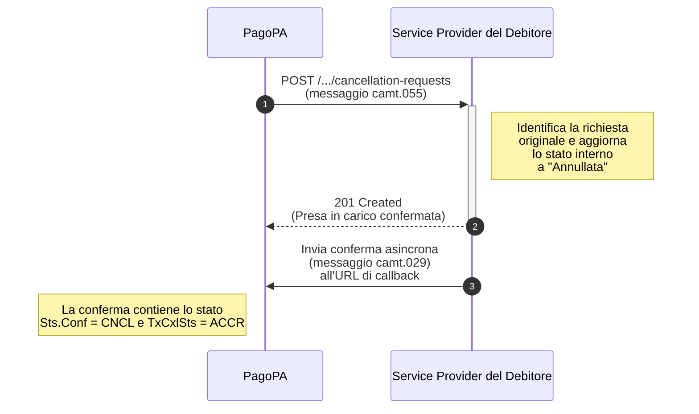

# Come ricevere e gestire una richiesta di cancellazione

Questo tutorial ti guida, in qualità di Service Provider del Debitore, attraverso i passaggi necessari per gestire correttamente una richiesta di cancellazione (RfC) in entrata. Questa operazione viene avviata da PagoPA quando un avviso di pagamento è stato annullato o pagato tramite altri canali.

Il processo prevede la ricezione di una richiesta, l'aggiornamento dello stato nei tuoi sistemi e l'invio di una notifica di conferma asincrona.



## **Step 1: Implementa l'endpoint di ricezione della cancellazione**

Il tuo sistema deve esporre un endpoint in grado di ricevere le richieste di cancellazione inviate da PagoPA.

### **Endpoint (da implementare)**

```http
POST /sepa-request-to-pay-requests/{sepaRequestToPayRequestResourceId}/cancellation-requests
```

## **Step 2: Ricevi e processa il messaggio di cancellazione (`camt.055`)**

Quando ricevi una chiamata su questo endpoint, il corpo della richiesta conterrà un oggetto `SepaRequestToPayCancellationRequestResource`, che incapsula un messaggio `camt.055.001.08`.

1. **Identifica la richiesta originale**: Usa l'`sepaRequestToPayRequestResourceId` ricevuto nel path e i dati di correlazione all'interno del messaggio (es. `OrgnlEndToEndId`) per individuare la richiesta di pagamento da annullare nel tuo sistema.
2. **Aggiorna lo stato**: Modifica lo stato della richiesta nella tua applicazione, mostrandola all'utente come "Annullata" o "Già pagata". Questo è un passaggio cruciale per impedire all'utente di tentare un pagamento non più dovuto.
3. **Rispondi alla chiamata**: Invia una risposta sincrona con status code **`201 Created`** per confermare la presa in carico della richiesta di cancellazione.

## **Step 3: Invia la conferma di cancellazione asincrona (`camt.029`)**

Dopo aver processato la richiesta, devi inviare una conferma asincrona all'URL di `callback` del mittente (ricevuto nella richiesta di pagamento originale).

### **Campi Chiave da Valorizzare:**

* **Correlazione**: Includi gli identificativi della richiesta di cancellazione (`camt.055`) a cui stai rispondendo.
* **Stato**: Imposta il campo `Sts.Conf` su `CNCL` (Cancelled) e `TxCxlSts` su `ACCR` (AcceptedCancellationRequest) per confermare l'esito positivo.

### **Esempio di Payload di Conferma Cancellazione (`camt.029`)**

```json
{
  "resourceId": "string",
  "SepaRequestToPayCancellationResponse": {
    "Document": {
      "RsltnOfInvstgtn": {
        "Assgnmt": {
          "Id": "ID_DELLA_RICHIESTA_DI_CANCELLAZIONE",
          "Assgnr": { /* Dati di chi ha assegnato il task */ },
          "Assgne": { /* Dati di chi ha eseguito il task */ },
          "CreDtTm": "2025-07-28T18:00:00.000Z"
        },
        "Sts": {
          "Conf": "CNCL"
        },
        "CxlDtls": {
          "OrgnlPmtInfAndSts": [
            {
              "TxInfAndSts": [
                {
                  "OrgnlEndToEndId": "IUV_DELLA_RICHIESTA_ORIGINALE",
                  "TxCxlSts": "ACCR"
                }
              ]
            }
          ]
        }
      }
    }
  }
}
```

Invia questo payload all'endpoint di `callback` per completare il processo di cancellazione.
