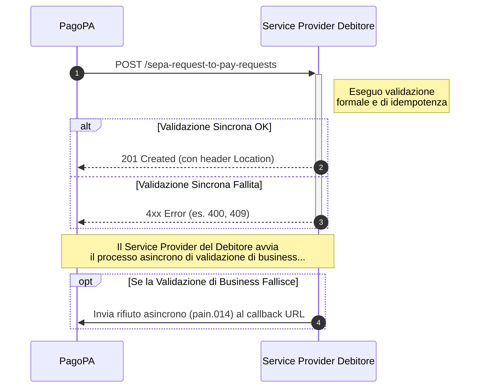

---
argomenti_correlati:
  - /guida-tecnica/api-per-la-ricezione-delle-richieste-srtp
funzione: tutorial
livello: intermedio
prodotto:
  nome: PagoPA SRTP
  versione: v1.0.0
schema:
  '@context': https://schema.org
  '@type': HowTo
  author:
    '@type': Organization
    name: PagoPA S.p.A.
  description: >-
    Tutorial che guida passo-passo gli sviluppatori nell'implementazione del
    flusso di ricezione, validazione e processamento di una richiesta di
    pagamento (SRTP) inviata da PagoPA.
  name: Come ricevere e validare una richiesta di pagamento
  step:
    - '@type': HowToStep
      name: 'Step 1: Implementa l''endpoint di ricezione'
      text: >-
        Esponi un endpoint POST /sepa-request-to-pay-requests per ricevere le
        richieste SRTP in entrata.
    - '@type': HowToStep
      name: 'Step 2: Gestisci gli Header della Richiesta'
      text: >-
        Gestisci correttamente gli header HTTP 'Idempotency-key' per prevenire
        duplicati e 'X-Request-ID' per il logging e il troubleshooting.
    - '@type': HowToStep
      name: 'Step 3: Valida il Corpo della Richiesta'
      text: >-
        Esegui una validazione sincrona per la correttezza formale del messaggio
        pain.013 e una validazione di business asincrona sui dati del pagatore.
    - '@type': HowToStep
      name: 'Step 4: Invia la Risposta Sincrona'
      text: >-
        In caso di successo della validazione formale, rispondi con '201
        Created' e l'header 'Location'. Altrimenti, rispondi con un codice di
        errore appropriato (es. 400, 409).
    - '@type': HowToStep
      name: 'Step 5: Gestisci il Rifiuto Asincrono (DS-04)'
      text: >-
        Se la validazione di business fallisce, notifica il mittente inviando un
        messaggio di rifiuto asincrono (pain.014) all'URL di callback fornito
        nella richiesta originale.
status: pubblicato
tecnologia:
  - HTTP
  - API
  - SEPA
utente:
  ruolo: erogatore
  tag:
    - SRTP
    - richiesta di pagamento
    - validazione
    - idempotenza
    - pain.013
    - pain.014
  tipo_ente: partner_tecnologico
---

# Come ricevere e validare una richiesta di pagamento

Questo tutorial guida attraverso i passaggi necessari per ricevere, validare e processare correttamente una richiesta di pagamento (SRTP) in entrata, inviata da PagoPA secondo le specifiche descritte in [API per la ricezione delle richieste SRTP](../guida-tecnica/api-per-la-ricezione-delle-richieste-srtp.md).

L'implementazione di questo flusso è il cuore del servizio, in quanto abilita la ricezione delle notifiche da presentare agli utenti finali.



## Step 1: Implementa l'endpoint di ricezione

Per prima cosa, il sistema dovrà esporre un endpoint in grado di ricevere le richieste. Questo endpoint diventerà il punto di ingresso per tutte le SRTP destinate agli utenti.

### Endpoint (da implementare)

```http
POST /sepa-request-to-pay-requests
```

## Step 2: Gestisci gli Header della Richiesta

Ogni richiesta in entrata conterrà degli header HTTP standard che occorrerà gestire correttamente.

* **`Idempotency-key`**: Questo header è fondamentale per prevenire la doppia elaborazione di una stessa richiesta. La logica deve:
  1. Salvare l'`Idempotency-key` della prima richiesta ricevuta.
  2. Se si riceve una nuova richiesta con una chiave già vista, occorre verificare se il payload è identico. Se lo è,  è necessario restituire la risposta originale (`201 Created`); se è diverso, occorre restituire un errore (`422 Unprocessable Entity`).
* **`X-Request-ID`**: Un ID di correlazione da utilizzare per il logging e il troubleshooting.

## Step 3: Validazione del Corpo della Richiesta (`SepaRequestToPayRequestResource`)

La validazione del payload avviene in due fasi:

1. **Validazione Sincrona (immediata)**: Appena si riceve la richiesta, occorre eseguire una validazione formale per assicurarsi che il corpo contenga un oggetto `SepaRequestToPayRequestResource` valido e che il messaggio `pain.013` incapsulato sia strutturalmente corretto. Se questa validazione fallisce,  occorre rispondere immediatamente con un errore (vedi Step 4).
2. **Validazione di Business (successiva)**: Dopo aver confermato la presa in carico (vedi Step 4), vanno eseguiti controlli più approfonditi.&#x20;

## Step 4: Invia la Risposta Sincrona

Dopo la validazione formale, è necessario inviare una risposta immediata per comunicare l'esito della presa in carico.

* **Caso di Successo**: Se la validazione iniziale ha successo, si salva la richiesta e si risponde con:
  * **`201 Created`**: Questo status code conferma al chiamante che la richiesta è stata accettata per l'elaborazione.
  * **Header `Location`**: È necessario includere in risposta l'URL univoco della risorsa che hai appena creato.
* **Caso di Errore**: Se la validazione iniziale fallisce, occorre rispondere con un codice di errore appropriato, ad esempio:
  * **`400 Bad Request`**: Per richieste malformate o non valide.
  * **`409 Conflict`**: Se la richiesta è un duplicato (stessa `Idempotency-key`).

## Step 5: Gestisci il Rifiuto Asincrono (DS-04)

Questo passaggio è necessario se la validazione di business (descritta nello Step 3) fallisce **dopo** che hai già risposto `201 Created`.

In questo scenario, è necessario notificare al mittente che non è possibile processare la richiesta. Per farlo, va inviato un messaggio di rifiuto asincrono (`pain.014` con motivazione tecnica) all'URL di `callback` ricevuto nel corpo della richiesta originale.
