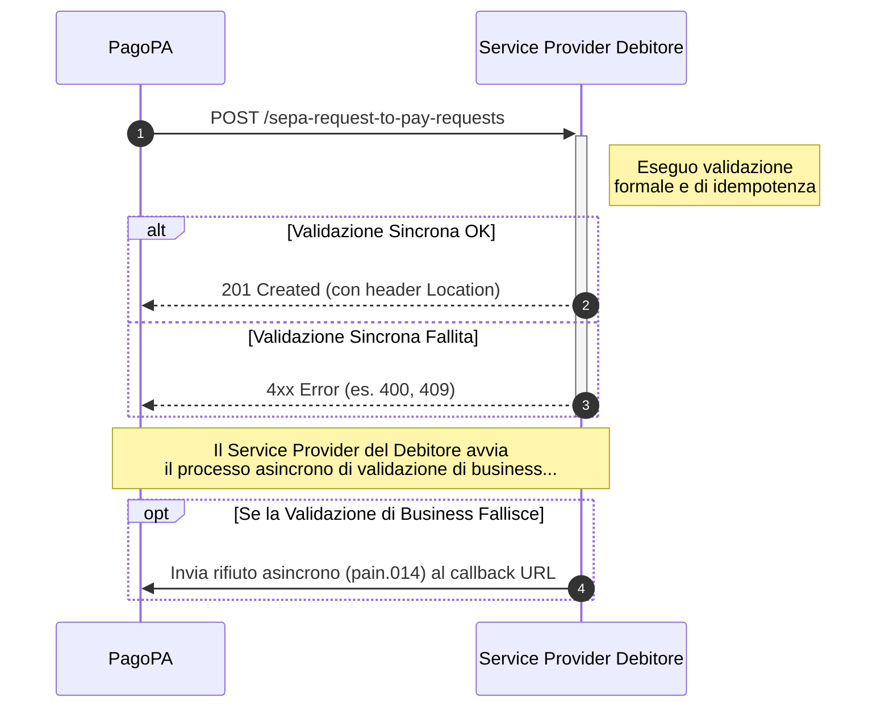

# Come ricevere e validare una richiesta di pagamento

Questo tutorial ti guida attraverso i passaggi necessari per ricevere, validare e processare correttamente una richiesta di pagamento (SRTP) in entrata, inviata da PagoPA secondo le specifiche descritte in [API per la ricezione delle richieste SRTP](../guida-tecnica/api-per-la-ricezione-delle-richieste-srtp.md).

L'implementazione di questo flusso è il cuore del servizio, in quanto abilita la ricezione delle notifiche da presentare ai tuoi utenti finali.



## **Step 1: Implementa l'endpoint di ricezione**

Per prima cosa, il tuo sistema deve esporre un endpoint in grado di ricevere le richieste. Questo endpoint diventerà il punto di ingresso per tutte le SRTP destinate ai tuoi utenti.

### **Endpoint (da implementare)**

```http
POST /sepa-request-to-pay-requests
```

## **Step 2: Gestisci gli Header della Richiesta**

Ogni richiesta in entrata conterrà degli header HTTP standard che devi gestire correttamente.

* **`Idempotency-key`**: Questo header è fondamentale per prevenire la doppia elaborazione di una stessa richiesta. La tua logica deve:
  1. Salvare l'`Idempotency-key` della prima richiesta ricevuta.
  2. Se ricevi una nuova richiesta con una chiave già vista, devi verificare se il payload è identico. Se lo è, restituisci la risposta originale (`201 Created`); se è diverso, restituisci un errore (`422 Unprocessable Entity`).
* **`X-Request-ID`**: Un ID di correlazione da utilizzare per il logging e il troubleshooting.

## **Step 3: Valida il Corpo della Richiesta (`SepaRequestToPayRequestResource`)**

La validazione del payload avviene in due fasi:

1. **Validazione Sincrona (immediata)**: Appena ricevi la richiesta, esegui una validazione formale per assicurarti che il corpo contenga un oggetto `SepaRequestToPayRequestResource` valido e che il messaggio `pain.013` incapsulato sia strutturalmente corretto. Se questa validazione fallisce, rispondi immediatamente con un errore (vedi Step 4).
2. **Validazione di Business (successiva)**: Dopo aver confermato la presa in carico (vedi Step 4), esegui controlli più approfonditi. Ad esempio, verifica che il Codice Fiscale del pagatore (`Payer`) corrisponda a un utente attivo sul tuo servizio.

## **Step 4: Invia la Risposta Sincrona**

Dopo la validazione formale, devi inviare una risposta immediata per comunicare l'esito della presa in carico.

* **Caso di Successo**: Se la validazione iniziale ha successo, salva la richiesta e rispondi con:
  * **`201 Created`**: Questo status code conferma al chiamante che la richiesta è stata accettata per l'elaborazione.
  * **Header `Location`**: Includi in risposta l'URL univoco della risorsa che hai appena creato.
* **Caso di Errore**: Se la validazione iniziale fallisce, rispondi con un codice di errore appropriato, ad esempio:
  * **`400 Bad Request`**: Per richieste malformate o non valide.
  * **`409 Conflict`**: Se la richiesta è un duplicato (stessa `Idempotency-key`).

## **Step 5: Gestisci il Rifiuto Asincrono (DS-04)**

Questo passaggio è necessario se la validazione di business (descritta nello Step 3) fallisce **dopo** che hai già risposto `201 Created`.

In questo scenario, devi notificare al mittente che non puoi processare la richiesta. Per farlo, invia un messaggio di rifiuto asincrono (`pain.014` con motivazione tecnica) all'URL di `callback` che hai ricevuto nel corpo della richiesta originale.
