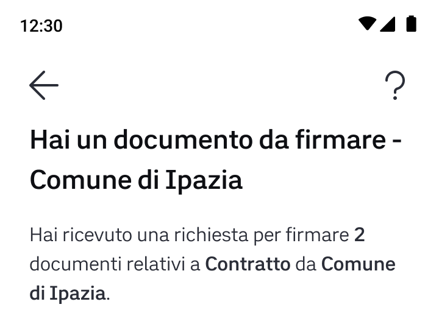

# 💼 Creare il Dossier

Ora dovrai creare il **Dossier**, un contenitore che identifica l'**insieme dei metadati dei documenti** da firmare all'interno di una richiesta di firma. Ti consente di raggruppare le richieste di firma per tipologia di contratto.

Ciascun dossier rappresenta un **caso d’uso specifico**. Ad esempio, potresti creare un dossier per i documenti delle borse di studio, denominato “_**Richiesta Borsa di studio”**_, e un altro _**“Contratto di assunzione”**_ per i contratti di collaborazione sulla didattica. In questo modo, è possibile creare le richieste di firma verso gli utenti riutilizzando lo stesso dossier. Infatti, tutti gli studenti e le studentesse che dovranno firmare dei contratti per richiedere una borsa di studio potranno ricevere una `signature request` creata a partire dallo stesso dossier (in questo esempio, “_Richiesta Borsa di studio”_).\
Le `signature request` dello stesso dossier possono avere in comune titolo, email di riferimento per l'assistenza e spesso anche le firme da inserire. Per questa ragione creare un dossier può agevolare anche nella revisione delle firme.

\
Il **titolo del dossier** sarà anche riportato nel messaggio di richiesta di firma al cittadino:




**Come scrivere il titolo del dossier**

Il titolo del dossier è composto da tre elementi: il nome dell'ente, il titolo del dossier che è anche l'oggetto della richiesta, il testo "Richiesta di firma".Il titolo del dossier deve essere **breve**, sintetizzando l'oggetto per cui si chiede la firma (es. Carta d'Identità, Contratto di Ricerca...)

* deve essere lungo al massimo **75 caratteri**, spazi inclusi
* deve essere scritto in **lettere minuscole** e non maiuscole, a meno che non si tratti di sigle o acronimi (es. Carta d'Identità e non CARTA D'IDENTITÀ)
* non deve contenere **sigle o acronimi poco noti**
* non deve contenere le parole "**online**" o "**digitale**", ma nemmeno parole come "**notifica**" o "**servizio**".

Il titolo del dossier **NON deve essere generico** o contenere un'informazione già presente (come ad esempio il nome dell'ente o il testo "richiesta di firma").


### Un esempio

Ecco un esempio di chiamata verso l'endpoint:

```
POST /api/v1/sign/dossiers
```

Immaginiamo di dover creare un Dossier per la firma di un **Contratto 150 ore** (`"title":"Contratto 150 ore"`).

Il Dossier prevede **un solo documento** (`"title":"Contratto"`), il quale a sua volta richiede **una** sola **firma** (`"title":"Firma contratto"`) **obbligatoria** (`"type":"REQUIRED"`) da parte dell'utente.

#### Vuoi aggiungere ulteriori documenti al dossier?

Un dossier può essere **composto da più documenti**. Puoi mandare in firma più documenti PDF in una singola richiesta, inserendo all'interno della lista `documents_metadata` un oggetto per ogni documento.

#### Vuoi aggiungere una email di assistenza specifica per il dossier?

Nella fase di creazione di un dossier, hai la possibilità di inserire una **email di assistenza specifica per quel dossier**. `support_email` è un campo **opzionale**. Nel caso in cui non venga specificato, come email di assistenza verrà utilizzata di default quella inserita in fase di onboarding.

#### Hai creato i campi firma tramite coordinate?

In questo caso, il corpo del messaggio sarà:

```json
{
   "title": "Contratto 150 ore",
   "documents_metadata":[
      {
         "title":"Contratto",
         "signature_fields":[
            {
               "clause":{
                  "title":"Firma contratto",
                  "type":"REQUIRED"
               },
               "attrs":{
                  "coordinates":{
                     "x":360,
                     "y":100
                  },
                  "size":{
                     "w":170,
                     "h":30
                  },
                  "page":1
               }
            }
         ]
      }
   ],
   "support_email": "demo@assistenza.it"
}
```

#### Non hai creato i campi firma (firma trasparente)?

In questo caso, il corpo del messaggio sarà:

```json
{
   "title": "Contratto 150 ore",
   "documents_metadata":[
      {
         "title":"Contratto",
         "signature_fields":[]
      }
   ]
}
```

In tutti i casi, all'interno della risposta riceverai il Dossier creato con il relativo **ID associato** (`dossier_id`).

```json
{
   "id":"01GG4NFBCN4ZH8ETCCKX3766KX",
   "title": "Contratto 150 ore",
   "documents":[
      {
         "title":"Contratto",
         "signature_fields":[
            {
               "unique_name":"Signature1",
               "clause":{
                  "title":"Firma contratto",
                  "type":"REQUIRED"
               }
            }
         ]
      }
   ]
}
```

In questo caso, naturalmente, si assume che l'unica firma trasparente necessaria per firmare il documento sia obbligatoria, per questo è stato inserito il "type":"REQUIRED". In generale, infatti, almeno una firma deve essere obbligatoria o vessatoria, non si accettano documenti con solo firme facoltative.


**Prendi nota del `dossier_id`**: ti servirà in una fase successiva.


**Come indicare se le firme sono obbligatorie, facoltative o vessatorie?**

* Per indicare che la firma è obbligatoria, inserisci il `"type":"REQUIRED"`
* Per indicare che la firma è vessatoria, inserisci il `"type":"UNFAIR"`
* Per indicare che la firma è facoltativa, inserisci il `"type":"OPTIONAL"`
