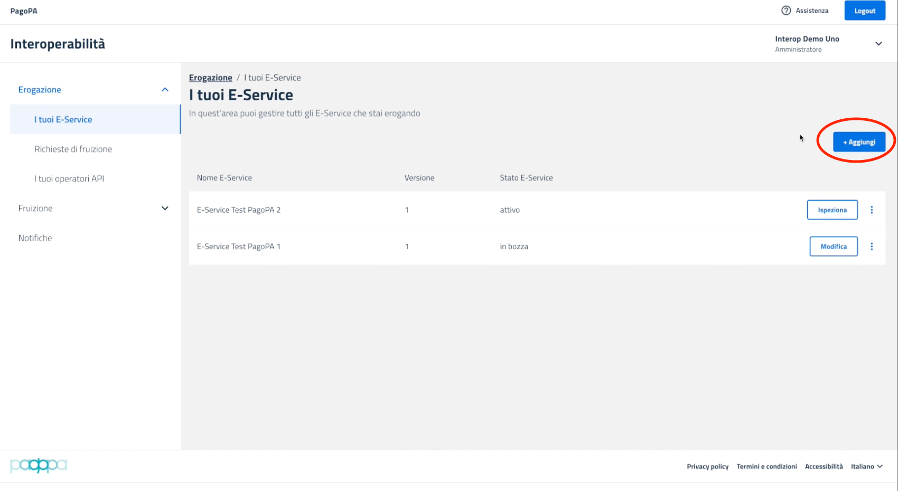
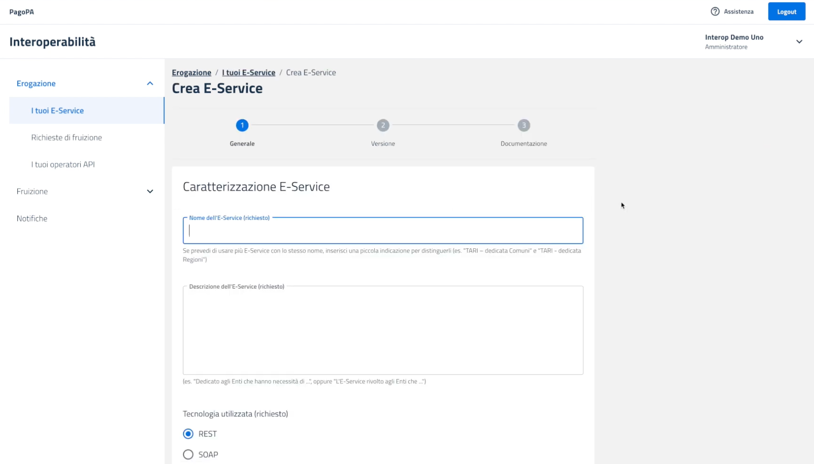

# Come creare e rendere disponibile un e-service

In questo tutorial vedremo come creare da zero un e-service PDND.

Che cos'è un e-service? In PDND Interoperabilità, gli e-service sono delle API che rispettano il perimetro di sicurezza e gli standard del modello di interoperabilità (ModI), e che vengono pubblicate sul catalogo di PDND con il corredo di tutte le informazioni di contesto necessarie al loro utilizzo.

Per creare un e-service occorre quindi, per prima cosa, rendere disponibile una API di un servizio. Una volta pronta l’API, ecco come procedere per pubblicarla sotto forma di e-service.

### Aggiungere un nuovo e-service 

La prima cosa da fare sarà selezionare la voce erogazione dal menu e quindi “I tuoi e-service”, per poi procedere facendo click sul pulsante + Aggiungi:

<figure><figcaption></figcaption></figure>

In questo modo si atterrerà sulla pagina di creazione dell’E-service.

<figure><figcaption></figcaption></figure>

&#x20;

Vediamo le voci nel dettaglio. I contenuti della prima pagina fanno riferimento a informazioni generali sull’e-service:

* un nome e una descrizione che saranno quelli esposti all'interno del catalogo degli e-service sulla piattaforma PDND Interoperabilità;
* con quale tecnologia è scritta l'API attraverso la quale si intende erogare il servizio, se REST o SOAP;

Queste informazioni non potranno più essere modificate una volta che la prima versione di questo E-service verrà pubblicata È previsto che sia sempre possibile creare nuove versioni di ogni E-service, cambiando tutti quei parametri che differiscono tra una versione e l'altra, come ad esempio il file che specifica le API che può naturalmente evolvere nel tempo. Alcune cose però, come ad esempio il nome dell’e-service, rimarranno fisse.

### Creare gli attributi dell’e-service 

Gli attributi sono di fatto delle proprietà che noi erogatori dell'e-service pretendiamo che i fruitori posseggano per potersi iscrivere a fruire del service. Sono divisi in tre tipologie: certificati, verificati e dichiarati.

Gli attributi certificati vengono attribuiti automaticamente all'Ente in base alle informazioni presenti nei database delle fonti autoritative a disposizione di interoperabilità. In questo momento l'unica fonte autoritativa implementata è il catalogo IPA. La verifica del possesso di questi attributi da parte dell'ente fruitore viene effettuata automaticamente da interoperabilità.

Per gli attributi dichiarati. L'ente fruitore, all'atto della sottoscrizione di una richiesta di fruizione, dichiara implicitamente di possederli. La veridicità di questa dichiarazione è a solo carico del fruitore e non necessita di verifica da parte dell'ente erogatore.

Gli attributi verificati sono invece attributi riutilizzabili sull'infrastruttura. In sostanza sono attributi dei quali un altro ente erogatore potrebbe aver già verificato il possesso per lo stesso fruitore.

Una volta inseriti i campi si può proseguire. Le informazioni inserite fin qui possono essere salvate in bozza e, come detto prima, rimangono modificabili fino alla pubblicazione della prima versione dell’E-service.

### Aggiungere le informazioni di versione 

Gli step 2 e 3 di creazione di un E-service fanno riferimento alle informazioni di versione. La prima volta che si crea un E-service, la versione sarà naturalmente la 1. Queste le informazioni richieste:

1. **Audience**: il parametro _audience (aud)_ che i fruitori dovranno inserire all'interno del token per le richieste che effettueranno verso questa versione dell'e-service. È discrezione dell'erogatore stabilire la policy relativa alle audience: è possibile utilizzare la stessa audience per più versioni, audience diverse per ogni versione, etc.
2. **Durata della validità del voucher**: dopo quanto tempo scade il voucher rilasciato da PDND Interoperabilità valido per accedere a questo servizio. Questo valore, espresso in minuti, determina per quanto tempo sarà valido l’access token utilizzabile nello scambio tra voi e il fruitore. Alla scadenza il fruitore dovrà fare richiesta di un nuovo access token a interoperabilità per poter accedere nuovamente al dato dell'erogatore. Il valore può andare da 1 minuto a 24 ore.
3. **Soglia delle chiamate API**: qui dovete segnalare quanto carico espresso in numero di chiamate al giorno dichiarate di poter sostenere per ogni singolo fruitore e in totale, sommando le richieste di tutti i fruitori. Questo meccanismo ha un corrispettivo per il fruitore. Ogni volta che il fruitore crea una nuova finalità per accedere al dato dichiarerà quanto carico intende mettere sulla vostra infrastruttura. Nel momento in cui il valore o la somma dei valori fosse superiore a quello che voi erogatori avete dichiarato di poter supportare, la nuova finalità non sarà attivata immediatamente, ma rimarrà in attesa di approvazione.
4. **Documentazione tecnica:** Se al primo step avete dichiarato un servizio REST dovrete caricare un file OpenAPI; se si tratta di un servizio SOAP, un file WSDL. In entrambi i casi il documento da caricare conterrà la specifica dell'interfaccia che esporrete verso il pubblico. Questo campo è obbligatorio.

### Pubblicare un e-service 

Un e-service in bozza può essere pubblicato immediatamente al termine della procedura guidata di creazione della versione o in un secondo momento.

Una volta pubblicata una bozza, questa diventerà la nuova versione "attiva" dell'e-service, mandando la versione precedente in stato "deprecato". Le versioni deprecate continueranno a funzionare per garantire ai fruitori continuità di servizio. Ai fruitori sarà indicato che possono aggiornare la loro richiesta di fruizione alla versione più recente dell'e-service.
