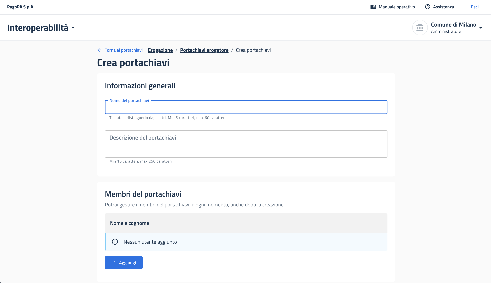
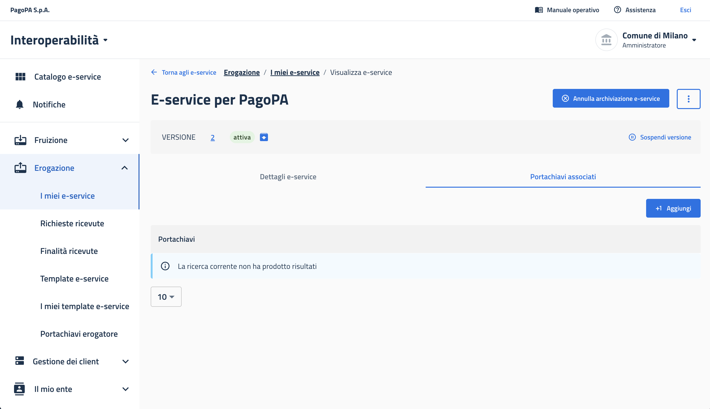

# E-service PDND e sicurezza

Riferimento dell'e-service nel contesto Titolare di Fonte Autentica e dei relativi meccanismi di sicurezza.&#x20;

## Informazioni generali

L'e-service del Titolare di Fonte Autentica opera in modalità **«eroga»**. In fase di pubblicazione si dichiarano: nome e descrizione (a catalogo), tecnologia (REST/SOAP), erogazione di **dati personali** (cfr. 4.3), presenza del servizio **Signal Hub**.

## Ciclo di vita dell'e-service

<table><thead><tr><th width="169.0859375">Stato</th><th>Significato</th></tr></thead><tbody><tr><td><strong>Bozza</strong></td><td>In creazione, non visibile né fruibile</td></tr><tr><td><strong>Pubblicata</strong></td><td>Versione corrente, a catalogo e fruibile</td></tr><tr><td><strong>Deprecata</strong></td><td>Non più la versione più recente; utilizzabile dai fruitori già iscritti fino all'archiviazione</td></tr><tr><td><strong>Sospesa</strong></td><td>Utilizzo temporaneamente bloccato dall'erogatore</td></tr><tr><td><strong>Archiviata</strong></td><td>Ritirata dal catalogo</td></tr></tbody></table>

Una nuova versione deprecà la precedente; l'aggiornamento dei fruitori è manuale; per le sospensioni programmate è previsto un preavviso secondo gli SLA. È inoltre possibile **clonare** un e-service per crearne uno nuovo (la numerazione riparte dalla versione 1).

## Sicurezza: portachiavi, firma e voucher

Il **portachiavi** consente all'erogatore di **firmare digitalmente le risposte** e di pubblicare le chiavi pubbliche associate all'e-service. La firma copre il **digest** della risposta: in caso di alterazione del contenuto, il fruitore lo rileva e scarta la risposta, con garanzia di **integrità** e **non ripudio**. Il pattern di firma è **`INTEGRITY_REST_02`** (header `Agid-JWT-Signature` e `Digest`); l'accesso alle API è regolato da **voucher** (Bearer/DPoP), coerentemente con i `pdnd_metadata` del file di progettazione.

Sul piano operativo, l'Operatore di Sicurezza o l'Amministratore **crea un portachiavi** (Erogazione → I tuoi portachiavi), **carica almeno una chiave pubblica** e **associa il portachiavi all'e-service** (tab «Portachiavi» nella scheda e-service).

<figure><figcaption></figcaption></figure>

<figure><figcaption></figcaption></figure>


**Approfondimento PDND.** [Portachiavi (riferimento tecnico)](https://developer.pagopa.it/pdnd-interoperabilita/guides/manuale-operativo-pdnd-interoperabilita/v1.0/riferimenti-tecnici/e-service/portachiavi); [Come firmare una risposta per un fruitore (INTEGRITY\_REST\_02)](https://www.developer.pagopa.it/it/pdnd-interoperabilita/guides/manuale-operativo-pdnd-interoperabilita/tutorial/tutorial-per-lerogatore/come-firmare-una-risposta-per-un-fruitore); [Utilizzare i voucher — FAQ](https://developer.pagopa.it/pdnd-interoperabilita/guides/manuale-operativo-pdnd-interoperabilita/v1.0/riferimenti-tecnici/utilizzare-i-voucher/faq-e-dubbi-comuni).

