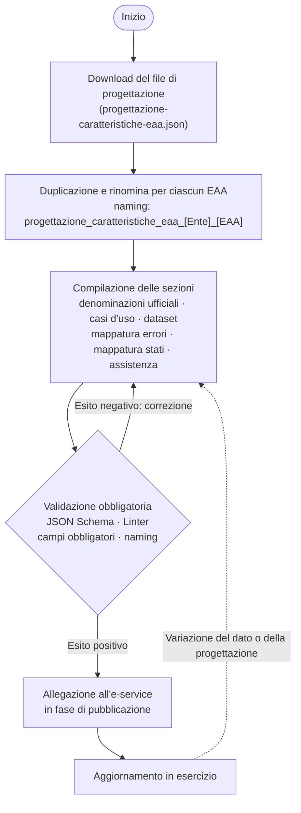

# Il file di progettazione dell'EAA

È il **documento di progettazione dell'EAA**: descrive in un unico file chi può ottenere l'EAA, come si utilizza, quali dati contiene, come si comporta in caso di errore, come varia di stato e come è assistito l'utente. Non costituisce un artefatto di runtime, bensì la **fonte di verità progettuale** da cui discendono le scelte dell'e-service. Si compila **una volta per ciascun EAA** e si **allega all'e-service** in fase di pubblicazione (vedi tutorial → [Come pubblicare e configurare l'e-service in collaudo](../tutorial/come-pubblicare-e-configurare-le-service-in-collaudo.md)).

## Le sezioni del file

<table><thead><tr><th width="165.55078125">Sezione</th><th width="335.1953125">Contenuto</th><th>Approfondimento</th></tr></thead><tbody><tr><td><code>denominazioni ufficiali</code></td><td>Ente titolare, nome EAA, versione</td><td>—</td></tr><tr><td><code>casi d'uso</code></td><td>Profilo d'uso dell'EAA, articolato in cinque sottosezioni: <code>target utenti</code> (destinatari), <code>emissione formato</code> (modalità di ottenimento — vi risiedono i campi <code>catalogo o touchpoint EAA</code> e <code>modalità sincrona differita EAA</code>), <code>utilizzo</code>, <code>pagamento</code>, <code>legale privacy</code></td><td><a href="../tutorial/come-progettare-le-caratteristiche-delleaa.md">Come progettare le caratteristiche dell'EEA</a></td></tr><tr><td><code>dataset</code></td><td>Parametri di richiesta e dati di risposta (attributi, tipologia, obbligatorietà, lunghezza, ordinamento)</td><td><a href="data-model-attributi-e-stati-delleaa.md">Data model: attributi e stati dell'EAA</a></td></tr><tr><td><code>mappatura errori</code></td><td>Codici di risposta dell'e-service, messaggi/azioni utente</td><td><a href="codici-di-errore-delle-service.md">Codici di errore dell'e-service</a></td></tr><tr><td><code>mappatura stati</code></td><td>Stati del ciclo di vita dell'EAA, applicabilità, messaggi, azioni</td><td><a href="data-model-attributi-e-stati-delleaa.md">Data model: attributi e stati dell'EAA</a></td></tr><tr><td><code>assistenza</code></td><td>Referenti, canali, FAQ, testi informativi</td><td><a href="assistenza-referenti-e-glossario.md">Assistenza, referenti e glossario</a></td></tr></tbody></table>

## Ciclo di vita del file di progettazione dell'EAA

