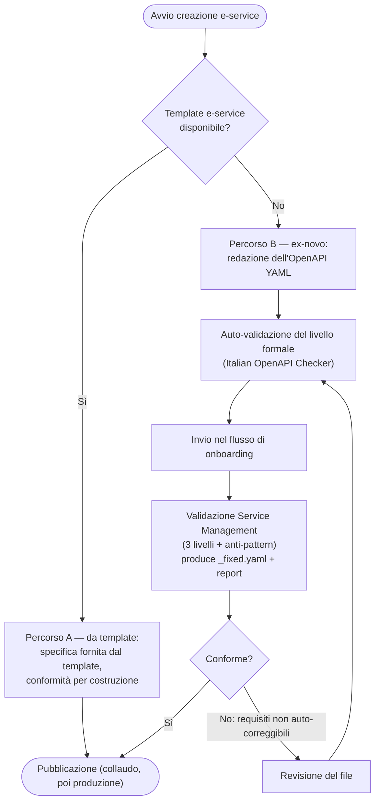

# Requisiti dell'OpenAPI YAML e dell'e-service

Riferimento dei requisiti che l'**OpenAPI YAML** dell'e-service deve rispettare per essere pubblicabile su PDND nel Sistema IT-Wallet. Il Titolare di Fonte Autentica produce **artefatti distinti**:&#x20;

* il **JSON di progettazione** (_→_ [_Il file di progettazione dell'EAA_](il-file-di-progettazione-delleaa.md))&#x20;
* l'**OpenAPI YAML** (contratto tecnico); nel percorso da template, la specifica è fornita dal [**Template e-service**](../tutorial/come-pubblicare-e-configurare-le-service-in-collaudo.md#procedura-operativa-creazione-delle-service-da-template)

## Ciclo di vita del YAML e creazione dell'e-service

La creazione dell'e-service può seguire **due percorsi**; in entrambi l'e-service pubblicato deve risultare **conforme** ai requisiti del presente capitolo.

**Percorso A — da Template e-service IT-Wallet.** Il Titolare di Fonte Autentica non redige né valida un OpenAPI YAML: la specifica è fornita dal template (struttura, numero, nome e ordine dei claim) ( _→_ [_Creazione e-service da template_](../tutorial/come-pubblicare-e-configurare-le-service-in-collaudo.md#procedura-operativa-creazione-delle-service-da-template))

1. **Derivazione** dell'istanza dal template pubblicato.
2. **Personalizzazione dei valori** (configurazioni di istanza; valori popolati a livello di codice). Sulle liste di claim è ammessa la variazione del **numero di oggetti** dell'array (implementazione), non dei campi del singolo oggetto. È modificabile il solo **suffisso** del nome.
3. **Conformità per costruzione** (struttura, blocchi e allineamento al Claim Registry già garantiti). Le incongruenze sono segnalate al creatore del template.
4. **Pubblicazione** (_→_ [_Come pubblicare e configurare l'e-service in collaudo_](../tutorial/come-pubblicare-e-configurare-le-service-in-collaudo.md)_, →_ [_Come pubblicare in produzione_](../tutorial/come-pubblicare-in-produzione.md)).

**Percorso B — ex-novo.**

1. **Produzione** — il Titolare di Fonte Autentica redige l'OpenAPI YAML, coerente con il Data Model.
2. **Auto-validazione (consigliata)** — verifica del livello formale con il checker pubblico ([Italian OpenAPI Checker](https://italia.github.io/api-oas-checker/)).
3. **Invio** — il Titolare di Fonte Autentica trasmette il YAML nel flusso di onboarding.
4. **Validazione Service Management** — verifica dei tre livelli e degli anti-pattern; produzione di `_fixed.yaml` e report.
5. **Correzione** — per i requisiti non auto-correggibili, il Titolare di Fonte Autentica revisiona il file.
6. **Pubblicazione** ((_→_ [_Come pubblicare e configurare l'e-service in collaudo_](../tutorial/come-pubblicare-e-configurare-le-service-in-collaudo.md)_, →_ [_Come pubblicare in produzione_](../tutorial/come-pubblicare-in-produzione.md))). Il file conforme può, ove previsto, essere **promosso a Template e-service**.


**Relazione struttura/valori.** La specifica OpenAPI definisce **la composizione della risposta** (campi, numero, nome, `constraint`), non i **valori**: l'e-service deve restituire **esattamente** tale struttura; i valori dipendono dall'AS e dalla richiesta.


## Requisiti formali (AgID/ModI)

<table><thead><tr><th width="220.046875">Requisito</th><th>Regola</th></tr></thead><tbody><tr><td><strong>Versione OpenAPI</strong></td><td><strong>OpenAPI 3.x</strong> (Swagger 2.0 non supportato)</td></tr><tr><td><strong>Italian Guidelines</strong></td><td>Checker <strong>Spectral</strong> con ruleset <em>Italian Guidelines Full</em> e <strong>0 errori</strong></td></tr></tbody></table>

Gli errori del livello formale non sono auto-correggibili.

## Requisiti strutturali IT-Wallet (estratto)

Oltre alla conformità formale, l'e-service deve rispettare i requisiti strutturali specifici di IT-Wallet, verificati al livello **strutturale** dal validatore del Service Management. Riguardano la forma degli endpoint, la sicurezza e l'integrità della risposta, la struttura del payload e la qualità della specifica; l'elenco seguente ne riporta un estratto, raggruppato per ambito.

* **Endpoint e operazioni**
  * `POST /attribute-claims/{datasetId}` **parametrico** (i path statici non sono conformi)
  * `operationId` univoco
  * endpoint `/status`
* **Sicurezza e integrità della risposta**
  * **server HTTPS**
  * autenticazione **Bearer**, con **assenza di DPoP**
  * header di sicurezza `Agid-JWT-Signature`, `Digest`, `Agid-JWT-TrackingEvidence`
  * `INTEGRITY_REST_02` sulla risposta `200`
* **Struttura del payload**
  * ordine fisso dei blocchi
  * `metadataClaims` **required**
* **Metadati e qualità della specifica**
  * `info.x-api-id` / `x-summary`
  * `$ref` risolti
* **Affidabilità e gestione degli errori**
  * **rate limiting**
  * error response conforme a **RFC 9457**

&#x20;

## Requisiti semantici (Claim Registry)

Un **claim** è il singolo attributo che compone l'EAA (nome, data di scadenza, numero di un documento). Perché l'attestato sia interpretato in modo univoco da Issuer, Titolari di Fonte Autentica e verificatori, i nomi dei claim non sono liberi: devono corrispondere a quelli del **registro dei claim di IT-Wallet** (il «Claim Registry» mantenuto da IPZS). Un nome non previsto genera una **non conformità** in validazione semantica; la riconduzione al nome standard (**armonizzazione**) è gestita con i team **Service Design / Service Management** di PagoPA.

**Riferimento.** La definizione dei claim e del modello dati è nelle Specifiche Tecniche IT-Wallet ([italia/eid-wallet-it-docs](https://github.com/italia/eid-wallet-it-docs)); per i quattro blocchi (`identityClaims`, `userClaims`, `attributeClaims`, `metadataClaims`) si veda il riferimento → [Data model: attributi e stati dell'EAA](data-model-attributi-e-stati-delleaa.md).

## Anti-pattern (estratto)

Gli anti-pattern sono costrutti e scelte da **evitare** nell'OpenAPI YAML dell'e-service: non sono errori formali, ma violazioni delle regole di progettazione IT-Wallet che il validatore del Service Management segnala insieme ai tre livelli di controllo. L'elenco seguente ne riporta un estratto (non esaustivo):

* **Annidamento oltre 2 livelli** — gli schemi della risposta non devono superare i due livelli di annidamento.
* **Stringhe di primo livello senza `maxLength ≤ 150`** — ogni stringa di livello radice deve dichiarare una lunghezza massima non superiore a 150 caratteri.
* **Ordine dei blocchi non rispettato** — i blocchi di claim devono seguire l'ordine previsto (`identityClaims`, `userClaims`, `attributeClaims`, `metadataClaims`).
* **`unique_id` assente nel `requestBody`** — la richiesta deve includere il campo `unique_id`.
* **Risposte senza `Cache-Control: no-store`** — le risposte non devono essere memorizzate in cache.
* **Uso di `document_url` / `pdf` / `screenshot`** — non è ammesso veicolare il documento come link, PDF o immagine: l'EAA è un insieme di attributi strutturati, non la riproduzione del documento.

**Riferimento:** sezione 13.4 [Endpoint delle Fonti Autentiche](https://italia.github.io/eid-wallet-it-docs/versione-corrente/it/authentic-source-endpoint.html) delle Specifiche Tecniche IT-Wallet, che include la [specifica OpenAPI dell'e-service (OAS3-PDND-AS)](https://italia.github.io/eid-wallet-it-docs/versione-corrente/it/OAS3-PDND-AS.html); l'applicazione puntuale di questi vincoli è demandata al validatore del Service Management.

## Strumenti di validazione

* **Livello formale** — auto-validabile con l'[Italian OpenAPI Checker](https://italia.github.io/api-oas-checker/).
* **Livelli strutturale/semantico** — validatore del **Service Management** di PagoPA, che produce `_fixed.yaml` e report. Il `_fixed.yaml` è da verificare prima del caricamento.

> <mark style="color:yellow;">**Da verificare.**</mark> <mark style="color:yellow;"></mark><mark style="color:yellow;">Se per IT-Wallet la modalità ex-novo sia ammessa o sia imposta la derivazione da template; se il template pubblicato coincida con il</mark> <mark style="color:yellow;"></mark><mark style="color:yellow;">`_fixed.yaml`</mark> <mark style="color:yellow;"></mark><mark style="color:yellow;">armonizzato; accesso del Titolare di Fonte Autentica al Claim Registry rispetto ai claim armonizzati dal SM.</mark>

***
