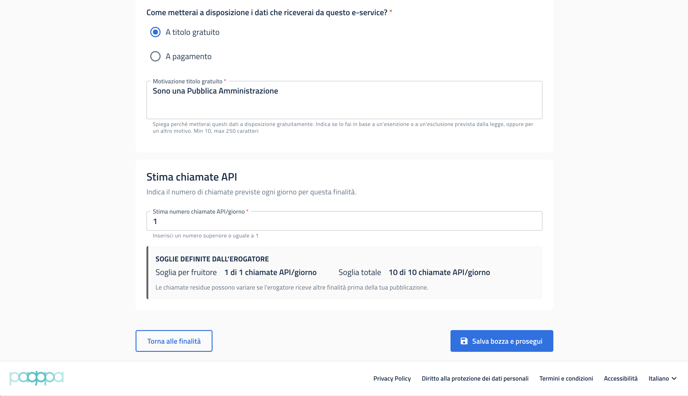

# Signal hub: soglie di carico, probing e tracing

[Signal Hub](https://developer.pagopa.it/it/pdnd-interoperabilita/guides/manuale-operativo-signal-hub) è un servizio PDND (LLGG AgID, Allegato 4 — [_Processo di distribuzione dei segnali di variazione_](https://www.agid.gov.it/sites/agid/files/2025-06/Linee_guida_PDND_v2_allegato_4.pdf)) che consente all'erogatore (**produttore**) di **notificare a PDND ogni variazione** di un dato; i fruitori interessati (**consumatori**) ricevono l'avviso in tempo reale e acquisiscono il dato aggiornato via e-service. PDND gestisce **la sola segnalazione**: i dati restano presso il Titolare di Fonte Autentica.

Sul piano operativo, il Titolare di Fonte Autentica **deposita un segnale** indicando l'`eserviceId` e un identificativo pseudonimizzato del dato variato; il `signalId` è un intero **monotòno crescente** (non riutilizzabile e sempre successivo all'ultimo inviato). I tipi di segnale comprendono variazioni di **ciclo di vita** dell'entità e segnali di **allineamento** delle modalità di pseudonimizzazione.&#x20;

Per consentire la correlazione con le emissioni, il Titolare di Fonte Autentica e il Credential Issuer **devono salvare il `jti`** del token `Agid-JWT-Signature` della richiesta dell'e-service; il Titolare registra il `last_updated` degli attributi e l'Issuer lo rilegge per rilevare variazioni dall'ultima emissione.

Ricevuto il segnale, il fruitore interroga l'e-service per lo specifico `object_id` e ne ottiene il dataset **qualunque sia lo stato** (`INVALID`, `SUSPENDED`, …), aggiornando di conseguenza l'attestato; in **emissione**, invece, l'e-service espone i soli dataset `VALID`.


**Approfondimento PDND.** [Manuale Operativo Signal Hub](https://developer.pagopa.it/pdnd-interoperabilita/guides/manuale-operativo-signal-hub); [Come depositare un segnale](https://www.developer.pagopa.it/pdnd-interoperabilita/guides/manuale-operativo-signal-hub/tutorial/come-depositare-un-segnale).


## Soglie di carico e approvazione delle finalità

Il Titolare di Fonte Autentica imposta **soglie** (per fruitore e totali) e una stima di carico della finalità. Qualora un fruitore crei una finalità con stima **entro** le soglie, la fruizione è attivata automaticamente; qualora la stima **superi** una soglia, è richiesta l'**approvazione manuale** dell'erogatore.

<figure><figcaption></figcaption></figure>


**Approfondimento PDND.** [Finalità, stima di carico e approvazioni](https://developer.pagopa.it/pdnd-interoperabilita/guides/pdnd-manuale-operativo/1.0/manuale-operativo/finalita).


## Probing

Strumento di monitoraggio della **disponibilità** delle API a catalogo. Una sonda di PDND contatta gli **endpoint di status** con cadenza di circa 5 minuti: l'esito si basa sul codice HTTP (**200** = operativo; **4xx/5xx** = errore o indisponibilità). L'endpoint è esposto in **HTTPS** e coerente con la tecnologia dichiarata.


**Approfondimento PDND.** [Probing (riferimento tecnico)](https://developer.pagopa.it/it/pdnd-interoperabilita/guides/manuale-operativo-pdnd-interoperabilita/v1.0/riferimenti-tecnici/probing); [Come integrare il Probing](https://www.developer.pagopa.it/it/pdnd-interoperabilita/guides/manuale-operativo-pdnd-interoperabilita/v1.0/tutorial/tutorial-per-lerogatore/come-integrare-il-proprio-e-service-con-il-probing).


## Tracing

Invio di un **report giornaliero** del numero di chiamate API e dei relativi status code, a supporto del dimensionamento e del monitoraggio (adempimento ModI/LLGG).


**Approfondimento PDND.** [Manuale operativo Tracing](https://developer.pagopa.it/it/pdnd-interoperabilita/guides/manuale-operativo-tracing)

